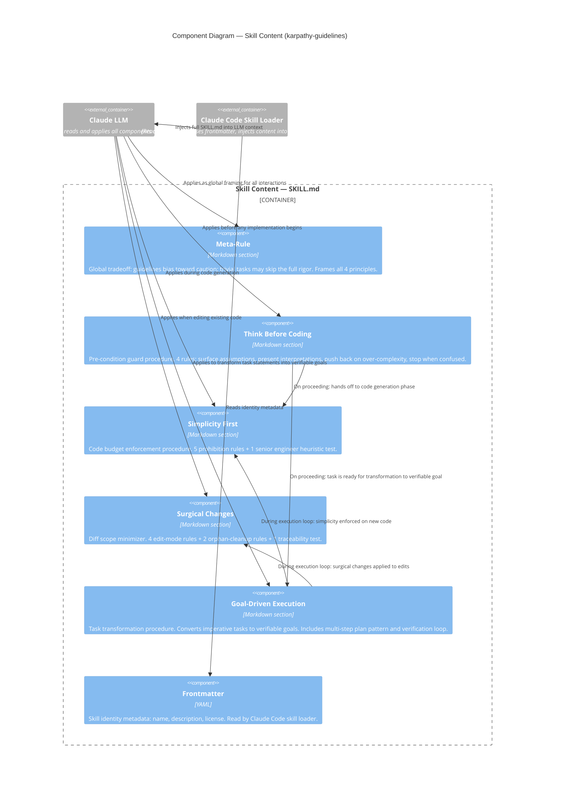
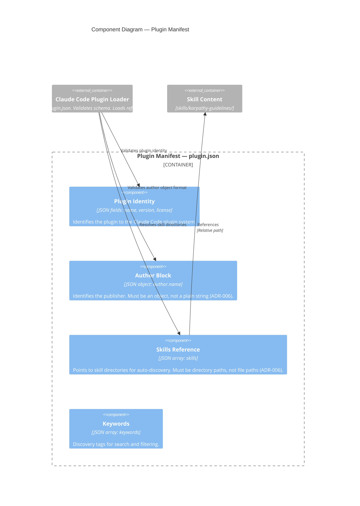

# C4 — Level 3: Components

> Generated by Reversa Architect · 2026-05-15

---

## Focus Container: Skill Content (`skills/karpathy-guidelines/SKILL.md`)

This is the most architecturally relevant container — it is the system's sole executable unit (in the sense that it modifies LLM behavior). Its internal structure is analyzed here.

---

## Component Detail

| Component | Rules | Trigger condition | Output |
|-----------|-------|------------------|--------|
| Meta-Rule | 1 (BR-21) | Always active | Frames all other components |
| Think Before Coding | 4 (BR-01–04) | Any implementation request | Clarification, stated assumptions, or proceed |
| Simplicity First | 6 (BR-05–10) | Any code generation | Approved or simplified implementation |
| Surgical Changes | 7 (BR-11–17) | Any edit to existing code | Minimal diff |
| Goal-Driven Execution | 5 (BR-18–22) | Any task (especially multi-step) | Verifiable goal or step plan |

---

## Focus Container: Plugin Manifest (`.claude-plugin/plugin.json`)

---

## Notes

- 🟢 **CONFIRMADO** — Component breakdown derived directly from SKILL.md section structure and plugin.json field analysis.
- 🟡 **INFERIDO** — The order of principle application (TBC → GDE → SF/SC) is inferred from the logical dependencies described in each principle. The Claude Code runtime does not enforce an order — the LLM applies them based on context.
- 🔴 **LACUNA** — The exact mechanism by which `meta_rule` overrides or qualifies the other components at inference time is not formally specified.
