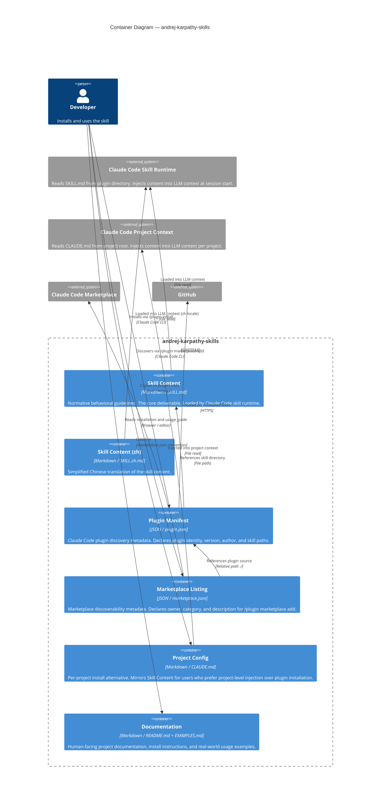

# C4 — Level 2: Containers

> Generated by Reversa Architect · 2026-05-15

---

## Diagram

---

## Container Responsibilities

| Container | Normative? | Maintained by | Update frequency |
|-----------|-----------|---------------|-----------------|
| Skill Content | Yes — primary deliverable | repo owner + contributors | When guidelines change |
| Skill Content (zh) | Yes — localized copy | community (vtrois white) | 🔴 No sync process |
| Plugin Manifest | Yes — required for plugin install | repo owner + contributors | When version/structure changes |
| Marketplace Listing | Yes — required for marketplace | repo owner + contributors | When version changes |
| Project Config | Yes — per-project mirror | repo owner | Must stay in sync with Skill Content |
| Documentation | No — informational | repo owner + contributors | When install instructions change |

---

## Notes

- 🟢 **CONFIRMADO** — All containers confirmed from file structure analysis.
- 🔴 **LACUNA** — No automated sync between `CLAUDE.md` (Project Config) and `SKILL.md` (Skill Content). They can diverge silently.
- 🔴 **LACUNA** — `Skill Content (zh)` has no update trigger when `Skill Content` changes.
