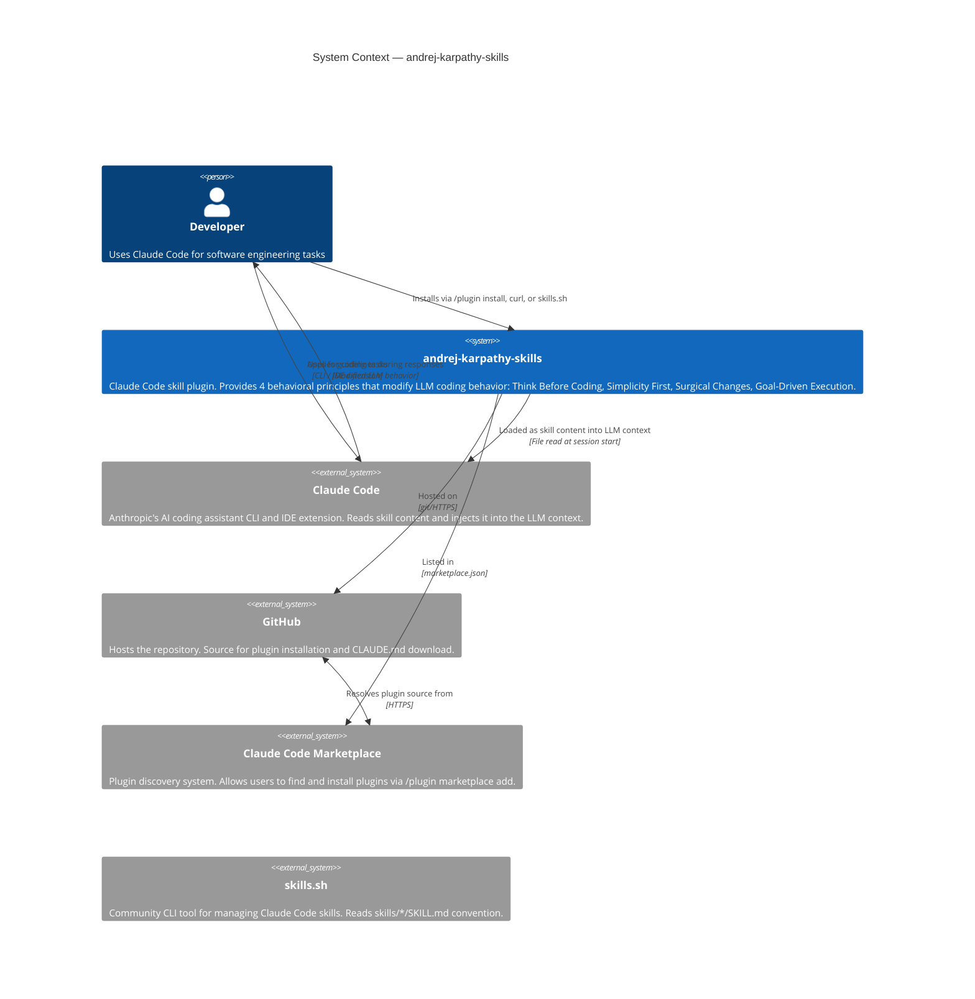

# C4 — Level 1: System Context

> Generated by Reversa Architect · 2026-05-15

---

## Diagram

---

## Notes

- 🟢 **CONFIRMADO** — All relationships confirmed from README.md, plugin.json, marketplace.json, and git history.
- 🟡 **INFERIDO** — The exact mechanism by which Claude Code injects skill content into the LLM context (file read timing, priority over CLAUDE.md, conflict resolution) is not documented in this repo.
- The "system" has no server, no process, and no network endpoint of its own — it is purely content that modifies an external system (Claude Code) at load time.
