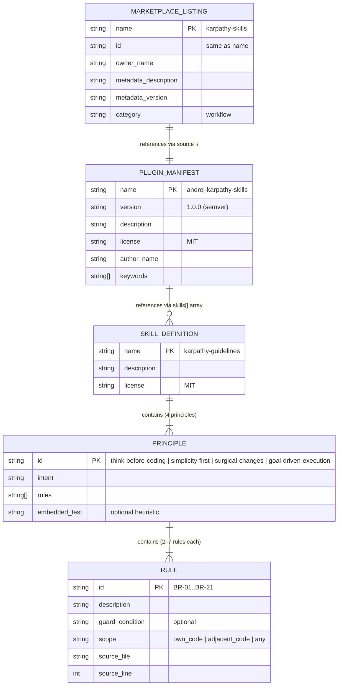

# ERD — Entity Relationship Diagram

> Generated by Reversa Architect · 2026-05-15

---

## Assessment

This project has **no database** and **no runtime data model**. The "entities" are static configuration structures in JSON and Markdown files. The ERD below documents the structural relationships between these static artifacts.

---

## Diagram

---

## Cardinalities

| Relationship | Cardinality | Notes |
|-------------|-------------|-------|
| PluginManifest → SkillDefinition | 1:N | A plugin can reference multiple skill directories; currently references 1 |
| MarketplaceListing → PluginManifest | 1:1 | Exactly one plugin per marketplace listing in this repo |
| SkillDefinition → Principle | 1:4 | Exactly 4 principles, plus 1 meta-rule |
| Principle → Rule | 1:2..7 | Think Before Coding: 4 rules; Simplicity First: 6; Surgical Changes: 7; Goal-Driven: 5 |

---

## Field Notes

- 🟢 **CONFIRMADO** — All entities and fields sourced directly from `plugin.json`, `marketplace.json`, and `SKILL.md`.
- 🟡 **INFERIDO** — `PRINCIPLE` and `RULE` entities are not formally typed data structures — they are sections and bullet points in Markdown. The entity model is an abstraction for documentation purposes.
- 🔴 **LACUNA** — No foreign key constraints or validation schema enforces the `PluginManifest → SkillDefinition` reference at authoring time; it is convention-based.
