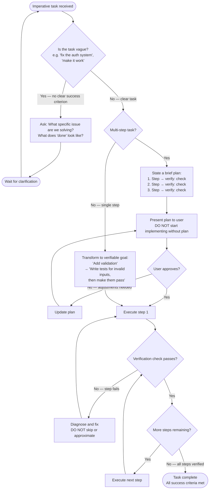

# Flowchart — Principle: Goal-Driven Execution

> Generated by Reversa Archaeologist · 2026-05-15  
> Source: `skills/karpathy-guidelines/SKILL.md` lines 40–55

---

## Task Transformation & Verification Loop

---

## Transformation Table

🟢 **CONFIRMADO** — From `SKILL.md` and `EXAMPLES.md`:

| Imperative | Verifiable Goal |
|------------|----------------|
| "Add validation" | "Write tests for invalid inputs, then make them pass" |
| "Fix the bug" | "Write a test that reproduces it, then make it pass" |
| "Refactor X" | "Ensure tests pass before and after" |
| "Add rate limiting" | "Test: 100 requests → first 10 succeed, rest get 429" (per step) |
| "Fix the auth system" | "Test that reproduces the specific symptom → make it pass → no regressions" |
| "Sort breaks with duplicate scores" | "Write test_sort_with_duplicate_scores() that fails → fix → test passes consistently" |

---

## Anti-Patterns Detected (from EXAMPLES.md)

| Anti-Pattern | Example | Correct Behavior |
|-------------|---------|-----------------|
| Vague approach | "I'll review and improve the authentication system" | Ask: what specific issue? Then write a test that reproduces it |
| Big-bang implementation | 300-line rate limiting in one commit, no verification steps | Break into 4 independently verifiable steps |
| Fix without reproducing | Changes sort logic without first writing a failing test | Write the failing test first, then fix, then verify |

---

## Key Insight

🟢 **CONFIRMADO** — Quoted verbatim from `README.md`:

> "LLMs are exceptionally good at looping until they meet specific goals... Don't tell it what to do, give it success criteria and watch it go."

This is the theoretical foundation of the principle: strong success criteria enable autonomous LLM loops; weak criteria ("make it work") require constant human intervention.

---

## Rules Summary

| ID | Rule | Type |
|----|------|------|
| GDE-01 | Transform imperative tasks to verifiable goals | Obligation |
| GDE-02 | For multi-step tasks: state plan with verify steps before starting | Obligation |
| GDE-03 | Loop until each verification check passes | Obligation |
| GDE-04 | Don't skip or approximate failing checks | Hard prohibition |
| GDE-05 | Ask for clarification when task has no clear success criterion | Obligation |
