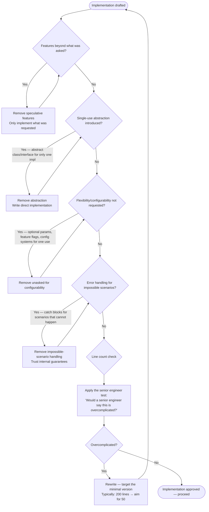

# Flowchart — Principle: Simplicity First

> Generated by Reversa Archaeologist · 2026-05-15  
> Source: `skills/karpathy-guidelines/SKILL.md` lines 14–23

---

## Complexity Evaluation Procedure

---

## Anti-Patterns Detected (from EXAMPLES.md)

| Anti-Pattern | Example | Correct Behavior |
|-------------|---------|-----------------|
| Strategy pattern for single case | `DiscountStrategy` ABC + 2 subclasses for one discount calc | One function: `calculate_discount(amount, percent)` |
| Speculative caching | Adds `InMemoryCache` to `save_preferences` nobody asked for | Just run the `UPDATE` query |
| Speculative notification | Adds `notify_preference_change` nobody asked for | Delete it |
| Configuration system | `merge: bool`, `validate: bool`, `notify: bool` params for simple save | Remove all optional params until they're needed |

---

## Rules Summary

| ID | Rule | Type |
|----|------|------|
| SF-01 | No features beyond what was asked | Hard prohibition |
| SF-02 | No abstractions for single-use code | Hard prohibition |
| SF-03 | No flexibility/configurability not requested | Hard prohibition |
| SF-04 | No error handling for impossible scenarios | Hard prohibition |
| SF-05 | If 200 lines could be 50, rewrite it | Obligation |
| SF-H1 | Senior engineer test: if overcomplicated → simplify | Heuristic |
