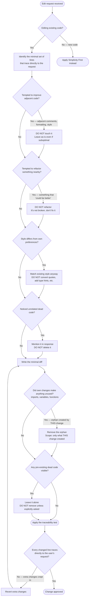

# Flowchart — Principle: Surgical Changes

> Generated by Reversa Archaeologist · 2026-05-15  
> Source: `skills/karpathy-guidelines/SKILL.md` lines 25–38

---

## Edit Scope Minimization Procedure

---

## Anti-Patterns Detected (from EXAMPLES.md)

| Anti-Pattern | Example | Correct Behavior |
|-------------|---------|-----------------|
| Drive-by refactoring | Fixing empty email crash → also adds username length/alphanumeric validation | Only fix the empty email guard |
| Quote style drift | Changes `'` → `"` while adding logging | Keep original quote style |
| Unsolicited type hints | Adds `file_path: str` while fixing bug | Leave type annotations as-is |
| Unsolicited docstrings | Adds `"""Upload file..."""` while adding logging | Don't add docstrings |
| Boolean refactor | Rewrites `if/else return True/False` to `return response.status_code == 200` while adding logging | Leave boolean pattern as-is |

---

## Rules Summary

| ID | Rule | Mode | Type |
|----|------|------|------|
| SC-01 | Don't improve adjacent code, comments, formatting | Edit | Hard prohibition |
| SC-02 | Don't refactor things that aren't broken | Edit | Hard prohibition |
| SC-03 | Match existing style | Edit | Hard obligation |
| SC-04 | Mention unrelated dead code — don't delete | Edit | Soft obligation |
| SC-05 | Remove orphans YOUR changes created | Orphan cleanup | Obligation (scoped to own changes) |
| SC-06 | Don't remove pre-existing dead code | Orphan cleanup | Hard prohibition |
| SC-T1 | Traceability test: every changed line traces to request | Verification | Heuristic |
