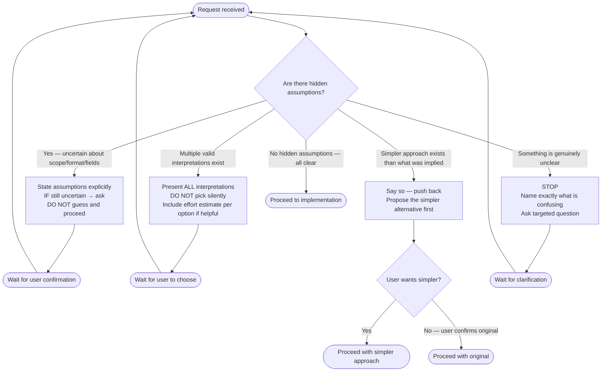

# Flowchart — Principle: Think Before Coding

> Generated by Reversa Archaeologist · 2026-05-15  
> Source: `skills/karpathy-guidelines/SKILL.md` lines 5–12

---

## Decision Procedure

---

## Anti-Patterns Detected (from EXAMPLES.md)

| Anti-Pattern | Example | Correct Behavior |
|-------------|---------|-----------------|
| Silent scope assumption | "Export all users" — assumes ALL users, ALL fields | Ask: filtered or all? which fields? |
| Silent format assumption | Assumes JSON when user says "export" | Ask: download, background job, or API? |
| Silent optimization choice | "Make search faster" → implements caching + async + indexes | Present 3 interpretations: latency vs. throughput vs. perceived UX |

---

## Rules Summary

| ID | Rule | Type |
|----|------|------|
| TBC-01 | State assumptions explicitly; if uncertain, ask | Obligation |
| TBC-02 | Present all interpretations; don't pick silently | Prohibition |
| TBC-03 | Push back when simpler approach exists | Recommendation |
| TBC-04 | If confused: stop, name the confusion, ask | Obligation |
