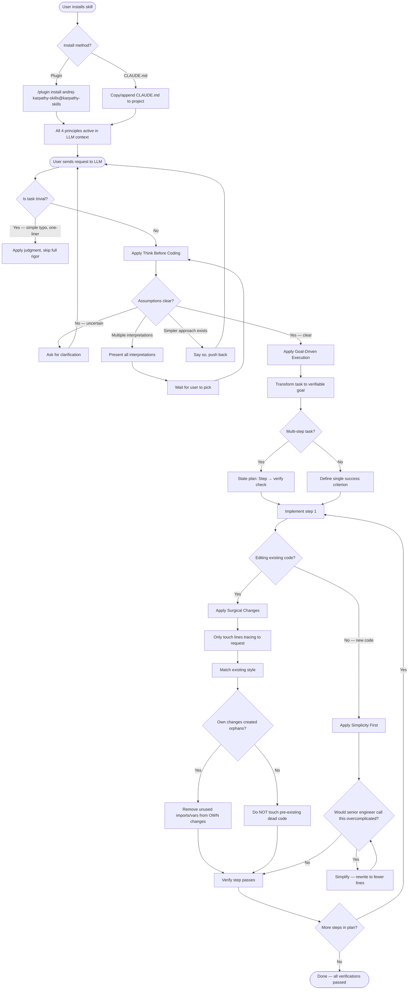

# Flowchart — Module: karpathy-guidelines

> Generated by Reversa Archaeologist · 2026-05-15

---

## Skill Activation & Execution Flow

This flowchart shows how the skill is activated and how its 4 principles interact at runtime.

---

## Notes

- 🟢 **CONFIRMADO** — All decision nodes derive directly from explicit rules in `SKILL.md`.
- 🟡 **INFERIDO** — The "trivial task" branch has no formal criteria; the LLM decides.
- The loop between `T → AC → AF → T` represents the Goal-Driven Execution loop.
- "Surgical Changes" and "Simplicity First" are not mutually exclusive but apply to different contexts (edit vs. new code).
