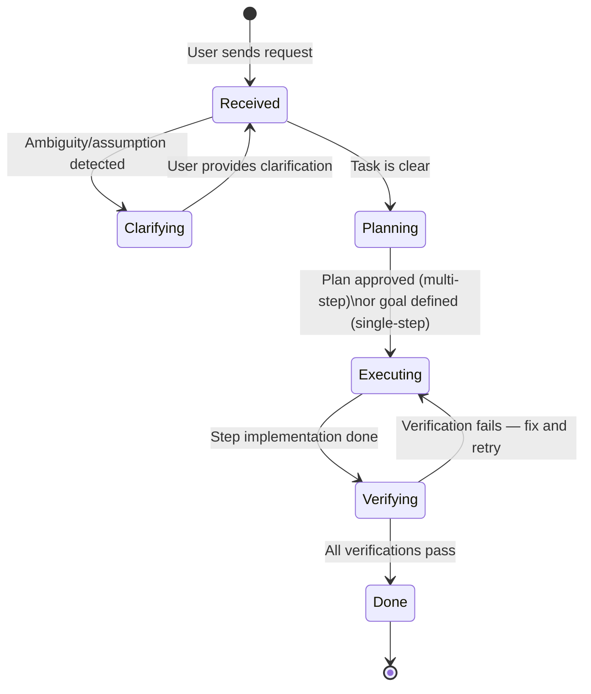

# State Machines — andrej-karpathy-skills

> Generated by Reversa Detective · 2026-05-15

---

## Assessment

🟢 **CONFIRMADO** — This project contains **no stateful entities**. There are no objects with a `status`, `state`, or lifecycle field. The skill is a static set of behavioral rules; it has no runtime that tracks state.

No state machine diagrams apply.

---

## Closest Analog: Guideline Application Lifecycle

🟡 **INFERIDO** — While not a state machine in the data model sense, the skill describes an implicit lifecycle for how a task is processed under the guidelines. This is a behavioral flow, not a persisted state.

**Note:** This lifecycle is not persisted anywhere. It exists only as the LLM's in-context reasoning process during a conversation turn. There is no database record, session object, or file that tracks which state a task is in.

---

## Conclusion

No state machine documentation is applicable to this project beyond the conceptual flow above. If the project evolves to include a CLI tool, skill registry, or version manager, state tracking would likely emerge.
