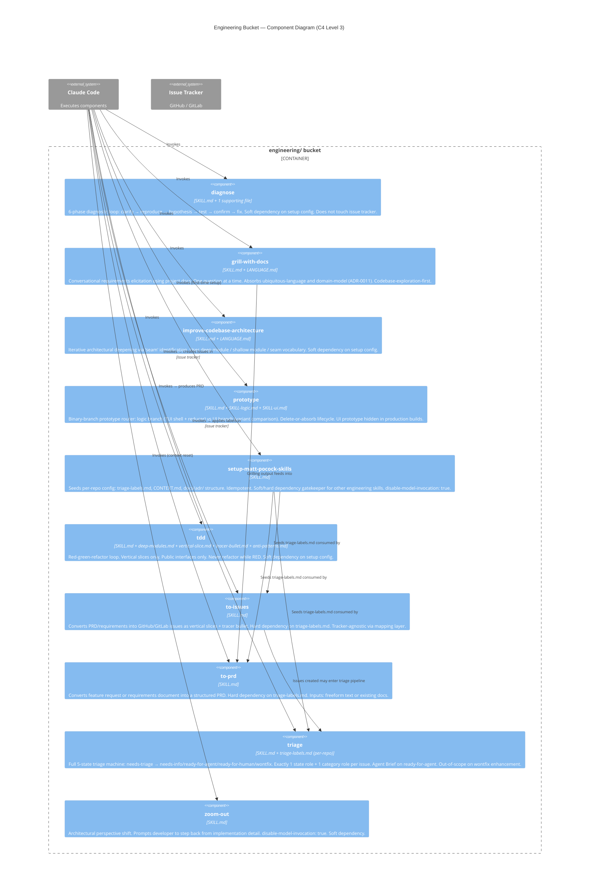
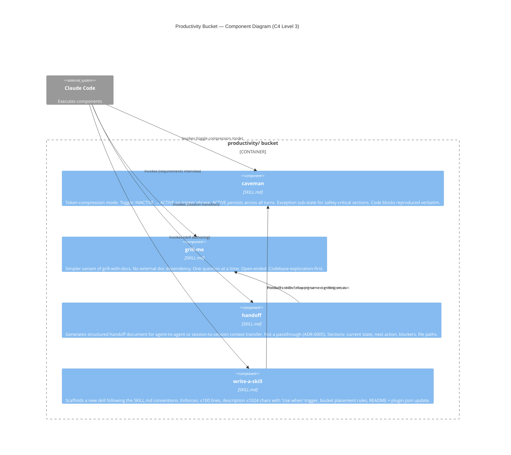
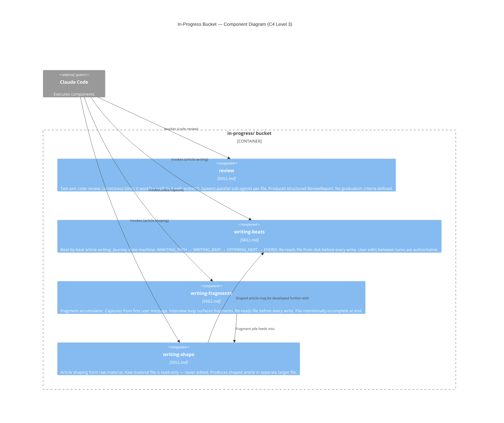

# C4 Components Diagram — skills

> Generated by Reversa Architect on 2026-05-15
> Level 3: Components inside the Active Skill Buckets container
> Confidence: 🟢 CONFIRMED

---

## Engineering Bucket Components

---

## Productivity Bucket Components

---

## In-Progress Bucket Components

---

## Key Component Interfaces

| Component | Input | Output | Side Effects |
|-----------|-------|--------|--------------|
| `triage` | GitHub/GitLab issue URL or issue content | Labels applied, comments posted | Writes .out-of-scope/ on wontfix |
| `to-issues` | PRD or requirements text | GitHub/GitLab issues created | Issues created in tracker |
| `to-prd` | Feature request / requirements | PRD Markdown document | None (no external writes) |
| `grill-with-docs` | User intent + project docs | Structured requirements | None (conversation only) |
| `tdd` | Feature spec | Test + implementation files | Modifies target repo files |
| `diagnose` | Bug description | Root cause analysis | None by default |
| `prototype` | Design question | TUI shell (logic) or UI variants | Creates throwaway files |
| `setup-matt-pocock-skills` | User preferences | Config files | Writes to target repo |
| `caveman` | Trigger phrase | Compressed responses | Changes agent output style |
| `handoff` | Current session state | Handoff.md document | Creates file |
| `review` | File paths | ReviewReport | None |
| `writing-fragments` | User messages | Fragment accumulation file | Writes/appends to file |
| `writing-beats` | Article path | Beat written to article | Appends to target file |
| `writing-shape` | Raw material + shaped target | Shaped article | Writes to target file |
