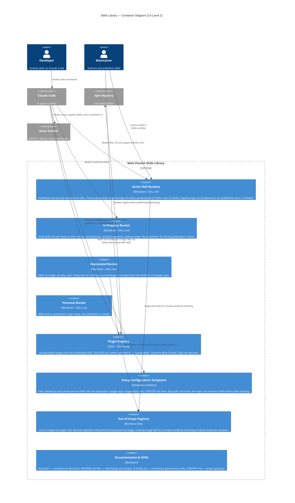

# C4 Containers Diagram — skills

> Generated by Reversa Architect on 2026-05-15
> Level 2: Internal structure of the Skills Library
> Confidence: 🟢 CONFIRMED (structure) | 🟡 INFERIDO (boundaries)

---

## Diagram

---

## Container Descriptions

### Active Skill Buckets
The core content of the library. Three publication tiers:
- **`engineering/`** (10 skills): code-work tools — diagnosis, TDD, triage, architecture, prototyping. Published in plugin.json.
- **`productivity/`** (4 skills): non-code workflow tools — caveman, grill-me, handoff, write-a-skill. Published in plugin.json.
- **`misc/`** (4 skills): kept but rarely used — git-guardrails, migrate-to-shoehorn, scaffold-exercises, setup-pre-commit. In repo but NOT in plugin.json.

### Plugin Registry
Two components:
- **`plugin.json`**: the machine-readable registry. Lists all published skills with their paths and descriptions.
- **`link-skills.sh`**: creates symlinks from `~/.claude/skills/<skill-name>/` to the actual skill folders. Excludes `deprecated/` explicitly (commit `494e4b2`).

### Setup Configuration Templates
Not stored in the skills library at rest — generated and written into the **developer's target repo** when `setup-matt-pocock-skills` is invoked. Contents vary by user choices (issue tracker type, domain vocabulary, label strings). Idempotent: will not overwrite existing config.

### Out-of-Scope Registry
🟢 Records rejected enhancement proposals as `.out-of-scope/<concept>.md` files. The `triage` skill reads these using concept-similarity matching (not keyword matching) before triaging a new issue. If a new issue conceptually duplicates a rejected enhancement, the skill flags it.

### Documentation & ADRs
Not executable — informational only. `CLAUDE.md` is the contributor governance document (rules for skill structure, publication, and README maintenance).

---

## Data Flows

| Flow | From | To | Trigger |
|------|------|----|---------| 
| Skill invocation | Claude Code | Active Skill Buckets | Developer slash command |
| Config seeding | Active Skill Buckets (setup skill) | Developer's Target Repo | First run of setup-matt-pocock-skills |
| Registry update | Maintainer | Plugin Registry | New skill published or deprecated |
| Issue creation | Claude Code | Issue Tracker | to-issues or to-prd skill invoked |
| Label application | Claude Code | Issue Tracker | triage skill state transition |
| Out-of-scope entry | Claude Code | Out-of-Scope Registry | triage closes enhancement as wontfix |
