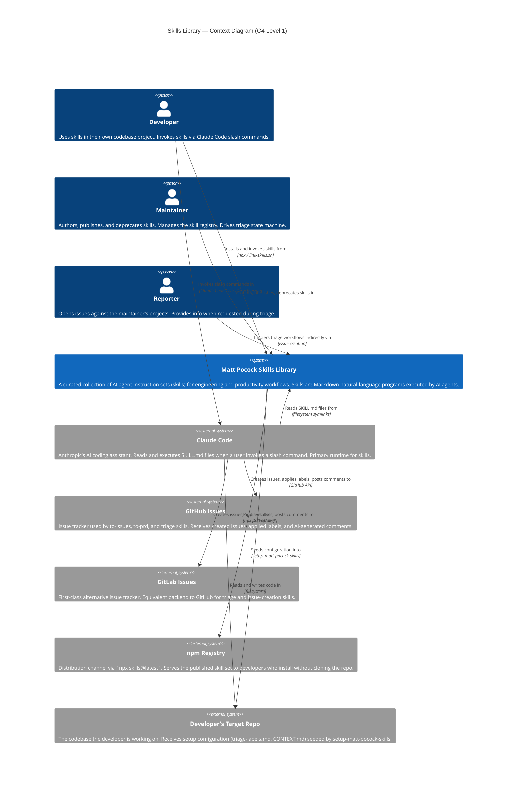

# C4 Context Diagram — skills

> Generated by Reversa Architect on 2026-05-15
> Level 1: System in its environment
> Confidence: 🟢 CONFIRMED

---

## Diagram

---

## Actor Descriptions

| Actor | Type | Role in system |
|-------|------|---------------|
| Developer | Human | End user; installs skills, invokes them during coding sessions |
| Maintainer | Human | Author and curator; defines skill behavior, drives triage state machine |
| Reporter | Human | External; opens issues that trigger triage workflows |
| Claude Code | External System | Primary AI agent runtime; executes skill instructions |
| GitHub Issues | External System | Hard-dependency issue tracker for to-issues, to-prd, triage |
| GitLab Issues | External System | Hard-dependency issue tracker (added in issue #98) |
| npm Registry | External System | Distribution channel for published skills |
| Developer's Target Repo | External System | Receives setup config seeded by setup-matt-pocock-skills |

---

## Key Relationships

🟢 **Claude Code → Skills Library**: symlinks from `~/.claude/skills/` to the skill folders created by `link-skills.sh`. On invocation, Claude Code reads the SKILL.md and supporting files.

🟢 **Skills Library → Target Repo**: `setup-matt-pocock-skills` writes per-repo config files (`triage-labels.md`, `CONTEXT.md` seed) into the developer's target repository, not into the skills library itself.

🟢 **Skills Library → npm Registry**: Published via `npx skills@latest`. Only `engineering/` and `productivity/` skills are published. `misc/`, `deprecated/`, and `personal/` are excluded.

🟡 **Local Markdown**: a third issue tracker backend exists (no external system dependency). The developer describes the workflow as prose; the skill adapts. Not shown separately to keep the diagram clean.
