# ERD Complete — skills

> Generated by Reversa Architect on 2026-05-15
> Entities extracted from data-dictionary.md, code-analysis.md, and skill content.
> Confidence scale: 🟢 CONFIRMED | 🟡 INFERIDO | 🔴 GAP

---

## Entity Relationship Diagram

```mermaid
erDiagram

    SKILL_STRUCTURE {
        string name PK "kebab-case skill name"
        string bucket "engineering | productivity | misc | in-progress | deprecated | personal"
        string skill_md_path "required - SKILL.md file path"
        boolean published "true if in plugin.json"
        boolean linked "true if in link-skills.sh"
        boolean disable_model_invocation "true for zoom-out, setup-matt-pocock-skills"
    }

    SKILL_METADATA {
        string name FK "matches SKILL_STRUCTURE.name"
        string description "≤1024 chars; must include 'Use when'"
        string license "MIT"
        string compatibility "agent runtimes supported"
        string author
        string version "no semantic versioning enforced"
        string phase "interpretacao | engineering | etc."
    }

    SUPPORTING_FILE {
        string skill_name FK "parent skill"
        string file_path "relative path within skill folder"
        string purpose "deep-modules | language | examples | etc."
    }

    ISSUE_SLICE {
        string id PK "issue tracker ID"
        string title
        string type "AFK | HITL | tracer-bullet"
        string tracker "github | gitlab | local-markdown"
        string slice_layer "schema | api | ui | test | all"
        boolean is_tracer_bullet
    }

    PRD_DOCUMENT {
        string id PK
        string title
        string status "draft | approved"
        string tracker_url
    }

    USER_STORY {
        string id PK
        string prd_id FK
        string role "As a [role]..."
        string want "I want [feature]..."
        string so_that "So that [benefit]..."
        string acceptance_criteria
    }

    AGENT_BRIEF {
        string issue_id FK "1:1 with Issue when state=ready-for-agent"
        string behavioral_spec "what the system should do (no procedural steps)"
        string acceptance_criteria
        string constraints "no file paths, no line numbers"
    }

    TRIAGE_STATE {
        string issue_id FK
        string state_role "needs-triage | needs-info | ready-for-agent | ready-for-human | wontfix"
        string category_role "bug | enhancement"
        string tracker_label_string "actual label in GitHub/GitLab"
    }

    TRIAGE_NOTES {
        string issue_id FK "1:1 with Issue when state=needs-info"
        string questions_asked "comma-separated list"
        string ai_generated_header "> *This was generated by AI during triage.*"
    }

    OUT_OF_SCOPE_ENTRY {
        string concept_slug PK "kebab-case concept name"
        string file_path "_out-of-scope/<concept>.md"
        string rationale
        string issue_ref "related issue number if available"
        string category "enhancement only - never bug"
    }

    KEY_INTERFACE {
        string component_name FK
        string interface_name "seam name"
        string type "deep | shallow"
        string leverage "high | medium | low"
    }

    DEPTH_ASSESSMENT {
        string component_name FK
        string current_depth "deep | medium | shallow"
        string target_depth
        string seams_identified "list of seam names"
    }

    PROTOTYPE_CONFIG {
        string prototype_id PK
        string type "logic | ui"
        string branch_decision "LOGIC_BRANCH | UI_BRANCH"
        string status "building | running | captured | deleted | promoted"
    }

    UI_PROTOTYPE_SWITCHER {
        string prototype_id FK
        string gate "NODE_ENV !== production"
        string route_path
        string variants "comma-separated variant names"
        string winner
    }

    HANDOFF_DOCUMENT {
        string session_id PK
        string current_state
        string next_action
        string blockers
        string open_questions
        string relevant_files "file paths + line numbers"
        string created_at
    }

    CAVEMAN_STATE {
        string session_id PK
        string mode "INACTIVE | ACTIVE"
        string sub_state "COMPRESSING | EXCEPTION"
        string trigger_phrase
    }

    FRAGMENT_FILE {
        string file_path PK "target article file"
        string h1_title
        string fragments_count
        string created_at
    }

    FRAGMENT {
        string id PK
        string file_path FK
        string content "any piece: claim, vignette, sentence, half-thought"
        string captured_at
        boolean survived "may not survive to final article"
    }

    BEAT {
        string id PK
        string article_path FK
        string content "one sentence to multiple paragraphs"
        string position "ordinal in article"
        string candidates_offered "2-3 candidates user chose from"
    }

    REVIEW_REPORT {
        string session_id PK
        string files_reviewed
        string correctness_findings "axis 1: does it work?"
        string craft_findings "axis 2: is it well-written?"
        string critical_count
        string suggested_count
        string confidence "🟢|🟡|🔴"
    }

    HOOKS_CONFIG {
        string repo_path PK
        string lint_staged_config "file patterns + commands"
        string husky_version
        string prettier_config_exists "boolean"
    }

    EXERCISE_STRUCTURE {
        string exercise_id PK
        string parent_repo
        string description_file "DESCRIPTION.md"
        string solution_dir "solution/"
        string test_file "*.test.*"
        string lint_config "ESLint config path"
    }

    SHOEHORN_API {
        string method_name PK "fromPartial | fromAny | fromExact"
        string input_type
        string output_type
        string usage_scope "test-only - never production"
    }

    %% Relationships

    SKILL_STRUCTURE ||--|| SKILL_METADATA : "has metadata"
    SKILL_STRUCTURE ||--o{ SUPPORTING_FILE : "has supporting files"
    SKILL_STRUCTURE }o--|| OUT_OF_SCOPE_ENTRY : "deprecation of enhancement may create"

    PRD_DOCUMENT ||--o{ USER_STORY : "contains"
    PRD_DOCUMENT ||--o{ ISSUE_SLICE : "broken into"

    ISSUE_SLICE ||--o| AGENT_BRIEF : "has (when ready-for-agent)"
    ISSUE_SLICE ||--o| TRIAGE_NOTES : "has (when needs-info)"
    ISSUE_SLICE ||--|| TRIAGE_STATE : "has exactly one state"

    PROTOTYPE_CONFIG ||--o| UI_PROTOTYPE_SWITCHER : "has (if type=ui)"

    FRAGMENT_FILE ||--o{ FRAGMENT : "accumulates"
    FRAGMENT_FILE ||--o{ BEAT : "developed via"

    KEY_INTERFACE }o--|| DEPTH_ASSESSMENT : "assessed in"
```

---

## Entity Notes

| Entity | Confidence | Notes |
|--------|-----------|-------|
| `SKILL_STRUCTURE` | 🟢 | Core entity; every skill is an instance |
| `SKILL_METADATA` | 🟢 | Extracted from SKILL.md frontmatter |
| `SUPPORTING_FILE` | 🟢 | Optional per-skill; varies 0-4 per skill |
| `ISSUE_SLICE` | 🟢 | Created by to-issues; AFK vs HITL types |
| `PRD_DOCUMENT` | 🟢 | Created by to-prd |
| `USER_STORY` | 🟡 | to-prd may produce these; format varies |
| `AGENT_BRIEF` | 🟢 | Mandatory side effect of triage → ready-for-agent |
| `TRIAGE_STATE` | 🟢 | Exactly 1 per issue; invariant enforced by triage skill |
| `TRIAGE_NOTES` | 🟢 | Side effect of triage → needs-info |
| `OUT_OF_SCOPE_ENTRY` | 🟢 | Enhancement rejections only; concept-similarity matched |
| `KEY_INTERFACE` | 🟡 | From improve-codebase-architecture; seam identification |
| `DEPTH_ASSESSMENT` | 🟡 | From improve-codebase-architecture; deep module analysis |
| `PROTOTYPE_CONFIG` | 🟢 | Created by prototype skill |
| `UI_PROTOTYPE_SWITCHER` | 🟢 | NODE_ENV gate; UI branch only |
| `HANDOFF_DOCUMENT` | 🟢 | Created by handoff skill |
| `CAVEMAN_STATE` | 🟢 | Per-session toggle |
| `FRAGMENT_FILE` | 🟢 | Created by writing-fragments |
| `FRAGMENT` | 🟢 | Accumulated by writing-fragments |
| `BEAT` | 🟡 | Produced by writing-beats; loosely defined |
| `REVIEW_REPORT` | 🟡 | In-progress skill; format may evolve |
| `HOOKS_CONFIG` | 🟢 | Created by setup-pre-commit |
| `EXERCISE_STRUCTURE` | 🟢 | Created by scaffold-exercises |
| `SHOEHORN_API` | 🟢 | Test-only constraint; never production |

---

## Cardinality Summary

| Relationship | Cardinality | Constraint |
|-------------|-------------|-----------|
| Skill → SKILL.md | 1:1 | SKILL.md is mandatory |
| Skill → Supporting files | 1:0..N | Optional; max ~4 observed |
| PRD → User Stories | 1:N | to-prd produces multiple |
| PRD → Issue Slices | 1:N | to-issues creates many from one PRD |
| Issue → Triage State | 1:1 | Exactly one state role + one category role |
| Issue → Agent Brief | 1:0..1 | Only when state = ready-for-agent |
| Issue → Triage Notes | 1:0..1 | Only when state = needs-info |
| Fragment File → Fragments | 1:N | Grows during session |
