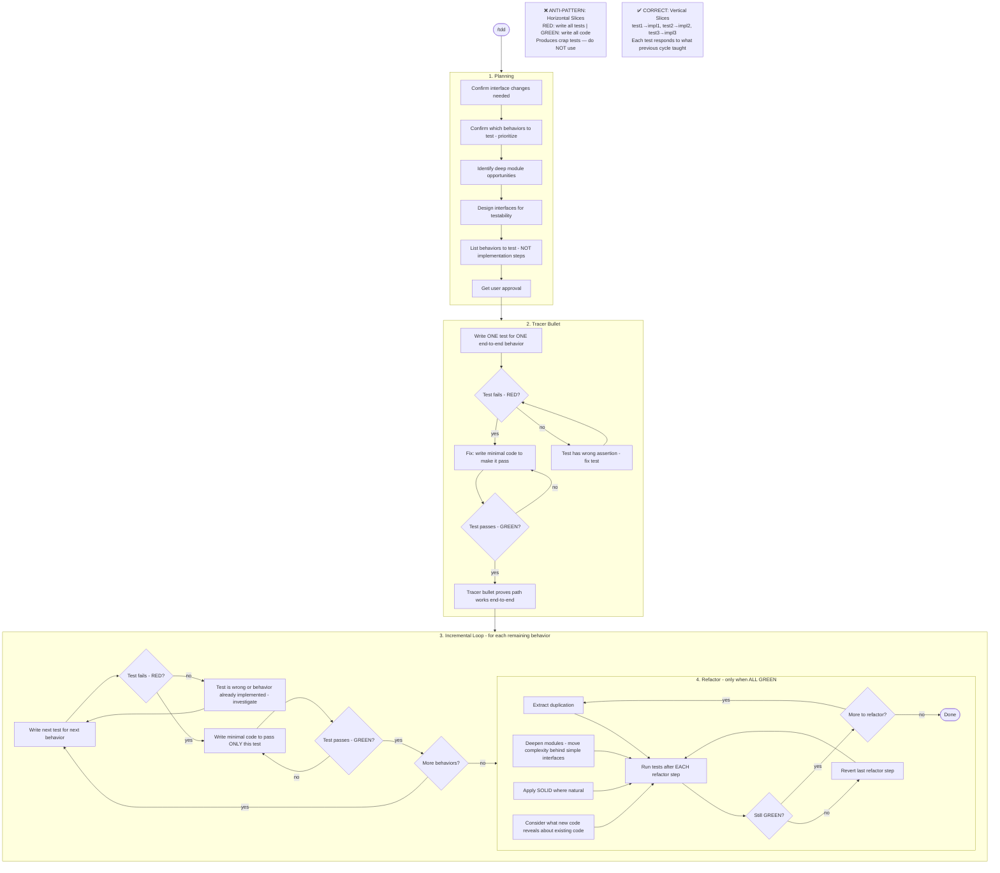

# Flowchart — engineering / tdd: vertical-slice cycle

> Generated by Reversa Archaeologist on 2026-05-15 | doc_level: detalhado

```mermaid
flowchart TD
    START([/tdd]) --> PLAN

    subgraph PLAN["1. Planning"]
        P1[Confirm interface changes needed]
        P2[Confirm which behaviors to test - prioritize]
        P3[Identify deep module opportunities]
        P4[Design interfaces for testability]
        P5[List behaviors to test - NOT implementation steps]
        P6[Get user approval]
        P1 --> P2 --> P3 --> P4 --> P5 --> P6
    end

    P6 --> TRACER

    subgraph TRACER["2. Tracer Bullet"]
        T1[Write ONE test for ONE end-to-end behavior]
        T2{Test fails - RED?}
        T3[Fix: write minimal code to make it pass]
        T4{Test passes - GREEN?}
        T1 --> T2
        T2 -- no --> WRONG_TEST[Test has wrong assertion - fix test]
        WRONG_TEST --> T2
        T2 -- yes --> T3
        T3 --> T4
        T4 -- no --> T3
        T4 -- yes --> TRACER_DONE[Tracer bullet proves path works end-to-end]
    end

    TRACER_DONE --> LOOP

    subgraph LOOP["3. Incremental Loop - for each remaining behavior"]
        L1[Write next test for next behavior]
        L2{Test fails - RED?}
        L3[Write minimal code to pass ONLY this test]
        L4{Test passes - GREEN?}
        L5{More behaviors?}
        L1 --> L2
        L2 -- no --> BAD_TEST[Test is wrong or behavior already implemented - investigate]
        BAD_TEST --> L1
        L2 -- yes --> L3
        L3 --> L4
        L4 -- no --> L3
        L4 -- yes --> L5
        L5 -- yes --> L1
        L5 -- no --> REFACTOR
    end

    subgraph REFACTOR["4. Refactor - only when ALL GREEN"]
        R1[Extract duplication]
        R2[Deepen modules - move complexity behind simple interfaces]
        R3[Apply SOLID where natural]
        R4[Consider what new code reveals about existing code]
        R5[Run tests after EACH refactor step]
        R6{Still GREEN?}
        R1 --> R5
        R2 --> R5
        R3 --> R5
        R4 --> R5
        R5 --> R6
        R6 -- no --> REVERT[Revert last refactor step]
        REVERT --> R5
        R6 -- yes --> MORE_REFACTOR{More to refactor?}
        MORE_REFACTOR -- yes --> R1
        MORE_REFACTOR -- no --> DONE([Done])
    end

    ANTI_PATTERN["❌ ANTI-PATTERN: Horizontal Slices\nRED: write all tests | GREEN: write all code\nProduces crap tests — do NOT use"]
    GOOD_PATTERN["✅ CORRECT: Vertical Slices\ntest1→impl1, test2→impl2, test3→impl3\nEach test responds to what previous cycle taught"]
```
