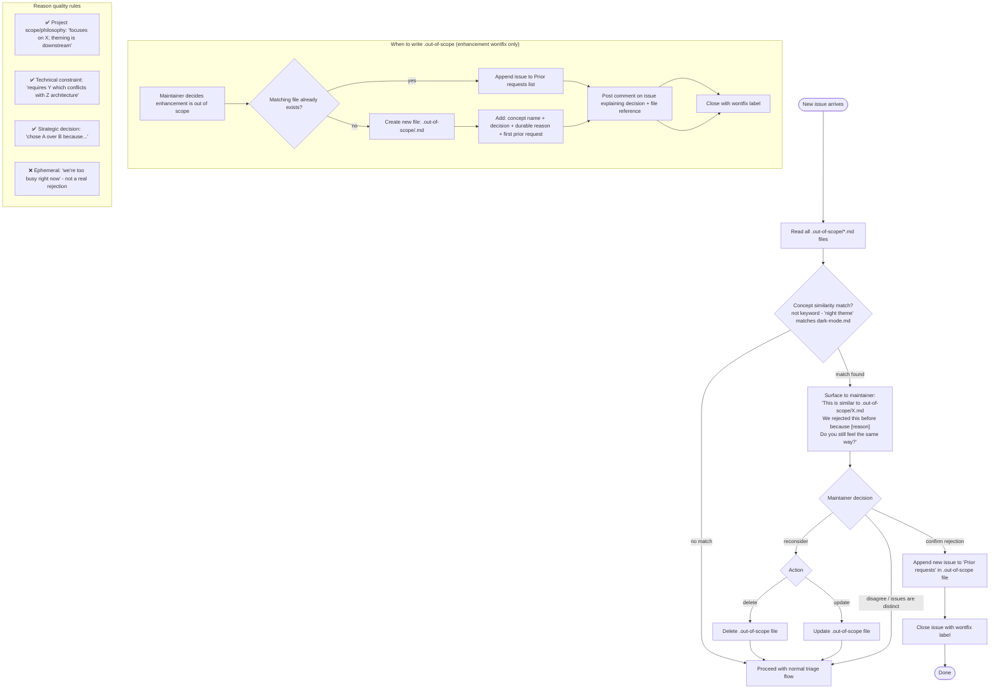

# Flowchart — engineering / triage: .out-of-scope matching algorithm

> Generated by Reversa Archaeologist on 2026-05-15 | doc_level: detalhado

```mermaid
flowchart TD
    START([New issue arrives]) --> READ_OOS[Read all .out-of-scope/*.md files]
    READ_OOS --> MATCH{Concept similarity match?\nnot keyword - 'night theme' matches dark-mode.md}
    
    MATCH -- no match --> NORMAL_TRIAGE[Proceed with normal triage flow]
    
    MATCH -- match found --> SURFACE["Surface to maintainer:\n'This is similar to .out-of-scope/X.md\nWe rejected this before because [reason]\nDo you still feel the same way?'"]
    
    SURFACE --> DECISION{Maintainer decision}
    
    DECISION -- confirm rejection --> APPEND[Append new issue to 'Prior requests' in .out-of-scope file]
    APPEND --> CLOSE[Close issue with wontfix label]
    CLOSE --> DONE([Done])
    
    DECISION -- reconsider --> HANDLE_RECONSIDER{Action}
    HANDLE_RECONSIDER -- delete --> DELETE_OOS[Delete .out-of-scope file]
    HANDLE_RECONSIDER -- update --> UPDATE_OOS[Update .out-of-scope file]
    DELETE_OOS & UPDATE_OOS --> NORMAL_TRIAGE
    
    DECISION -- disagree / issues are distinct --> NORMAL_TRIAGE

    subgraph WRITE_OOS["When to write .out-of-scope (enhancement wontfix only)"]
        W1[Maintainer decides enhancement is out of scope]
        W2{Matching file already exists?}
        W3[Append issue to Prior requests list]
        W4["Create new file: .out-of-scope/<concept>.md"]
        W5[Add: concept name + decision + durable reason + first prior request]
        W6[Post comment on issue explaining decision + file reference]
        W7[Close with wontfix label]
        W1 --> W2
        W2 -- yes --> W3 --> W6 --> W7
        W2 -- no --> W4 --> W5 --> W6 --> W7
    end

    subgraph REASON_QUALITY["Reason quality rules"]
        RQ1["✅ Project scope/philosophy: 'focuses on X; theming is downstream'"]
        RQ2["✅ Technical constraint: 'requires Y which conflicts with Z architecture'"]
        RQ3["✅ Strategic decision: 'chose A over B because...'"]
        RQ4["❌ Ephemeral: 'we're too busy right now' - not a real rejection"]
    end
```
