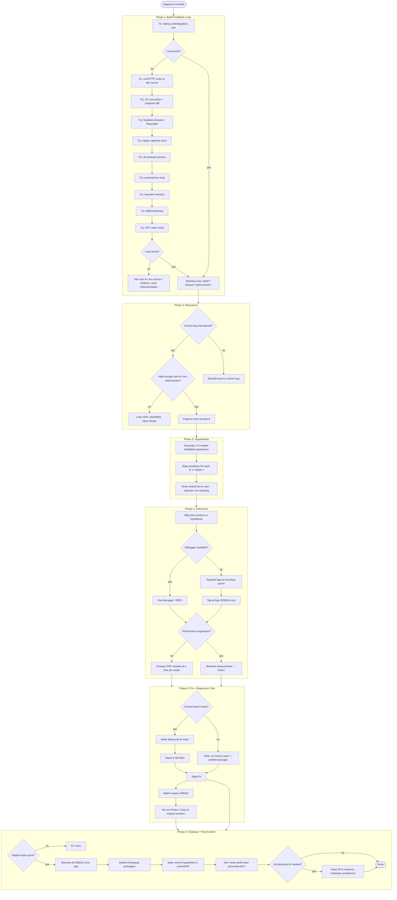
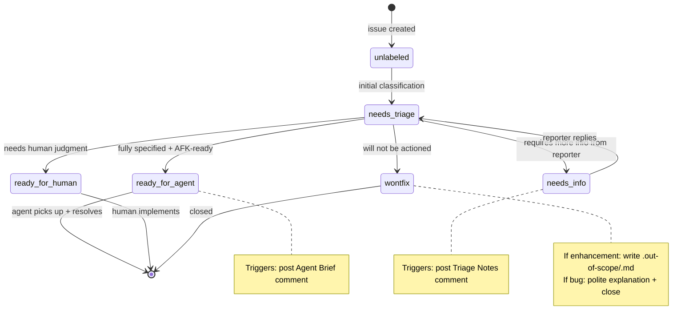
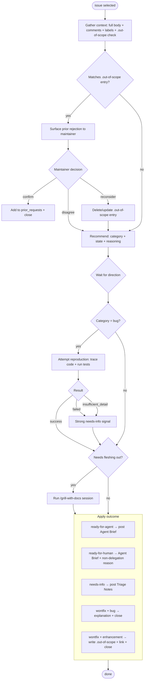
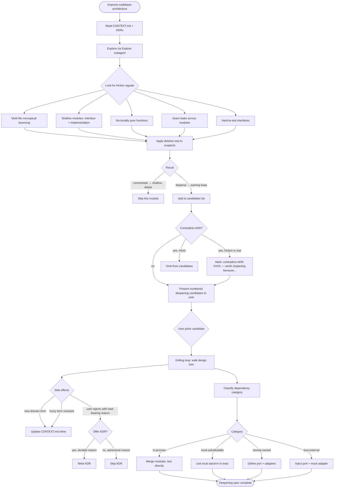
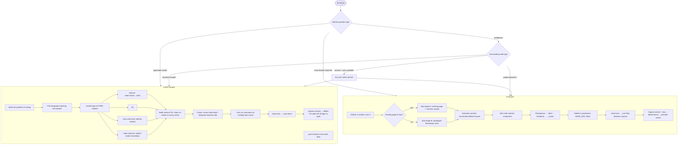
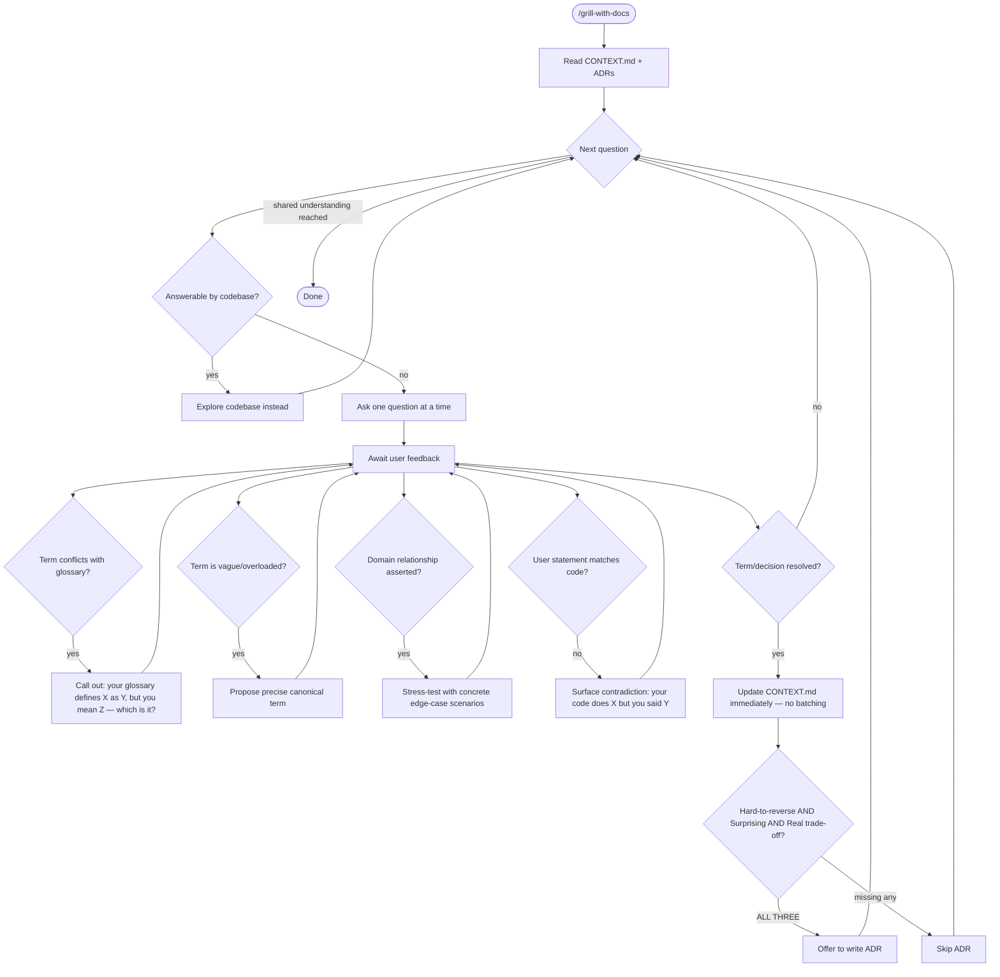

# Flowcharts — engineering module

> Generated by Reversa Archaeologist on 2026-05-15 | doc_level: detalhado

---

## diagnose — 6-phase state machine

---

## triage — issue state machine

---

## triage — per-issue processing flow

---

## improve-codebase-architecture — deepening workflow

---

## prototype — branch router

---

## grill-with-docs — interview + inline doc update

