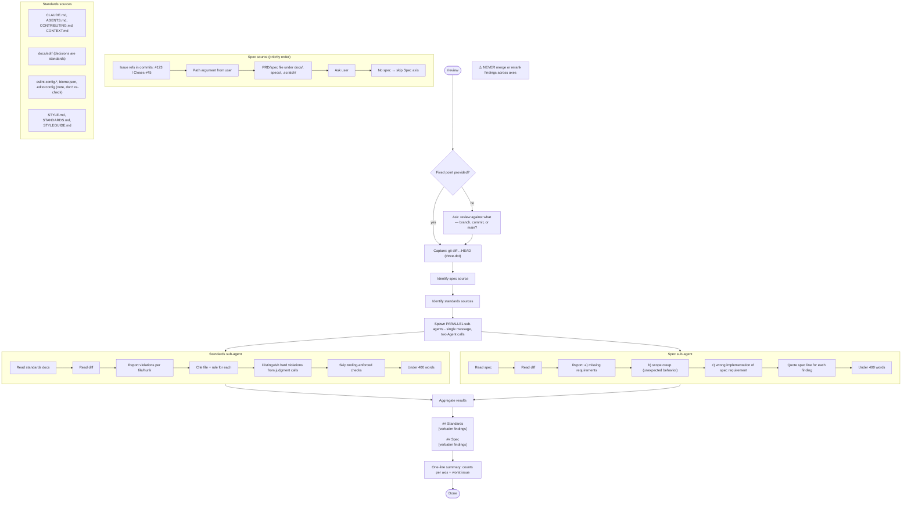
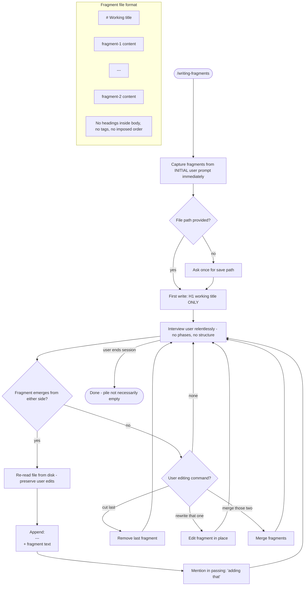
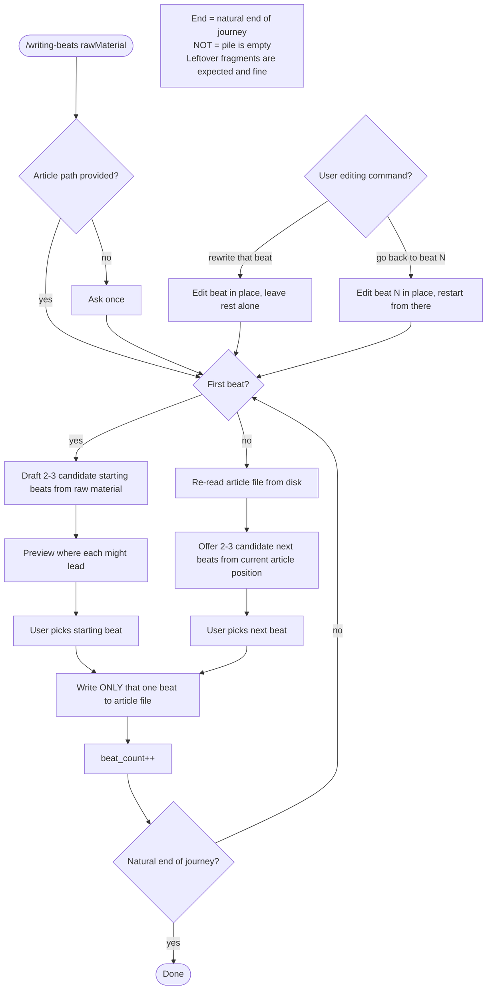
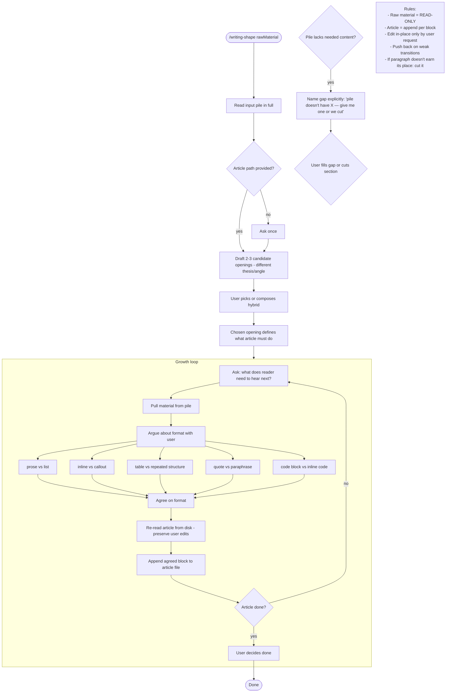

# Flowcharts — in-progress module

> Generated by Reversa Archaeologist on 2026-05-15 | doc_level: detalhado
> 🟡 INFERRED: skills are under active development; behavior may change.

---

## review — two-axis parallel review

---

## writing-fragments — fragment accumulator

---

## writing-beats — beat-by-beat journey

---

## writing-shape — article shaping

