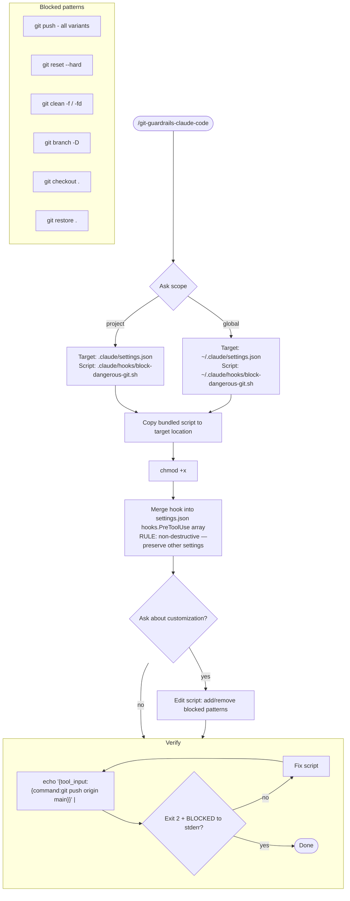
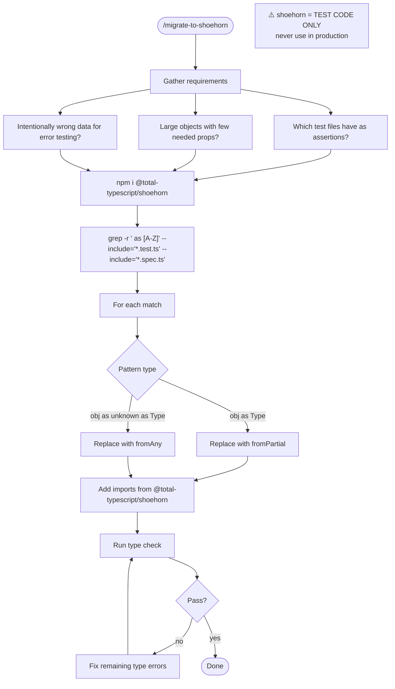
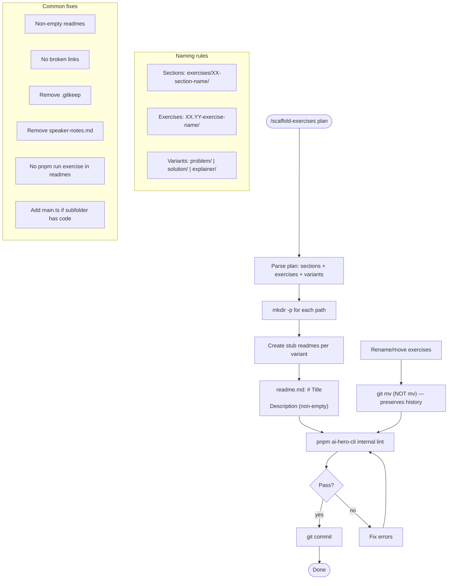

# Flowcharts — misc module

> Generated by Reversa Archaeologist on 2026-05-15 | doc_level: detalhado

---

## git-guardrails-claude-code — hook setup



---

## migrate-to-shoehorn — migration workflow



---

## scaffold-exercises — directory creation + lint loop



---

## setup-pre-commit — detection + installation

```mermaid
flowchart TD
    START([/setup-pre-commit]) --> DETECT{Detect package manager}
    DETECT -- package-lock.json --> NPM[npm]
    DETECT -- pnpm-lock.yaml --> PNPM[pnpm]
    DETECT -- yarn.lock --> YARN[yarn]
    DETECT -- bun.lockb --> BUN[bun]
    DETECT -- none --> NPM

    NPM & PNPM & YARN & BUN --> INSTALL[Install devDeps: husky lint-staged prettier]
    INSTALL --> HUSKY_INIT[npx husky init]
    HUSKY_INIT --> PRECOMMIT[Create .husky/pre-commit]

    subgraph PRECOMMIT_CONTENT["pre-commit content"]
        PC1[npx lint-staged]
        PC2{typecheck script exists?}
        PC3[pm run typecheck]
        PC2 -- yes --> PC3
        PC4{test script exists?}
        PC5[pm run test]
        PC4 -- yes --> PC5
        PC2 -- no --> SKIP_TC[omit + tell user]
        PC4 -- no --> SKIP_T[omit + tell user]
    end

    PRECOMMIT --> LINTSTAGED[Create .lintstagedrc]
    LINTSTAGED --> LINTSTAGED_CONTENT["{\"*\": \"prettier --ignore-unknown --write\"}"]

    LINTSTAGED_CONTENT --> PRETTIER_CHK{Prettier config exists?}
    PRETTIER_CHK -- yes --> SKIP_P[Skip - idempotent]
    PRETTIER_CHK -- no --> CREATE_P[Create .prettierrc with defaults]

    SKIP_P & CREATE_P --> VERIFY[Verify checklist]
    
    subgraph VERIFY_SUB["Verify"]
        V1[.husky/pre-commit exists + executable]
        V2[.lintstagedrc exists]
        V3[package.json prepare = husky]
        V4[prettier config exists]
        V5[npx lint-staged runs without error]
    end

    VERIFY --> COMMIT[Stage + commit all changes]
    COMMIT --> SMOKE[Commit runs through new hooks = smoke test]
    SMOKE --> DONE([Done])
```
