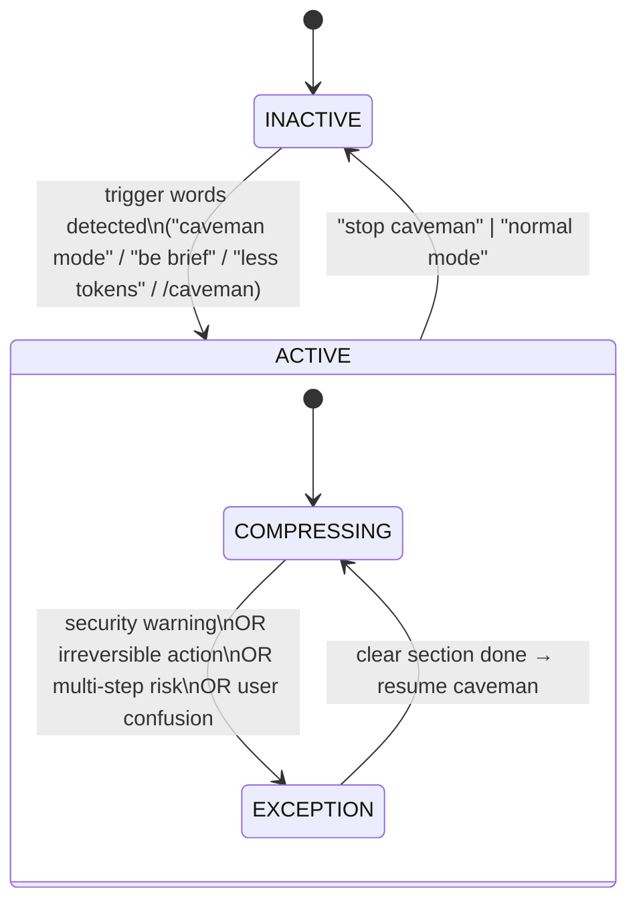
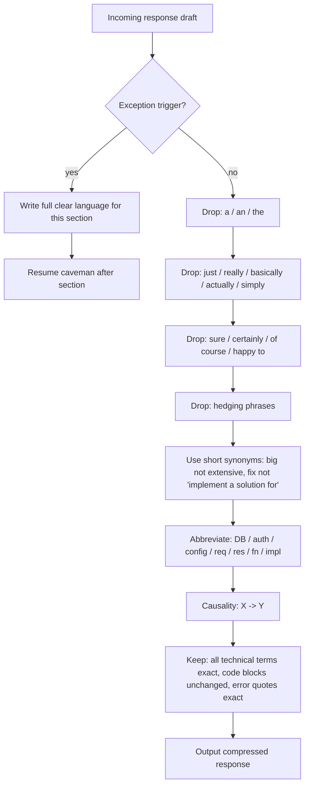
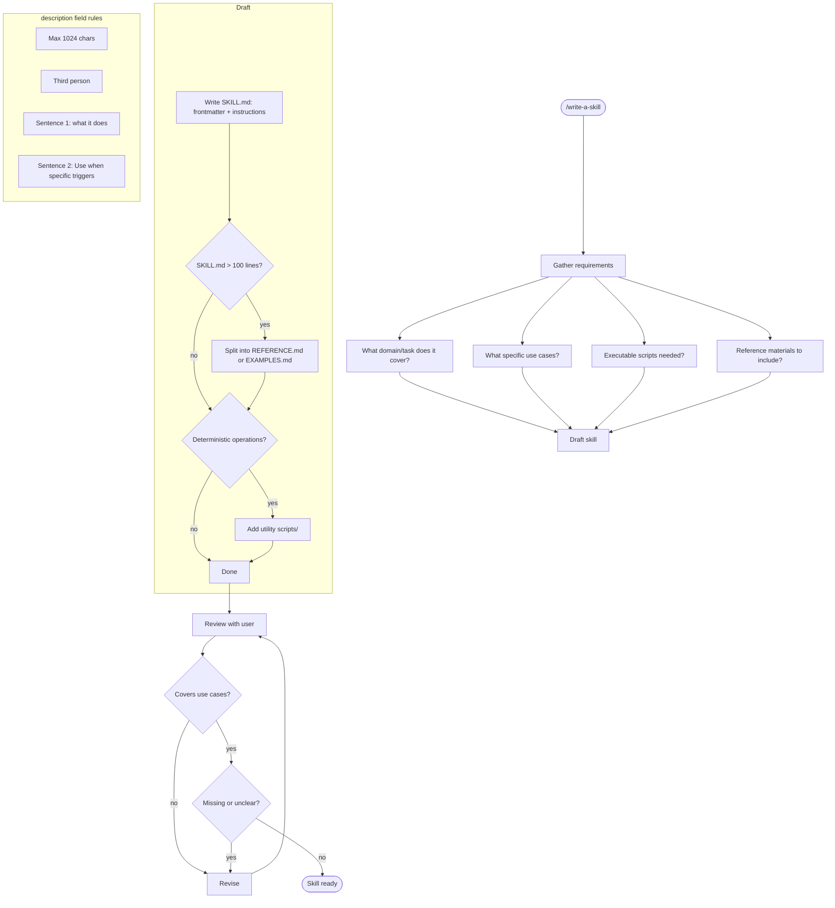
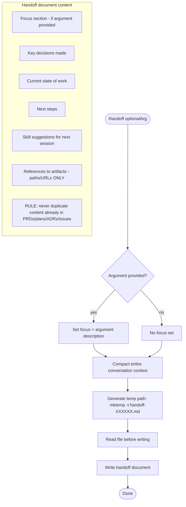

# Flowcharts — productivity module

> Generated by Reversa Archaeologist on 2026-05-15 | doc_level: detalhado

---

## caveman — toggle state machine

---

## caveman — message transformation rules

---

## write-a-skill — scaffold loop

---

## handoff — document generation

