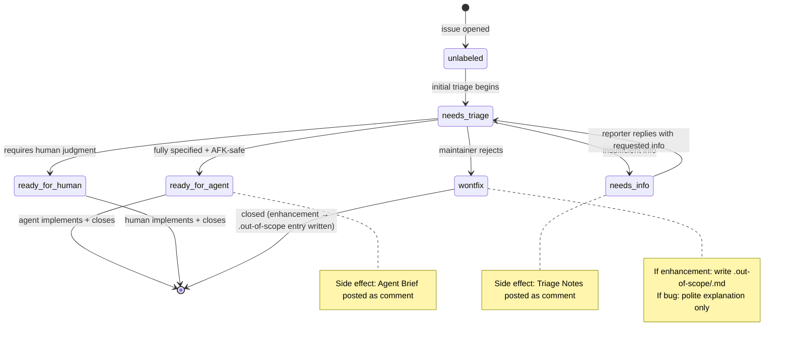
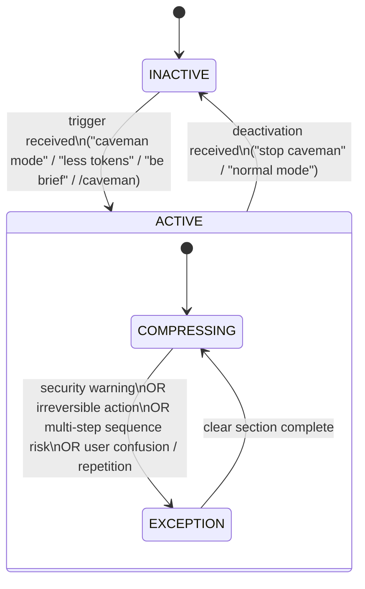
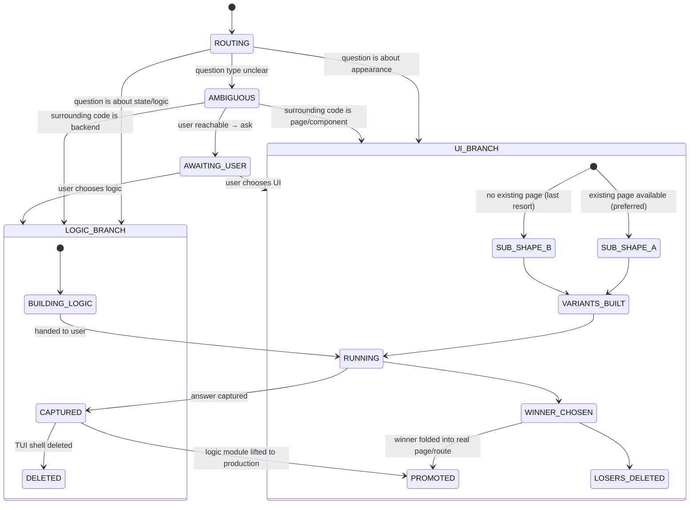
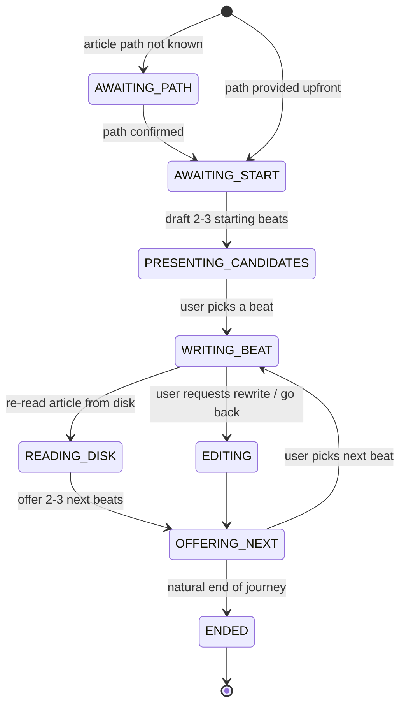
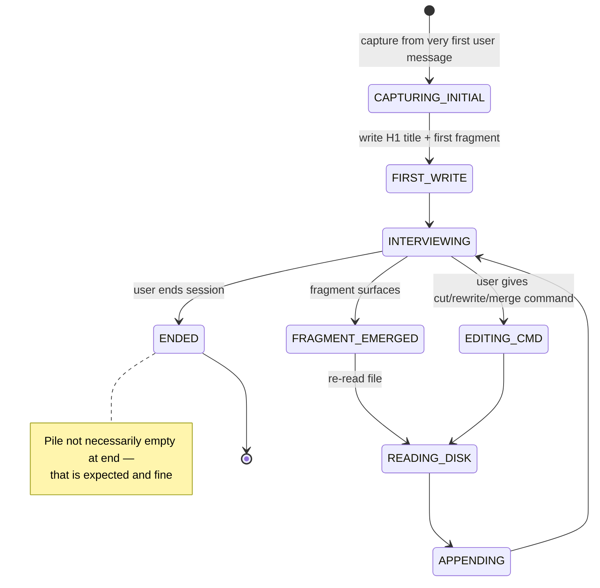
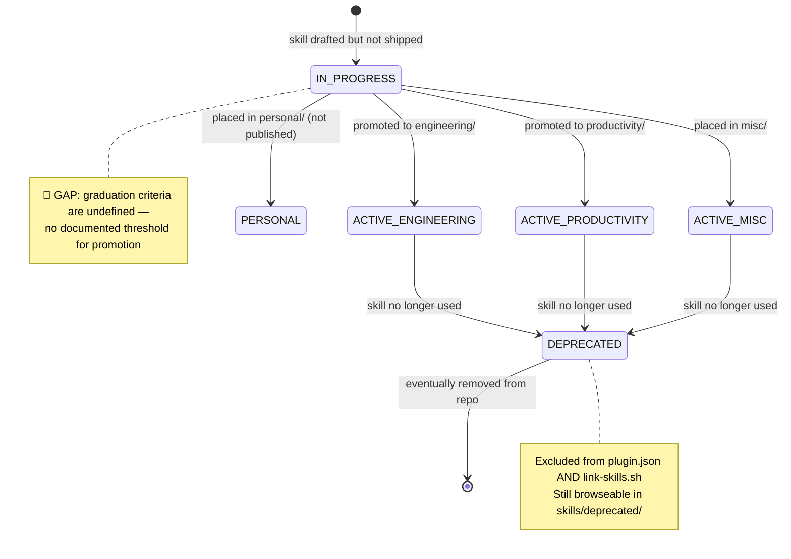

# State Machines — skills

> Generated by Reversa Detective on 2026-05-15
> Confidence scale: 🟢 CONFIRMED | 🟡 INFERIDO | 🔴 GAP

---

## 1. Issue Triage State Machine

🟢 CONFIRMED — defined explicitly in `skills/engineering/triage/SKILL.md`

### State roles (one active per issue at all times)

| State | Meaning | Trigger |
|-------|---------|---------|
| `needs-triage` | Maintainer needs to evaluate | Default on any new unlabeled issue |
| `needs-info` | Waiting on reporter | Maintainer decides issue is under-specified |
| `ready-for-agent` | Fully specified; AFK agent can pick up | Grilling complete; agent brief posted |
| `ready-for-human` | Needs human (judgment call, external access) | Maintainer decides it cannot be delegated |
| `wontfix` | Will not be actioned | Maintainer rejects |

### Category roles (one active per issue at all times)

| Category | Meaning |
|---------|---------|
| `bug` | Something is broken |
| `enhancement` | New feature or improvement |

### Transition diagram

### Invariants
- A triaged issue carries **exactly 1 state role** + **exactly 1 category role** at all times.
- Maintainer may override to any state at any time.
- Conflicting state roles: flag and ask maintainer before acting.
- All AI-generated comments must open with `> *This was generated by AI during triage.*`

---

## 2. Caveman Communication Mode State Machine

🟢 CONFIRMED — defined in `skills/productivity/caveman/SKILL.md`

### Invariants
- ACTIVE persists across **all** turns once triggered — never auto-deactivates.
- Exception sub-state is temporary; COMPRESSING resumes immediately after.
- Code blocks and exact error quotes are always reproduced verbatim regardless of state.

---

## 3. Prototype Branch State Machine

🟢 CONFIRMED — defined in `skills/engineering/prototype/SKILL.md`

---

## 4. Writing Session States

🟡 INFERRED — from `writing-beats`, `writing-fragments`, `writing-shape` SKILL.md files

### writing-beats journey state

### writing-fragments accumulation state

---

## 5. Skill Lifecycle State Machine

🟡 INFERRED — from CLAUDE.md rules + git history patterns

### Known deprecations (from git history)

| Skill | Replaced by | Commit |
|-------|------------|--------|
| `ubiquitous-language` | `grill-with-docs` (absorbed functionality) | `62f43a1` Apr 28 2026 |
| `triage-issue` | `triage` (full state-machine approach) | `a32ebfb` Apr 28 2026 |
| `github-triage` | `triage` (renamed + abstracted) | `7afa86d` Apr 28 2026 |
| `domain-model` | Merged into `grill-with-docs` | `62f43a1` Apr 28 2026 |
| `qa` | No direct successor (interactive bug filing) | `62f43a1` Apr 28 2026 |
| `request-refactor-plan` | No direct successor | `62f43a1` Apr 28 2026 |
| `prd-to-plan` | Removed entirely | `a77fa6e` |
| `design-an-interface` | `prototype` (UI branch) | `62f43a1` Apr 28 2026 |
