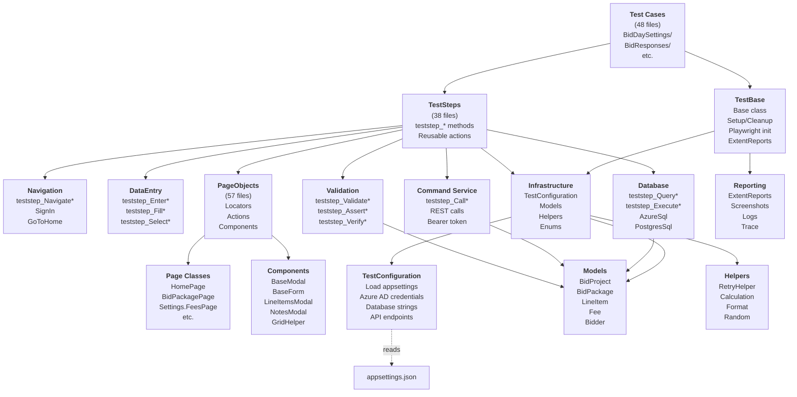

# C4 Model: Component Diagram — DESTINI.BidDay.UI.Tests.Playwright

**Nível:** 3 — Component (Test Execution Layer)  
**Data:** 2026-05-20  
**Confiança:** 🟢 CONFIRMADO

---

## 📐 Diagrama



---

## 🔧 Componentes Detalhados

### 1. Test Cases (48 files)

**Organização por Feature:**

```
TestCases/
├── Bidders/
│   └── Bidders.cs
│       ├── AddBidderModal_RequiredFields()
│       └── ...
├── BidDaySettings/
│   ├── AdminBidPackages.cs
│   ├── AdminFees.cs
│   ├── GeneralConditions.cs
│   ├── GeneralRequirements.cs
│   ├── Directory.cs
│   ├── Preferences.cs
│   ├── UnitsOfMeasure.cs
│   └── UserPermissions.cs
├── BidResponses/
│   ├── LineItems.cs
│   ├── Adjustments.cs
│   ├── AlternateLineItems.cs
│   ├── GeneralRequirements.cs
│   ├── TradeRequirements.cs
│   └── RollUps.cs
├── BidPackageNotes/
│   └── BidPackageNotes.cs
├── BidSummaryPageEdits/
│   └── BidSummaryPageEdits.cs
├── EnvironmentSetup/
│   ├── EnvironmentSetup.cs
│   ├── ResyncBidDaySystemSettings.cs
│   └── RunDatabaseMigration.cs
├── EventFallbacks/
│   ├── BidDayApplicationEntities.cs
│   ├── FrozenEntities.cs
│   └── QueryDbSync.cs
├── LineItems/
│   └── LineItems.cs
└── UserPermissionsMatrix/
    └── UserPermissionsMatrix.cs
```

**Example Test Case Structure:**

```csharp
[TestFixture]
public class LineItems : TestBase
{
    [Test]
    [Parallelizable]
    [FunctionalArea("BidResponses")]
    [RunGroup("LineItems")]
    public async Task LineItems_AddLineItem_CalculatesExtendedAmount()
    {
        // Setup
        var project = await teststep.teststep_CreateProject();
        var bidder = await teststep.teststep_AddBidder(project.ProjectId);
        
        // Action
        var lineItem = new LineItem 
        { 
            Quantity = 150, 
            UnitPrice = 125.50m 
        };
        await teststep.teststep_AddLineItem(project.Id, lineItem);
        
        // Assert
        var extended = await teststep.teststep_QueryLineItemExtended(lineItem.Id);
        extended.Should().Be(150 * 125.50m);
    }
}
```

---

### 2. TestBase

**Responsabilidade:** Initialization, setup, cleanup, reporting

**Métodos principais:**

```csharp
public class TestBase
{
    // Setup
    [SetUp]
    public async Task BaseSetup()
    {
        // Load configuration
        _config = new TestConfiguration();
        
        // Initialize Playwright
        var options = new BrowserLaunchOptions { Headless = true };
        _browser = await Playwright.Chromium.LaunchAsync(options);
        
        // Create context (multi-tenant)
        _context = await _browser.NewContextAsync();
        _page = await _context.NewPageAsync();
        
        // Initialize ExtentReports
        _extent = new ExtentReports();
        _test = _extent.CreateTest(TestContext.CurrentContext.Test.MethodName);
        
        // Initialize TestSteps
        _teststep = new TestStep(_config, _testUser, _page);
    }
    
    // Cleanup
    [TearDown]
    public async Task BaseCleanup()
    {
        if (_test.Status == Status.Fail)
        {
            var screenshot = await _page.ScreenshotAsync();
            _test.AddScreenCaptureFromPath(screenshot);
        }
        
        await _browser.CloseAsync();
        _extent.Flush();
    }
}
```

---

### 3. TestStep Classes (38 files)

**Main file:** TestStep.cs

```csharp
public partial class TestStep
{
    private readonly TestConfiguration _config;
    private readonly TestUser _testUser;
    private readonly IPage _page;
    private readonly AzureSql _azureSql;
    private readonly PostgresSql _postgreSql;
    
    public TestStep(TestConfiguration config, TestUser testUser, IPage page)
    {
        _config = config;
        _testUser = testUser;
        _page = page;
        _azureSql = new AzureSql(_config.AzureSqlConnectionString);
        _postgreSql = new PostgresSql(_config.PostgresConnectionString);
    }
}
```

**Partial files (by feature):**

| File | Methods | Responsibility |
|------|---------|-----------------|
| TestStep.cs | Main constructor | Base definition |
| TestStep.Navigation.cs | teststep_Navigate* | Navigate between pages |
| TestStep.BidPackages.cs | teststep_*BidPackage* | Bid package operations |
| TestStep.BidResponses.cs | teststep_*Response* | Response entry |
| TestStep.Database.cs | teststep_Query*, teststep_Execute* | SQL queries/execution |
| TestStep.Database.CommandService.cs | teststep_CallCommandService | API calls to backend |
| TestStep.Bidders.cs | teststep_*Bidder* | Bidder management |
| TestStep.LineItems.cs | teststep_*LineItem* | Line item CRUD |
| TestStep.Fees.cs | teststep_*Fee* | Fee operations |
| ... | ... | ... |

**Example partial class:**

```csharp
// TestStep.LineItems.cs
public partial class TestStep
{
    public async Task teststep_AddLineItem(int packageId, LineItem item)
    {
        var page = new BidPackagePage(_page);
        await page.ClickAddLineItemButton();
        
        var modal = new LineItemsModal(_page);
        await modal.FillForm(item);
        await modal.ClickSaveButton();
    }
    
    public async Task<LineItem> teststep_QueryLineItem(int lineItemId)
    {
        var sql = "SELECT * FROM LineItems WHERE LineItemId = @id";
        return await _azureSql.QuerySingleAsync<LineItem>(sql, new { id = lineItemId });
    }
}
```

---

### 4. PageObjects (57 files)

**Hierarchy:**

```
PageObjects/
├── BaseClasses/
│   ├── BasePage
│   │   ├── WaitForNavigation()
│   │   ├── GetUrl()
│   │   └── Close()
│   ├── BaseModal
│   │   ├── Close()
│   │   ├── ClickSubmitButton()
│   │   └── GetErrorMessage()
│   └── BaseForm
│       ├── FillField(name, value)
│       └── GetFieldError(name)
├── Pages/
│   ├── HomePage
│   ├── SignInPage
│   ├── BidPackagePage
│   ├── BidSummaryPage
│   ├── Settings.FeesPage
│   ├── Settings.PermissionsPage
│   └── ... (20+ more)
└── Components/
    ├── LineItemsModal
    ├── NotesModal
    ├── BidderModal
    ├── GridHelper
    ├── SortableRow
    └── ... (17+ more)
```

**Example PageObject:**

```csharp
// PageObjects/Components/LineItemsModal.cs
public class LineItemsModal : BaseModal
{
    public LineItemsModal(IPage page) : base(page) { }
    
    private ILocator DescriptionInput => Page.Locator("input[name='description']");
    private ILocator QuantityInput => Page.Locator("input[name='quantity']");
    private ILocator UnitSelect => Page.Locator("select[name='unit']");
    private ILocator UnitPriceInput => Page.Locator("input[name='unitPrice']");
    private ILocator SaveButton => Page.Locator("button:has-text('Save')");
    
    public async Task FillForm(LineItem item)
    {
        await DescriptionInput.FillAsync(item.Description);
        await QuantityInput.FillAsync(item.Quantity.ToString("F2"));
        await UnitSelect.SelectOptionAsync(item.Unit);
        await UnitPriceInput.FillAsync(item.UnitPrice.ToString("C"));
    }
    
    public async Task ClickSaveButton()
        => await SaveButton.ClickAsync();
    
    public async Task<string> GetErrorMessage(string fieldName)
        => await Page.Locator($"[data-field-error='{fieldName}']").TextContentAsync();
}
```

---

### 5. Infrastructure Components

#### 5.1 TestConfiguration

```csharp
public class TestConfiguration
{
    // Browser settings
    public string BrowserToTest { get; set; } = "Chromium";
    public bool Headless { get; set; } = true;
    
    // Authentication
    public string TenantId { get; set; }
    public string ClientId { get; set; }
    public string ClientSecret { get; set; }
    
    // Databases
    public string AzureSqlConnectionString { get; set; }
    public string PostgresConnectionString { get; set; }
    
    // API
    public string CommandServiceUrl { get; set; }
    public string QueryServiceUrl { get; set; }
    
    // Test data
    public int DefaultBidDaysOffset { get; set; } = 30;
    public int DefaultProjectDurationDays { get; set; } = 365;
    
    // Reporting
    public string TestOutputDirectory { get; set; } = "TestResults/";
    public bool RecordTestRun { get; set; } = false;
    
    public static TestConfiguration Load()
    {
        var config = new ConfigurationBuilder()
            .AddJsonFile("appsettings.json")
            .AddJsonFile($"appsettings.{Environment.GetEnvironmentVariable("TEST_ENV")}.json", optional: true)
            .AddUserSecrets<TestConfiguration>()
            .AddEnvironmentVariables()
            .Build();
        
        return config.Get<TestConfiguration>();
    }
}
```

#### 5.2 Models (Data Classes)

```csharp
// Models/BidProject.cs
public class BidProject
{
    public int ProjectId { get; set; }
    public string ProjectName { get; set; }
    public bool HardBid { get; set; }
    public DateTime? BidDueDate { get; set; }
    public DateTime? ProjectStartDate { get; set; }
    public DateTime? ProjectCompletionDate { get; set; }
    public bool IsClosed { get; set; }
    public List<BidPackage> IncludedBidPackages { get; set; }
    public List<Fee> Fees { get; set; }
}

// Models/LineItem.cs
public class LineItem
{
    public int LineItemId { get; set; }
    public int BidPackageId { get; set; }
    public string Description { get; set; }
    public decimal Quantity { get; set; }
    public string Unit { get; set; }
    public decimal UnitPrice { get; set; }
    
    [NotMapped]
    public decimal Extended => Quantity * UnitPrice;
}
```

#### 5.3 Helpers

```csharp
// Helpers/RetryHelper.cs
public class RetryHelper
{
    public static async Task<T> ExecuteWithRetryAsync<T>(
        Func<Task<T>> action,
        int maxAttempts = 3,
        int delayMs = 1000)
    {
        for (int i = 0; i < maxAttempts; i++)
        {
            try { return await action(); }
            catch (Exception) when (i < maxAttempts - 1)
            {
                await Task.Delay(delayMs);
            }
        }
        throw new TimeoutException($"Action failed after {maxAttempts} attempts");
    }
}

// Helpers/CalculationHelpers.cs
public class CalculationHelpers
{
    public static decimal CalculateFee(decimal subtotal, decimal percentage)
        => subtotal * (percentage / 100);
    
    public static decimal CalculateGrandTotal(decimal subtotal, List<Fee> fees)
        => subtotal + fees.Sum(f => f.FeeType == "Percentage" 
            ? CalculateFee(subtotal, f.Percentage) 
            : f.FixedAmount);
}
```

---

### 6. Reporting Component

**ExtentReports Setup (in TestBase):**

```csharp
public class TestBase
{
    private ExtentReports _extent;
    private ExtentTest _test;
    
    [SetUp]
    public async Task BaseSetup()
    {
        var options = new ExtentHtmlReporterOptions
        {
            Theme = Theme.Dark,
            EnableTimeline = true
        };
        var reporter = new ExtentHtmlReporter("TestResults/index.html");
        reporter.Config.DocumentTitle = "DESTINI BidDay UI Tests";
        
        _extent = new ExtentReports();
        _extent.AddSystemInfo("User", Environment.UserName);
        _extent.AddSystemInfo("Browser", _config.BrowserToTest);
        _extent.AttachReporter(reporter);
        
        _test = _extent.CreateTest(TestContext.CurrentContext.Test.MethodName);
    }
    
    [TearDown]
    public async Task BaseCleanup()
    {
        if (_test.Status == Status.Fail)
        {
            var screenshot = await _page.ScreenshotAsync();
            _test.AddScreenCaptureFromPath(screenshot);
        }
        
        _extent.Flush();
    }
}
```

---

## 🔄 Interaction Flows

### Flow 1: User Signs In

```
SignInPage
  ├── FillEmail()
  ├── FillPassword()
  └── ClickSignInButton()
      │ (Redirects to Azure AD B2C)
      ▼
Azure AD B2C
  ├── Authenticate user
  └── Redirect back with token
      │
      ▼
HomePage (logged in)
  └── User sees dashboard
```

### Flow 2: Create LineItem with Calculation

```
TestStep.teststep_AddLineItem()
  │
  ├─► PageObject: LineItemsModal.FillForm()
  │     ├── Fill description
  │     ├── Fill quantity
  │     ├── Select unit
  │     └── Fill unit price
  │
  ├─► PageObject: LineItemsModal.ClickSaveButton()
  │     └── POST /AddLineItem to backend
  │
  └─► TestStep.teststep_VerifyExtendedAmount()
        ├── Query SELECT * FROM LineItems
        ├── Calculate: Qty × Price
        └── Assert: Extended == calculated
```

---

## 🎯 Design Principles

| Principle | Implementation |
|-----------|-----------------|
| **Single Responsibility** | Each PageObject has one page; each TestStep group has one feature |
| **Don't Repeat Yourself** | BaseModal, BaseForm for common behavior |
| **Dependency Injection** | Constructor injection for TestConfiguration, IPage |
| **Async/Await** | All browser interactions non-blocking |
| **Fail-Fast** | Assertions immediately, not at end |
| **Clear Naming** | `teststep_*`, `Click*Button()`, `Get*Value()` |

---

**Gerado pelo Reversa — Architect Agent**
