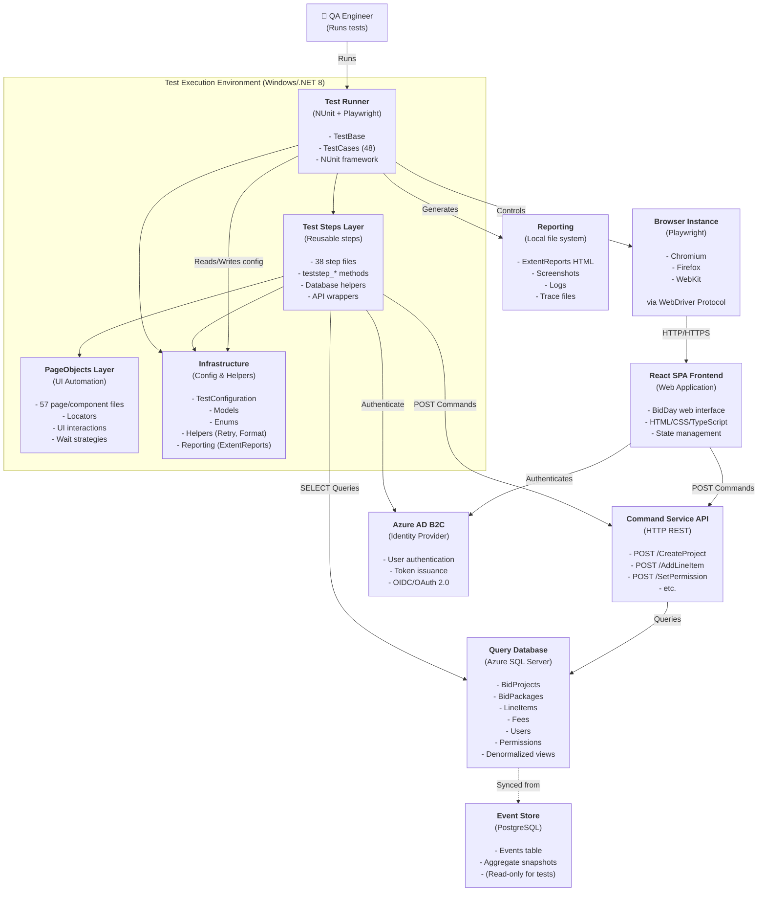

# C4 Model: Container Diagram — DESTINI.BidDay.UI.Tests.Playwright

**Nível:** 2 — Container  
**Data:** 2026-05-20  
**Confiança:** 🟢 CONFIRMADO

---

## 📐 Diagrama



---

## 🗂️ Containers Detalhados

### 1. Test Execution Environment (Overall Container)

**Responsabilidade:** Orchestrate test execution, manage browser, report results

**Tecnologia:** C# .NET 8.0, NUnit 4.4.0, Microsoft.Playwright.NUnit 1.51.0

**Componentes internos:**
- TestBase.cs — Base class for all tests
- TestCases/ (48 files) — Individual test cases
- NUnit framework — Test runner
- ExtentReports — Reporting engine

**Entradas:**
- appsettings.json (environment config)
- Test parameters (browser, tenant, user role)
- Command-line args (filter, headless mode, etc.)

**Saídas:**
- Test results (pass/fail)
- ExtentReports HTML
- Screenshots on failure
- Tracing files

---

### 2. Test Steps Layer

**Responsabilidade:** Reusable steps for common test actions

**Tecnologia:** C# partial classes, async/await

**Arquivos (38):**
- TestStep.cs (main entry)
- TestStep.BidPackages.cs
- TestStep.BidResponses.cs
- TestStep.Bidders.cs
- TestStep.Database.cs (database queries/execution)
- TestStep.Database.CommandService.cs (API calls)
- TestStep.Navigation.cs
- TestStep.Projects.cs
- TestStep.Preferences.cs
- TestStep.UserPermissionMatrix.cs
- ... (28 more)

**Exemplos de métodos:**
```csharp
public async Task teststep_CreateProject(BidProject project) { ... }
public async Task teststep_NavigateToBidPackagePage(int projectId) { ... }
public async Task teststep_AddLineItem(int packageId, LineItem item) { ... }
public async Task<BidProject> teststep_QueryBidProject(int projectId) { ... }
public async Task teststep_CallCommandService(string endpoint, object data) { ... }
```

**Dependências:**
- PageObjects (delegates UI interaction)
- Infrastructure (TestConfiguration, Models)
- Database helpers (AzureSql, PostgresSql)

---

### 3. PageObjects Layer

**Responsabilidade:** Encapsulate UI element locators and interactions

**Tecnologia:** Playwright ILocator, IPage, async actions

**Arquivos (57):**

**Pages (20+):**
- HomePage.cs
- SignInPage.cs
- BidPackagePage.cs
- BidSummaryPage.cs
- BidSummaryPage.SummaryGrid.cs
- Settings pages (8)
  - Settings.BidPackagesPage.cs
  - Settings.FeesPage.cs
  - Settings.UserPermissionsPage.cs
  - etc.
- ErrorPage.cs
- FrozenEntitiesPage.cs
- UnfreezePage.cs

**Components (21):**
- BaseForm.cs (base for forms)
- BaseModal.cs (base for modals)
- BidderModal.cs
- LineItemsModal.cs
- NotesModal.cs
- BidResponseAmountCell.cs
- GridHelper.cs
- SortableRow.cs
- etc.

**Exemplo:**
```csharp
public class LineItemsModal : BaseModal
{
    private ILocator _descriptionInput => page.Locator("input[name='description']");
    private ILocator _quantityInput => page.Locator("input[name='quantity']");
    
    public async Task FillForm(LineItem item)
    {
        await _descriptionInput.FillAsync(item.Description);
        await _quantityInput.FillAsync(item.Quantity.ToString());
    }
    
    public async Task ClickSaveButton()
        => await page.Locator("button:has-text('Save')").ClickAsync();
}
```

---

### 4. Infrastructure Container

**Responsabilidade:** Configuration, helpers, models, and cross-cutting concerns

**Sub-components:**

#### 4a. Configuration (TestConfiguration.cs)
```csharp
public class TestConfiguration
{
    public string BrowserToTest { get; set; } // Chromium, Firefox, WebKit
    public string TenantId { get; set; }
    public string ClientId { get; set; }
    public string CommandServiceUrl { get; set; }
    public string AzureSqlConnectionString { get; set; }
    public string PostgresConnectionString { get; set; }
}
```

#### 4b. Models (Models/ directory, 10 files)
- BidProject.cs
- BidPackage.cs
- LineItem.cs
- Bidder.cs
- Fee.cs
- Requirement.cs
- Alternate.cs
- BidderResponse.cs
- BidderTotals.cs
- Condition.cs

#### 4c. Helpers
- RetryHelper.cs (execute with retry logic)
- CalculationHelpers.cs (fee calculation, totals)
- FormatExtensions.cs (decimal, date formatting)
- LocatorExtensions.cs (Playwright locator helpers)
- RandomHelpers.cs (test data generation)
- Utilities.cs (general helpers)

#### 4d. Database Helpers
- AzureSql.cs
  ```csharp
  public class AzureSql
  {
      public async Task<T> QuerySingleAsync<T>(string sql, object parameters)
      public async Task ExecuteAsync(string sql, object parameters)
      public async Task BackupAndRestoreAsync(string dbName)
  }
  ```

- PostgresSql.cs (read-only for event store verification)

#### 4e. Reporting
- StepScope.cs (ExtentReports scope tracking)
- ExtentReports setup (in TestBase)

---

### 5. Browser Container (Playwright)

**Responsabilidade:** Control browser instance, navigate, interact with UI

**Teknologi:** Playwright WebDriver

**Modes:**
- Headless (for CI/CD)
- Headed (for debugging)

**Supported Browsers:**
- Chromium (default)
- Firefox
- WebKit

**Capabilities:**
- Screenshot on failure
- Video recording (optional)
- Tracing (interactions + snapshots)
- Network request interception (optional)

---

### 6. React SPA Frontend Container

**Responsabilidade:** User interface for BidDay application

**Technology:** React, TypeScript, HTML/CSS

**Features:**
- BidProject CRUD
- BidPackage management
- LineItem entry
- Fee configuration
- Permission management
- User authentication (Azure AD B2C)
- Multi-tenant support

**Entry Point:** HomePage.cs → navigates to features

---

### 7. Command Service API Container

**Responsabilidade:** Business logic, event sourcing, write model

**Technology:** C# .NET 8, PostgreSQL Event Store

**Endpoints:** (examples from tests)
- `POST /CreateProject` — Create new BidProject
- `POST /AddLineItem` — Add LineItem to BidPackage
- `POST /AddFee` — Add Fee to project
- `POST /SetUserPermission` — Update permission
- `POST /CloseBidPackage` — Mark package as closed
- `POST /AddBidder` — Add bidder to project
- etc.

**Response Format:**
```json
{
  "status": "success|error",
  "data": { /* aggregate state */ },
  "errors": [ /* validation errors */ ]
}
```

---

### 8. Query Database Container

**Responsabilidade:** Denormalized read models for fast queries

**Technology:** Azure SQL Server, SqlClient

**Tables:**
- BidProjects
- BidPackages
- LineItems
- Bidders
- Fees
- Conditions
- Requirements
- Units of Measure
- Users
- RolePermissions
- Trades

**Access Pattern:**
```csharp
var sql = "SELECT * FROM BidProjects WHERE ProjectId = @id";
var project = await azureSql.QuerySingleAsync<BidProject>(sql, new { id });
```

---

### 9. Event Store Container (PostgreSQL)

**Responsabilidade:** Immutable event log (write model)

**Technology:** PostgreSQL, Npgsql

**Tables:**
- Events — { EventId, AggregateId, EventType, EventData, Timestamp }
- Aggregates — { AggregateId, AggregateType, Version, State }
- Snapshots — { SnapshotId, AggregateId, Version, SnapshotData }

**Access:** Read-only for tests (verification only)

---

### 10. Azure AD B2C Container

**Responsabilidade:** User authentication and identity

**Technology:** Cloud service (OIDC/OAuth 2.0)

**Flow:**
1. Test navigates to sign-in page
2. Redirects to Azure AD B2C login
3. User provides credentials
4. Azure AD issues ID token + access token
5. Test includes token in Authorization header (Bearer)

**Test Users:**
- AllRoles@test.com (admin)
- Contributor@test.com (limited write)
- Viewer@test.com (read-only)
- Approver@test.com (approval workflows)

---

### 11. Reporting Container

**Responsabilidade:** Generate test execution reports

**Technology:** ExtentReports 5.0.2

**Artifacts:**
- HTML report (index.html + test details)
- Screenshots (on failure or per test)
- Logs (test output)
- Trace files (Playwright recording)

**Output Directory:** `TestResults/`

---

## 🔄 Communication Patterns

### Synchronous (HTTP REST)

```
Test Step
  │ POST /CreateProject { name, ... }
  ▼
Command Service
  │ Process, emit event
  ▼
Query Database (eventually consistent)
```

### Asynchronous (Event-driven, internal)

```
Command Service
  │ Emit ProjectCreatedEvent
  ▼
Azure Service Bus
  │ Route event
  ▼
Event Processor
  │ Map to read model
  ▼
Query Database
  │ INSERT/UPDATE
```

**Note:** Tests typically wait for consistency before asserting.

---

## 📊 Data Flow Example: Adding LineItem

```
1. Test calls teststep_AddLineItem(itemData)
   │
2. TestStep calls LineItemsModal.FillForm()
   │
3. PageObject fills locators, clicks Save
   │
4. Frontend POSTs to /AddLineItem
   │
5. Command Service processes, emits event
   │
6. Event Processor maps to read model
   │
7. Query DB updated
   │
8. Test queries SELECT * FROM LineItems
   │
9. Assertion validates Extended = Qty × Price
```

---

## 🎯 Key Design Decisions

| Decision | Rationale |
|----------|-----------|
| **Async/await** | Better performance, non-blocking |
| **PageObject pattern** | Maintainability, reuse |
| **TestStep layer** | DRY, cross-test reuse |
| **Separation of concerns** | Each layer has one responsibility |
| **Retry logic** | Resilience on flaky UI |
| **Factory for test data** | Consistent, clean test setup |
| **Parallel execution** | Faster test runs (NUnit parallelizable) |

---

**Gerado pelo Reversa — Architect Agent**
