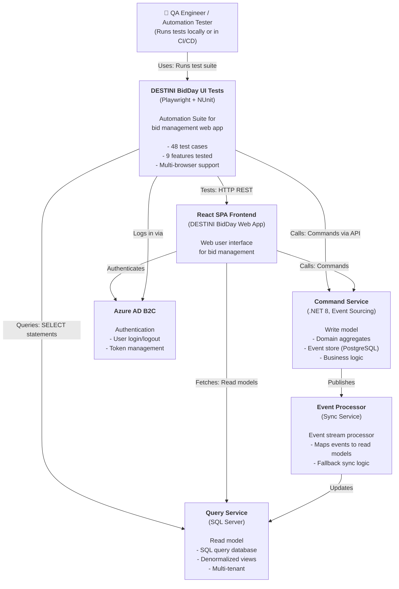

# C4 Model: Context Diagram — DESTINI.BidDay.UI.Tests.Playwright

**Nível:** 1 — System Context  
**Data:** 2026-05-20  
**Confiança:** 🟢 CONFIRMADO

---

## 📐 Diagrama



---

## 📋 Atores & Sistemas

### Usuários (Personas)

| Actor | Descrição | Interação com Tests |
|-------|-----------|-------------------|
| **QA Engineer** | Executa testes e valida funcionalidade | Roda test suite, analisa relatórios (ExtentReports) |
| **CI/CD Pipeline** | Executa testes automaticamente | Integração via Azure DevOps/GitHub Actions |
| **Test Bidders** | Usuários de teste que licita | Criados dinamicamente em testes |
| **Test Admins** | Administradores de teste | Gerenciam configurações, permissions |

### Sistemas Externos

| Sistema | Tipo | Responsabilidade | Protocolo |
|---------|------|-------------------|-----------|
| **React SPA Frontend** | Web App | Display UI, handle user interactions | HTTP/HTTPS |
| **Command Service** | Microservice | Business logic, event sourcing, writes | HTTP REST |
| **Query Service** | Database | SQL Server read models | SqlClient |
| **Event Processor** | Service | Sync domain events to read models | Azure Service Bus (internal) |
| **Azure AD B2C** | Identity Provider | User authentication, token issuance | OIDC/OAuth 2.0 |
| **PostgreSQL Event Store** | Database | Event sourcing backend | Npgsql (read-only for tests) |

---

## 🔄 Fluxos de Interação Principais

### 1. Teste de Criação de Projeto

```
┌──────────────┐
│ Test Code    │
└──────┬───────┘
       │ 1. teststep_CreateProject()
       ▼
┌─────────────────────────────┐
│ Command Service API         │
│ POST /CreateProject         │
└──────┬──────────────────────┘
       │ 2. Create event
       ▼
┌─────────────────────────────┐
│ Event Processor             │
│ (processes ProjectCreated)  │
└──────┬──────────────────────┘
       │ 3. Map to read model
       ▼
┌─────────────────────────────┐
│ Query Service (SQL)         │
│ INSERT BidProjects          │
└──────┬──────────────────────┘
       │ 4. Query for verification
       │
       ◀──────────────────────
       │ 5. SELECT * FROM BidProjects
```

### 2. Teste de Autenticação

```
┌──────────────┐
│ Test Code    │
│ Sign In      │
└──────┬───────┘
       │ 1. Navigate to sign-in page
       ▼
┌──────────────────────────────────┐
│ Frontend (Sign In Page)          │
└──────┬───────────────────────────┘
       │ 2. Redirect to Azure AD B2C
       ▼
┌──────────────────────────────────┐
│ Azure AD B2C                     │
│ (Authenticate user)              │
└──────┬───────────────────────────┘
       │ 3. Issue token + redirect
       ▼
┌──────────────────────────────────┐
│ Frontend (Logged in)             │
│ + Bearer Token in headers        │
└──────────────────────────────────┘
```

### 3. Teste de Permissões (RBAC)

```
┌──────────────┐
│ Test Code    │
│ User: Viewer │
└──────┬───────┘
       │ 1. Navigate to Settings
       ▼
┌──────────────────────────────────┐
│ Frontend                         │
│ Check permission: Viewer         │
│ → Settings not visible           │
└──────────────────────────────────┘
       │ 2. Assert: Button disabled
       ▼
┌──────────────┐
│ Test Passes  │
└──────────────┘
```

---

## 🎯 Objetivos do Sistema de Testes

1. **Validar funcionalidade** da aplicação BidDay em múltiplos navegadores
2. **Testar workflows** end-to-end (criar projeto → adicionar pacotes → enviar licitação)
3. **Verificar consistência** entre write model (Event Store) e read model (SQL)
4. **Garantir permissões** são aplicadas corretamente (RBAC)
5. **Testar recuperação** de falhas (Event Fallbacks, Sync)
6. **Documentar** cenários esperados via testes

---

## 🔐 Segurança & Isolamento

```
┌─────────────────────────────────────┐
│ Test Isolation                      │
├─────────────────────────────────────┤
│ - Cada teste cria dados de teste    │
│ - Tenant isolation (multi-tenant)   │
│ - Usuários de teste separados       │
│ - Banco de dados backup/restore     │
│ - Browser context isolation         │
│   (multi-user per context)          │
└─────────────────────────────────────┘

┌─────────────────────────────────────┐
│ Acesso aos Recursos                 │
├─────────────────────────────────────┤
│ - Read-only: Event Store (Postgres) │
│ - Read-write: Query DB (Azure SQL)  │
│ - Write: Command Service API        │
│ - Auth: Azure AD B2C (test tenant)  │
└─────────────────────────────────────┘
```

---

## 📊 Capacidades do Sistema

### Automação (UI)
- ✅ Multi-browser (Chrome, Firefox, WebKit)
- ✅ Headless mode
- ✅ Parallel test execution
- ✅ Screenshot/video recording
- ✅ Tracing (Playwright)

### Validação
- ✅ FluentAssertions (readable)
- ✅ Database query assertions
- ✅ API response validation
- ✅ Permission enforcement checks

### Relatórios
- ✅ ExtentReports (HTML)
- ✅ NUnit console output
- ✅ Test result attachment (screenshots, logs)

---

## 🔗 Dependências Externas

| Dependência | Tipo | Versão | Uso |
|-------------|------|--------|-----|
| Playwright | Library | 1.51.0 | Browser automation |
| NUnit | Framework | 4.4.0 | Test execution |
| FluentAssertions | Library | 6.7.0 | Assertions |
| ExtentReports | Library | 5.0.2 | Reporting |
| .NET | Runtime | 8.0 | Language/runtime |
| Azure AD B2C | Service | (cloud) | Authentication |
| Azure SQL | Service | (cloud) | Query database |
| PostgreSQL | Service | (cloud) | Event store |

---

## 🚀 Escopo & Limites

### ✅ In Scope
- Testes UI end-to-end
- Validação de cálculos (Extended Amount, Fees, Totals)
- Verificação de permissões (RBAC)
- Sincronização de dados (Domain → Query)
- Múltiplos navegadores e contextos de usuário

### ❌ Out of Scope
- Testes de carga/performance
- Testes de segurança (pentest)
- Testes de integração com terceiros (ex: pagamento)
- Testes de infraestrutura/deployment

---

**Gerado pelo Reversa — Architect Agent**
