# Entity Relationship Diagram (ERD) — DESTINI.BidDay.UI.Tests.Playwright

**Escopo:** Complete data model for Query Database (Azure SQL Server)  
**Data:** 2026-05-20  
**Confiança:** 🟢 CONFIRMADO

---

## 📐 ER Diagram (Mermaid)

```mermaid
erDiagram
    BID_PROJECTS ||--o{ BID_PACKAGES : contains
    BID_PROJECTS ||--o{ BIDDERS : "has bids from"
    BID_PROJECTS ||--o{ FEES : "charges"
    BID_PROJECTS ||--o{ CONDITIONS : "specifies"
    BID_PROJECTS ||--o{ REQUIREMENTS : "requires"
    BID_PROJECTS ||--o{ ALTERNATES : "offers"
    BID_PACKAGES ||--o{ LINE_ITEMS : contains
    BID_PACKAGES ||--o{ TRADES : "covers"
    BID_PACKAGES ||--o{ BID_PACKAGE_NOTES : "documented in"
    BID_PACKAGES ||--o{ REQUIREMENTS : "inherits"
    BIDDERS ||--o{ BID_RESPONSES : submits
    BID_RESPONSES ||--o{ LINE_ITEM_RESPONSES : contains
    BID_RESPONSES ||--o{ ADJUSTMENT_RESPONSES : "applies"
    BID_RESPONSES ||--o{ REQUIREMENT_RESPONSES : "fulfills"
    UNITS_OF_MEASURE ||--o{ LINE_ITEMS : "measured in"
    USERS ||--o{ ROLE_PERMISSIONS : has
    BID_DAY_SETTINGS ||--o{ UNITS_OF_MEASURE : stores
    BID_DAY_SETTINGS ||--o{ ROLE_PERMISSIONS : defines

    BID_PROJECTS {
        int ProjectId PK
        string ProjectName UK
        bool HardBid
        string Subtitle
        string Address
        string AptSuiteBldg
        string City
        string State
        string Zip
        string Country
        datetime BidDueDate
        datetime ProjectStartDate
        datetime ProjectCompletionDate
        string Owner
        string Architect
        string TotalBuildingArea
        string TotalBuildingAreaUnit
        string TotalSiteArea
        string TotalSiteAreaUnit
        bool IsClosed
        string ImageUri
        datetime CreatedDate
        datetime ModifiedDate
    }

    BID_PACKAGES {
        int PackageId PK
        int ProjectId FK
        string Code
        string Description
        datetime DueDate
        bool IsClosed
        string LockedByUser
        decimal ContingencyPercentage
        datetime CreatedDate
        datetime ModifiedDate
        "UK: (ProjectId, Code)"
    }

    LINE_ITEMS {
        int LineItemId PK
        int PackageId FK
        string Description
        decimal Quantity
        string Unit FK
        decimal UnitPrice
        int DisplayOrder
        decimal Extended "Calculated: Qty × Price"
        datetime CreatedDate
        datetime ModifiedDate
    }

    BIDDERS {
        int BidderId PK
        int ProjectId FK
        string CompanyName
        string ContactName
        string Email UK "per project"
        string PhoneNumber
        datetime CreatedDate
        datetime ModifiedDate
    }

    BID_RESPONSES {
        int ResponseId PK
        int BidderId FK
        int PackageId FK
        decimal Subtotal "Sum of LineItems"
        decimal FeesTotal
        decimal Adjustments
        decimal GrandTotal
        datetime SubmittedDate
        datetime CreatedDate
        datetime ModifiedDate
    }

    LINE_ITEM_RESPONSES {
        int ResponseLineId PK
        int ResponseId FK
        int LineItemId FK
        decimal BidAmount
        bool IsAlternate
        datetime CreatedDate
        datetime ModifiedDate
    }

    ADJUSTMENT_RESPONSES {
        int AdjustmentId PK
        int ResponseId FK
        string Name
        decimal Amount "Positive or negative"
        decimal Percentage
        datetime CreatedDate
        datetime ModifiedDate
    }

    REQUIREMENT_RESPONSES {
        int RequirementResponseId PK
        int ResponseId FK
        int RequirementId FK
        bool IsFulfilled
        string Notes
        datetime CreatedDate
        datetime ModifiedDate
    }

    FEES {
        int FeeId PK
        int ProjectId FK
        string Name
        string FeeType "Percentage | FixedAmount | ..."
        decimal Percentage "If FeeType=Percentage"
        decimal FixedAmount "If FeeType=FixedAmount"
        string ApplicablePackages "JSON or pipe-delimited"
        datetime CreatedDate
        datetime ModifiedDate
    }

    CONDITIONS {
        int ConditionId PK
        int ProjectId FK
        string Name
        string Description
        int DisplayOrder
        datetime CreatedDate
        datetime ModifiedDate
    }

    REQUIREMENTS {
        int RequirementId PK
        int ProjectId FK "or null for general"
        int PackageId FK "or null for project"
        string Name
        string Description
        bool IsRequired
        int DisplayOrder
        datetime CreatedDate
        datetime ModifiedDate
    }

    ALTERNATES {
        int AlternateId PK
        int ProjectId FK
        string Name
        string Description
        int DisplayOrder
        datetime CreatedDate
        datetime ModifiedDate
    }

    BID_PACKAGE_NOTES {
        int NoteId PK
        int PackageId FK
        string Content "Rich text"
        string AuthorId FK
        datetime CreatedDate
        datetime ModifiedDate
    }

    TRADES {
        int TradeId PK
        int ProjectId FK "or null for system"
        string Name "Electrical, HVAC, etc."
        string Description
        datetime CreatedDate
        datetime ModifiedDate
    }

    UNITS_OF_MEASURE {
        string UnitCode PK "FT, SQFT, YD, etc."
        string UnitName "Foot, Square Foot, Yard"
        decimal ConversionFactor "To base unit"
        bool IsActive
        datetime CreatedDate
        datetime ModifiedDate
    }

    USERS {
        int UserId PK
        string Email UK
        string DisplayName
        string AzureAdId FK "Azure AD B2C ObjectId"
        bool IsActive
        datetime LastLoginDate
        datetime CreatedDate
        datetime ModifiedDate
    }

    ROLE_PERMISSIONS {
        int PermissionId PK
        int UserId FK
        string Role "AllRoles, Contributor, Viewer, Approver"
        int ProjectId FK "or null for system-level"
        bool CanRead
        bool CanWrite
        bool CanDelete
        bool CanApprove
        datetime CreatedDate
        datetime ModifiedDate
        "UK: (UserId, Role, ProjectId)"
    }

    BID_DAY_SETTINGS {
        int SettingId PK
        string SettingKey UK "CONTINGENCY_PERCENT, DEFAULT_CURRENCY, ..."
        string SettingValue
        string Description
        datetime CreatedDate
        datetime ModifiedDate
    }
```

---

## 📋 Entidades & Campos

### BID_PROJECTS (Agregado raiz)

| Campo | Tipo | Constraints | Descrição |
|-------|------|-------------|-----------|
| ProjectId | int | PK, identity | ID único do projeto |
| ProjectName | string(255) | UK, not null | Nome único do projeto |
| HardBid | bool | default: false | Licitação firme vs. estimativa |
| Subtitle | string(500) | nullable | Subtítulo |
| Address | string(255) | nullable | Rua |
| City | string(100) | nullable | Cidade |
| State | string(50) | nullable | Estado/província |
| Zip | string(20) | nullable | CEP (validação: 5 dígitos para EUA) |
| Country | string(100) | nullable | País |
| BidDueDate | datetime | nullable | Data de vencimento |
| ProjectStartDate | datetime | nullable | Data de início |
| ProjectCompletionDate | datetime | nullable | Data de conclusão |
| Owner | string(255) | nullable | Proprietário |
| Architect | string(255) | nullable | Arquiteto |
| TotalBuildingArea | string(20) | nullable | Área (valor numérico) |
| TotalBuildingAreaUnit | string(10) | nullable | Unidade de área |
| TotalSiteArea | string(20) | nullable | Área do terreno |
| TotalSiteAreaUnit | string(10) | nullable | Unidade do terreno |
| IsClosed | bool | default: false | Project fechado (irreversível) |
| ImageUri | string(1000) | nullable | URI da imagem |
| CreatedDate | datetime | default: getdate() | Timestamp criação |
| ModifiedDate | datetime | default: getdate() | Timestamp modificação |

**Validações:**
- ProjectName: não vazio, max 255
- BidDueDate ≤ ProjectStartDate ≤ ProjectCompletionDate (ordem temporal)
- TotalBuildingArea ≤ TotalSiteArea

---

### BID_PACKAGES (Subagregado)

| Campo | Tipo | Constraints | Descrição |
|-------|------|-------------|-----------|
| PackageId | int | PK, identity | ID único |
| ProjectId | int | FK → BID_PROJECTS, not null | Projeto pai |
| Code | string(20) | not null | Código do pacote ("01.40") |
| Description | string(255) | not null | Nome descritivo |
| DueDate | datetime | nullable | Data de vencimento (override) |
| IsClosed | bool | default: false | Pacote fechado (irreversível) |
| LockedByUser | string(255) | nullable | Email do usuário que travou |
| ContingencyPercentage | decimal(5,2) | default: 0 | Contingência % (0-100) |
| CreatedDate | datetime | default: getdate() | Timestamp criação |
| ModifiedDate | datetime | default: getdate() | Timestamp modificação |

**Índices:**
- UK: (ProjectId, Code)
- FK: ProjectId → BID_PROJECTS.ProjectId
- IX: ProjectId, IsClosed (para queries)

---

### LINE_ITEMS

| Campo | Tipo | Constraints | Descrição |
|-------|------|-------------|-----------|
| LineItemId | int | PK, identity | ID único |
| PackageId | int | FK → BID_PACKAGES, not null | Pacote pai |
| Description | string(255) | not null | Descrição do item |
| Quantity | decimal(15,4) | not null | Quantidade |
| Unit | string(10) | FK → UNITS_OF_MEASURE, not null | Unidade de medida |
| UnitPrice | decimal(18,2) | not null, >= 0 | Preço unitário |
| DisplayOrder | int | default: 0 | Ordem de exibição |
| Extended | decimal(18,2) | calculated: Qty × Price | Total = Qty × UnitPrice |
| CreatedDate | datetime | default: getdate() | Timestamp criação |
| ModifiedDate | datetime | default: getdate() | Timestamp modificação |

**Validações:**
- Quantity > 0
- UnitPrice ≥ 0
- Unit deve existir em UNITS_OF_MEASURE

---

### BIDDERS

| Campo | Tipo | Constraints | Descrição |
|-------|------|-------------|-----------|
| BidderId | int | PK, identity | ID único |
| ProjectId | int | FK → BID_PROJECTS, not null | Projeto |
| CompanyName | string(255) | not null | Razão social |
| ContactName | string(255) | not null | Nome de contato |
| Email | string(255) | not null | Email (UK per project) |
| PhoneNumber | string(20) | not null | Telefone (10-15 dígitos) |
| CreatedDate | datetime | default: getdate() | Timestamp criação |
| ModifiedDate | datetime | default: getdate() | Timestamp modificação |

**Índices:**
- UK: (ProjectId, Email)
- FK: ProjectId → BID_PROJECTS.ProjectId

**Validações:**
- Email: formato válido (RFC 5322)
- PhoneNumber: 10-15 dígitos, permite símbolos

---

### BID_RESPONSES

| Campo | Tipo | Constraints | Descrição |
|-------|------|-------------|-----------|
| ResponseId | int | PK, identity | ID único |
| BidderId | int | FK → BIDDERS, not null | Licitante |
| PackageId | int | FK → BID_PACKAGES, not null | Pacote |
| Subtotal | decimal(18,2) | calculated | Soma dos itens |
| FeesTotal | decimal(18,2) | calculated | Soma das taxas |
| Adjustments | decimal(18,2) | default: 0 | Ajustes (+/−) |
| GrandTotal | decimal(18,2) | calculated | Subtotal + Fees + Adj |
| SubmittedDate | datetime | nullable | Data de submissão |
| CreatedDate | datetime | default: getdate() | Timestamp criação |
| ModifiedDate | datetime | default: getdate() | Timestamp modificação |

**Cálculos:**
- Subtotal = SUM(LINE_ITEM_RESPONSES.BidAmount)
- FeesTotal = SUM de taxas aplicáveis
- GrandTotal = Subtotal + FeesTotal + Adjustments

---

### FEES

| Campo | Tipo | Constraints | Descrição |
|-------|------|-------------|-----------|
| FeeId | int | PK, identity | ID único |
| ProjectId | int | FK → BID_PROJECTS, not null | Projeto |
| Name | string(255) | not null | Nome da taxa |
| FeeType | string(50) | not null | "Percentage" \| "FixedAmount" \| ... |
| Percentage | decimal(5,2) | nullable | % (se FeeType='Percentage') |
| FixedAmount | decimal(18,2) | nullable | $ (se FeeType='FixedAmount') |
| ApplicablePackages | string | nullable | JSON ou CSV de codes |
| CreatedDate | datetime | default: getdate() | Timestamp criação |
| ModifiedDate | datetime | default: getdate() | Timestamp modificação |

**Validações:**
- (FeeType='Percentage' AND Percentage IS NOT NULL AND FixedAmount IS NULL) XOR (FeeType='FixedAmount' AND FixedAmount IS NOT NULL AND Percentage IS NULL)
- Percentage: 0-100
- FixedAmount ≥ 0

---

### REQUIREMENTS

| Campo | Tipo | Constraints | Descrição |
|-------|------|-------------|-----------|
| RequirementId | int | PK, identity | ID único |
| ProjectId | int | FK → BID_PROJECTS, nullable | Projeto (null = geral) |
| PackageId | int | FK → BID_PACKAGES, nullable | Pacote (null = projeto) |
| Name | string(255) | not null | Nome do requisito |
| Description | string(max) | nullable | Descrição |
| IsRequired | bool | default: true | Obrigatório vs. opcional |
| DisplayOrder | int | default: 0 | Ordem |
| CreatedDate | datetime | default: getdate() | Timestamp criação |
| ModifiedDate | datetime | default: getdate() | Timestamp modificação |

**Hierarquia:**
- Requisitos de projeto (ProjectId NOT NULL, PackageId NULL)
- Requisitos de pacote (ProjectId NULL, PackageId NOT NULL)
- Requisitos gerais (ambos NULL — para reutilização)

---

### ROLE_PERMISSIONS (RBAC)

| Campo | Tipo | Constraints | Descrição |
|-------|------|-------------|-----------|
| PermissionId | int | PK, identity | ID único |
| UserId | int | FK → USERS, not null | Usuário |
| Role | string(50) | not null | "AllRoles" \| "Contributor" \| "Viewer" \| "Approver" |
| ProjectId | int | FK → BID_PROJECTS, nullable | Projeto (null = sistema) |
| CanRead | bool | default: true | Permissão de leitura |
| CanWrite | bool | default: false | Permissão de escrita |
| CanDelete | bool | default: false | Permissão de exclusão |
| CanApprove | bool | default: false | Permissão de aprovação |
| CreatedDate | datetime | default: getdate() | Timestamp criação |
| ModifiedDate | datetime | default: getdate() | Timestamp modificação |

**Índices:**
- UK: (UserId, Role, ProjectId)

**RBAC Matrix:**

| Role | CanRead | CanWrite | CanDelete | CanApprove |
|------|---------|----------|-----------|-----------|
| AllRoles | ✅ | ✅ | ✅ | ✅ |
| Contributor | ✅ | ✅ | ❌ | ❌ |
| Viewer | ✅ | ❌ | ❌ | ❌ |
| Approver | ✅ | ❌ | ❌ | ✅ |

---

### UNITS_OF_MEASURE (Sistema)

| Campo | Tipo | Constraints | Descrição |
|-------|------|-------------|-----------|
| UnitCode | string(10) | PK | Código: "FT", "SQFT", "YD", "IN" |
| UnitName | string(100) | not null | Nome completo: "Foot", "Square Foot" |
| ConversionFactor | decimal(15,6) | default: 1 | Fator para unidade-base |
| IsActive | bool | default: true | Ativo para seleção |
| CreatedDate | datetime | default: getdate() | Timestamp criação |
| ModifiedDate | datetime | default: getdate() | Timestamp modificação |

**Exemplos:**
| UnitCode | UnitName | ConversionFactor |
|----------|----------|------------------|
| FT | Foot | 1.0 |
| SQFT | Square Foot | 1.0 |
| IN | Inch | 0.0833 |
| YD | Yard | 3.0 |

---

### BID_PACKAGE_NOTES

| Campo | Tipo | Constraints | Descrição |
|-------|------|-------------|-----------|
| NoteId | int | PK, identity | ID único |
| PackageId | int | FK → BID_PACKAGES, not null | Pacote |
| Content | string(max) | not null | Conteúdo (RTF) |
| AuthorId | string(255) | not null | Email de quem criou |
| CreatedDate | datetime | default: getdate() | Timestamp criação |
| ModifiedDate | datetime | default: getdate() | Timestamp modificação |

---

### USERS (Identity)

| Campo | Tipo | Constraints | Descrição |
|-------|------|-------------|-----------|
| UserId | int | PK, identity | ID único |
| Email | string(255) | UK, not null | Email (via Azure AD B2C) |
| DisplayName | string(255) | not null | Nome de exibição |
| AzureAdId | string(255) | not null | Azure AD ObjectId |
| IsActive | bool | default: true | Usuário ativo |
| LastLoginDate | datetime | nullable | Último acesso |
| CreatedDate | datetime | default: getdate() | Timestamp criação |
| ModifiedDate | datetime | default: getdate() | Timestamp modificação |

---

## 🔄 Relacionamentos Principais

### 1:N Relationships
- BID_PROJECTS → BID_PACKAGES (1 project, N packages)
- BID_PROJECTS → BIDDERS (1 project, N bidders)
- BID_PACKAGES → LINE_ITEMS (1 package, N line items)
- BIDDERS → BID_RESPONSES (1 bidder, N responses)
- BID_RESPONSES → LINE_ITEM_RESPONSES (1 response, N line items)

### Many:Many (via junction)
- BID_PACKAGES ← → TRADES (via implicit many)
- REQUIREMENTS ← → BID_PACKAGES (via hierarchy: project/package/general)

---

## 📊 Índices & Performance

**Índices recomendados:**
- PK em todas as tabelas (identity)
- UK: (ProjectId, Code) em BID_PACKAGES
- UK: (ProjectId, Email) em BIDDERS
- UK: (UserId, Role, ProjectId) em ROLE_PERMISSIONS
- FK indexes em todas as chaves estrangeiras
- IX: BID_RESPONSES.(BidderId, PackageId)
- IX: LINE_ITEMS.(PackageId, DisplayOrder)

---

**Gerado pelo Reversa — Architect Agent**
