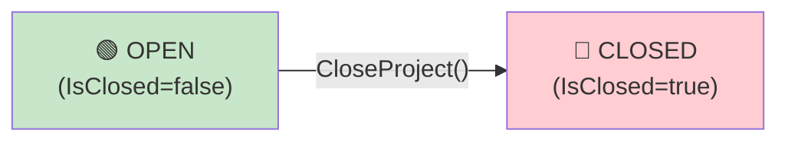
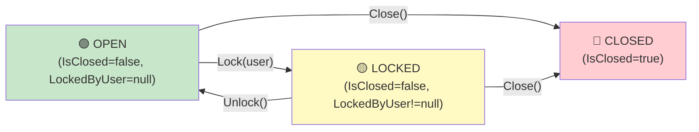
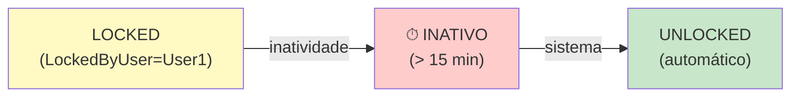
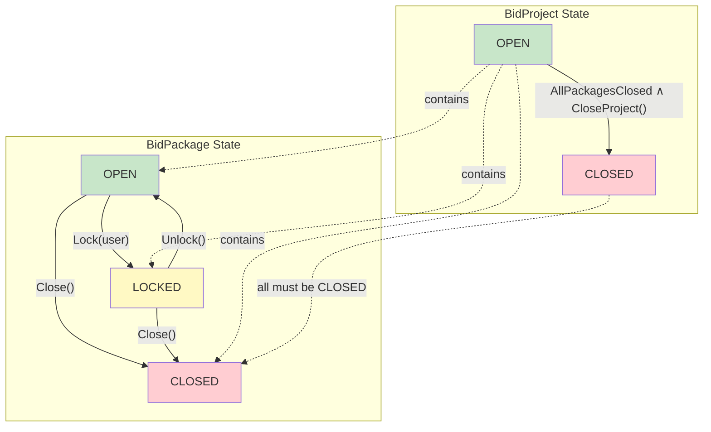

# State Machines — DESTINI.BidDay.UI.Tests.Playwright

**Escopo:** Máquinas de estado para entidades com campos de status/estado  
**Data:** 2026-05-20  
**Confiança:** 🟡 INFERIDO (padrões em Data Dictionary + Tests) | 🔴 LACUNA (transições exatas)

---

## 🔄 BidProject State Machine

**Estados possíveis:** `OPEN`, `CLOSED`

**Campo:** `BidProject.IsClosed` (bool → OPEN=false, CLOSED=true)

### Diagrama de Estados



### Transições Permitidas

| De | Para | Gatilho | Precondições | Efeitos |
|----|------|---------|--------------|---------|
| OPEN | CLOSED | `CloseProject()` | ✅ Todos BidPackages fechados | IsClosed ← true, timestamp updated, audit log |

### Estados Finais (Absorventes)

- **CLOSED**: Irreversível. Uma vez fechado, projeto fica read-only para licitantes e admins.

### Regras de Negócio Associadas

1. **Fechamento cascata**: Não é possível fechar BidProject se houver BidPackage.IsClosed=false
   ```
   PRECONDITION: ∀ pkg ∈ BidProject.IncludedBidPackages, pkg.IsClosed = true
   ```

2. **Restrições durante OPEN**:
   - Novas licitações podem ser submeter
   - Admins podem editar packages, requisitos, taxas
   - Licitantes podem visualizar e inserir respostas

3. **Restrições durante CLOSED**:
   - Nenhuma edição de projeto, packages, requisitos, taxas
   - Licitantes: view-only
   - Relatórios/análises podem ser gerados

---

## 🔄 BidPackage State Machine

**Estados possíveis:** `OPEN`, `CLOSED`, `LOCKED`

**Campos:**
- `BidPackage.IsClosed` (bool)
- `BidPackage.LockedByUser` (string | null)

### Diagrama de Estados



### Transições Permitidas

| De | Para | Gatilho | Precondições | Efeitos |
|----|------|---------|--------------|---------|
| OPEN | LOCKED | `Lock(user)` | Nenhuma | LockedByUser ← user, timestamp |
| LOCKED | OPEN | `Unlock()` | user = LockedByUser ou admin | LockedByUser ← null |
| OPEN | CLOSED | `Close()` | Project not closed | IsClosed ← true |
| LOCKED | CLOSED | `Close()` | user = LockedByUser \| admin | IsClosed ← true, LockedByUser cleared |

### Efeitos de Estados

#### OPEN
- Qualquer usuário com permissão pode editar LineItems, Fees, Requirements
- Múltiplos licitantes podem submeter respostas simultaneamente
- EditHistory é registrado com username e timestamp

#### LOCKED
- Somente `LockedByUser` pode editar LineItems
- Outros usuários veem UI disabled + aviso "Locked by [user]"
- 🟡 INFERIDO: Timeout automático (liberação após ~15-30 min de inatividade)

#### CLOSED
- Todas as operações de escrita bloqueadas
- LineItems, Fees, Requirements, Bidders: view-only
- Relatórios podem ser gerados
- Histórico e auditoria disponíveis

### Invariantes

```
IF BidProject.IsClosed = true
  THEN BidPackage.IsClosed MUST BE true

IF BidPackage.IsClosed = true
  THEN BidPackage.LockedByUser MUST BE null
```

---

## 📋 Fee Lifecycle (Pseudo-Estados)

Fees não têm máquina de estado explícita, mas têm ciclo de vida implícito:

```
CREATE → (ACTIVE) → [EDITED*] → DELETE
         ↑←← ← ← ← ← ← ← ← ← ←↑
```

**Estados implícitos:**
- **PENDING_CALCULATION**: Fee definida mas ainda não incluída em rollup
- **ACTIVE**: Fee incluída em cálculos de BidResponse
- **ARCHIVED**: Fee foi deletada mas referenciada em histórico de BidResponse (soft-delete possível)

**Regra:** Se uma Fee é removida enquanto há BidResponses ativas, sistema decide:
- 🟡 INFERIDO: Recalcular todas as respostas? Ou manter histórico?

---

## 📋 Requirement Lifecycle (Pseudo-Estados)

Requirements mapeiam para Booleans em BidResponse (atendido/não atendido):

```
REQUIREMENT DEFINED
  ↓
LICITANTE SUBMETE RESPOSTA
  ├─ checkbox CHECKED (atendido)
  └─ checkbox UNCHECKED (não atendido)
  ↓
RESPOSTA FINAL (read-only após fechamento de projeto)
```

**Invariante:** Se Requirement deletado, BidResponse mantém referência (soft-delete necessário).

---

## 🟡 Timeout Travamento (Inferido)



🟡 **Comportamento inferido, não confirmado:** Timeout ≈ 15-30 minutos.

---

## 🔴 Lacunas Identificadas

1. **Transições exatas**: Como fechar um BidPackage? Qual é a precondição? (UI não mostra botão?)
2. **Timeout travamento**: Qual é o timeout exato? Sistema monitora heartbeat ou apenas time-since-lock?
3. **Conflito resolver**: Se user1 trava, user2 começa edição, user1 trava novamente — qual ganho?
4. **Cascata fechamento**: Sistema permite fechar BidProject → auto-fecha packages? Ou precisa de pré-validação?
5. **Auditoria de transição**: Cada mudança de estado é loggada com motivo/usuário?

---

## Diagrama de Estados Consolidado


