# C4 Diagram — Level 3: Components

> Generated by Reversa Architect · 2026-05-23
> Confidence: 🟢 CONFIRMADO | 🟡 INFERIDO | 🔴 LACUNA

This diagram focuses on the **Skills Layer** and **Scripts Layer** — the two most complex containers.

---

## Skills Layer — Components

```mermaid
C4Component
    title Component Diagram — Skills Layer (BeckTech.QA.Tools)

    Container_Ext(agents, "Agents Layer", "qa-investigate, qa-implement")
    Container_Ext(scripts, "Scripts Layer", "22 PowerShell scripts")
    Container_Ext(jira_ext, "Jira", "External system")
    Container_Ext(ado_ext, "Azure DevOps", "External system")

    Container_Boundary(skills_layer, "Skills Layer (claude-skills/skills/)") {

        Component(work_on, "work-on", "Skill / Router", "Entry point. Routes Jira issue type → fix-qa-bug or implement-story. Shortcut if type obvious from message.")
        Component(fix_qa_bug, "fix-qa-bug", "Skill / Orchestrator", "End-to-end bug fix: fetch Jira → investigate → plan → implement → review → commit.")
        Component(implement_story, "implement-story", "Skill / Orchestrator", "End-to-end story: same pipeline as fix-qa-bug, story context.")

        Component(fetch_jira, "fetch-jira-item", "Skill / Leaf", "Fetches Jira issue + attachments. Caches in ~/.claude/fetch-jira-item/<key>/. Checks freshness against 'updated' field.")

        Component(plan_feature, "plan-feature-coverage", "Skill / Planner", "Evaluates AC vs existing ADO test cases. Builds feature coverage plan → test-plan.")
        Component(plan_regression, "plan-regression-coverage", "Skill / Planner", "Audits AUT/sprint/JQL scope. Applies rubric (NEW/Manual/Absorbed/Dropped). Delegates to test-plan.")
        Component(test_plan, "test-plan", "Skill / Generator", "Converts categorization input into feature or regression Markdown test plan document.")
        Component(apply_test_plan, "apply-test-plan", "Skill / Executor", "Gate-based: locate → parse → validate → approve → create/update ADO → Jira writeback (feature only).")
        Component(revise_test_plan, "revise-test-plan", "Skill / Editor", "Iterates plan on feedback. Rewrites via test-plan. Never mutates ADO directly.")

        Component(plan_change, "plan-change", "Skill / Gate", "Creates implementation plan. User approval gate before any code changes.")
        Component(review_change, "review-change", "Skill / Gate", "Summarizes changes. User approval gate before commit.")
        Component(commit_change, "commit-change", "Skill / Leaf", "Commits to git + writes Jira comment.")

        Component(create_tc, "create-ado-test-cases", "Skill / ADO Writer", "Source-agnostic TC creator. Owns Operations JSON schema, field defaults, state transitions.")
        Component(update_tc, "update-ado-test-cases", "Skill / ADO Writer", "Updates fields, rewrites steps, transitions state.")
        Component(manage_suite, "manage-ado-test-suite", "Skill / ADO Writer", "Creates suites, manages hierarchy.")

        Component(principles, "principles", "Skill / Context", "QA automation principles. Agent-loaded only; not user-invocable.")

        Component(onboard, "onboard", "Skill / Setup", "Per-user setup walkthrough.")
        Component(setup_skills, "setup-* (8 skills)", "Skill / Setup", "setup-repo-context, setup-claude-md, setup-claude-hooks, setup-atlassian-mcp, setup-atlassian-credentials, setup-azure-devops-mcp, setup-playwright-mcp, setup-notifications.")
        Component(refresh_setup, "refresh-setup", "Skill / Maintenance", "Audits and refreshes generated files (CLAUDE.md, settings.json, repo-context) using version markers.")
    }

    Rel(work_on, fetch_jira, "Fetches issue context")
    Rel(work_on, fix_qa_bug, "Routes Bug type")
    Rel(work_on, implement_story, "Routes Story type")

    Rel(fix_qa_bug, fetch_jira, "Fetches bug details")
    Rel(fix_qa_bug, plan_change, "Creates plan + approval gate")
    Rel(fix_qa_bug, agents, "Spawns qa-investigate then qa-implement")
    Rel(fix_qa_bug, review_change, "Review + approval gate")
    Rel(fix_qa_bug, commit_change, "Commits + Jira comment")

    Rel(plan_feature, test_plan, "Delegates plan generation")
    Rel(plan_regression, test_plan, "Delegates plan generation")
    Rel(apply_test_plan, create_tc, "Delegates TC creation")
    Rel(apply_test_plan, update_tc, "Delegates TC updates")
    Rel(apply_test_plan, scripts, "Calls set-jira-test-plan-ids.ps1")

    Rel(create_tc, scripts, "Calls create-ado-test-cases.ps1")
    Rel(update_tc, scripts, "Calls update-ado-test-cases.ps1")
    Rel(manage_suite, scripts, "Calls manage-ado-test-suite.ps1")
    Rel(fetch_jira, scripts, "Calls fetch-jira-issue.ps1")
    Rel(commit_change, scripts, "Calls add-jira-comment.ps1")

    Rel(scripts, jira_ext, "REST API")
    Rel(scripts, ado_ext, "MCP tool calls")
```

---

## Scripts Layer — Components

```mermaid
C4Component
    title Component Diagram — Scripts Layer (claude-skills/scripts/)

    Container_Ext(skills_layer, "Skills Layer", "Calls scripts via Bash tool")
    Container_Ext(jira, "Jira Cloud", "REST API + Atlassian MCP")
    Container_Ext(ado, "Azure DevOps", "ADO MCP (mcp__ado_*)")
    Container_Ext(fs, "Local Filesystem", "~/.claude/fetch-jira-item/, repo files")

    Container_Boundary(scripts_layer, "Scripts Layer (claude-skills/scripts/)") {

        Component(fetch_jira_issue, "fetch-jira-issue.ps1", "PowerShell", "GET /issue/{key}. Writes raw.json + jira-fetch-brief.md to cache dir.")
        Component(fetch_jira_batch, "fetch-jira-items-batch.ps1", "PowerShell", "POST /search/jql with nextPageToken pagination. Returns array.")
        Component(add_jira_comment, "add-jira-comment.ps1", "PowerShell", "POST /issue/{key}/comment. Requires explicit -Pat.")
        Component(query_jira, "query-jira.ps1", "PowerShell", "JQL search. Requires explicit -Pat.")
        Component(transition_jira, "transition-jira-issue.ps1", "PowerShell", "POST /issue/{key}/transitions. Requires explicit -Pat.")
        Component(update_jira, "update-jira-issue.ps1", "PowerShell", "PUT /issue/{key}. Uses env-var fallback.")
        Component(set_jira_ids, "set-jira-test-plan-ids.ps1", "PowerShell", "Writes TestPlan/Suite IDs to Jira custom fields 10257, 10258.")
        Component(download_attach, "download-attachment.ps1", "PowerShell", "Downloads Jira attachments to local cache dir.")

        Component(fetch_ado_pr, "fetch-ado-pr-*.ps1 (4)", "PowerShell", "fetch-ado-pr-summary, -comments, -diff, -files. Read-only ADO PR data.")
        Component(fetch_ado_tc, "fetch-ado-test-case*.ps1 (3)", "PowerShell", "fetch-ado-test-case, -test-cases-by-query, -test-cases-by-suite.")
        Component(fetch_ado_suite, "fetch-ado-test-suite-hierarchy.ps1", "PowerShell", "Reads full suite tree from ADO test plan.")
        Component(create_ado_pr, "create-ado-pull-request.ps1", "PowerShell", "Creates ADO PR via mcp__ado_repo_create_pull_request.")
        Component(create_ado_tc, "create-ado-test-cases.ps1", "PowerShell", "Reads Operations JSON. wit_create_work_item → testplan_update_test_case_steps → wit_update_work_item (state Ready). NOT idempotent.")
        Component(post_ado_pr, "post-ado-pr-comment.ps1", "PowerShell", "Posts comment to ADO PR thread.")
        Component(update_ado_pr, "update-ado-pr-status.ps1", "PowerShell", "Updates ADO PR vote/status.")
        Component(update_ado_tc, "update-ado-test-cases.ps1", "PowerShell", "Updates TC fields, rewrites steps, transitions state.")
        Component(manage_ado_suite, "manage-ado-test-suite.ps1", "PowerShell", "Creates/updates ADO test suites and hierarchy.")

        Component(gen_test_plan, "generate-test-plan-md.ps1", "PowerShell", "Converts structured input → Markdown test plan format.")
    }

    Rel(skills_layer, fetch_jira_issue, "Bash tool call")
    Rel(skills_layer, fetch_jira_batch, "Bash tool call")
    Rel(skills_layer, add_jira_comment, "Bash tool call")
    Rel(skills_layer, create_ado_tc, "Bash tool call + Operations JSON stdin")
    Rel(skills_layer, update_ado_tc, "Bash tool call")
    Rel(skills_layer, manage_ado_suite, "Bash tool call")
    Rel(skills_layer, gen_test_plan, "Bash tool call")

    Rel(fetch_jira_issue, jira, "GET /issue/{key}", "HTTPS REST")
    Rel(fetch_jira_batch, jira, "POST /search/jql", "HTTPS REST + pagination")
    Rel(add_jira_comment, jira, "POST /issue/{key}/comment", "HTTPS REST")
    Rel(update_jira, jira, "PUT /issue/{key}", "HTTPS REST")
    Rel(transition_jira, jira, "POST /issue/{key}/transitions", "HTTPS REST")
    Rel(set_jira_ids, jira, "PUT custom fields 10257, 10258", "HTTPS REST")

    Rel(fetch_ado_tc, ado, "mcp__ado_* read calls")
    Rel(create_ado_tc, ado, "mcp__ado_wit_create_work_item + testplan_update_test_case_steps")
    Rel(update_ado_tc, ado, "mcp__ado_wit_update_work_item")
    Rel(manage_ado_suite, ado, "mcp__ado suite management")

    Rel(fetch_jira_issue, fs, "Writes raw.json + brief.md", "~/.claude/fetch-jira-item/")
    Rel(download_attach, fs, "Writes attachment", "~/.claude/fetch-jira-item/<key>/attachments/")
```

---

## Setup Infrastructure — Components

| Component | Type | Role | Confidence |
|-----------|------|------|------------|
| `sync-shared-skills.ps1` | PowerShell | Reads SHARED_MANIFEST; pulls per-file from `published-skills`; writes `.sync-record` | 🟢 |
| `guard-shared-skills.ps1` | PreToolUse hook | Blocks edits to SHARED_MANIFEST paths in `.claude/`. Fail-open on errors. | 🟢 |
| `check-updates.ps1` | SessionStart hook | Fetches remote, checks delta, notifies user. 4h TTL cache per repo root. | 🟢 |
| `generate-manifest.ps1` | Utility | Regenerates `SHARED_MANIFEST` from tracked file list | 🟢 |
| `publish-skills.ps1` | Release tool | Validates manifest, runs `git subtree split --force-push` | 🟢 |
| `SHARED_MANIFEST` | Data file | Path list for sync; source of truth for guard hook | 🟢 |
| `notify.ps1` | Stop/Notification hook | User notification on session end | 🔴 LACUNA |
