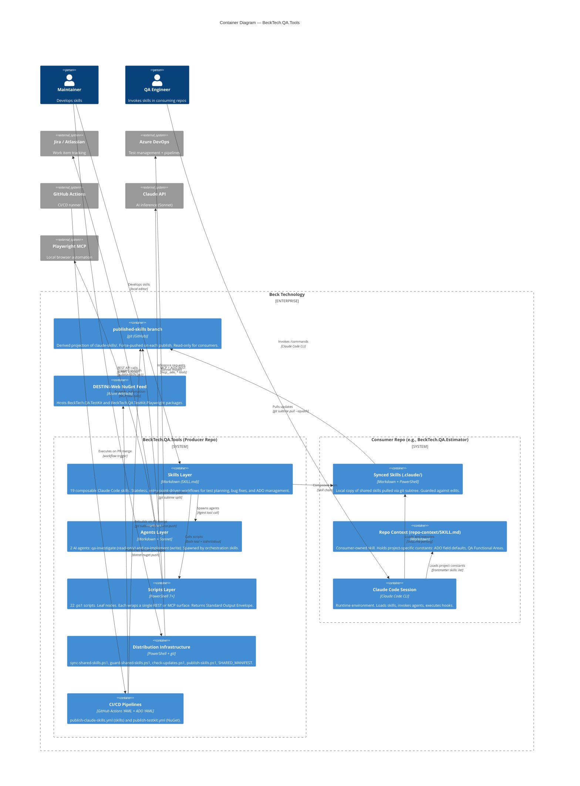

# C4 Diagram — Level 2: Containers

> Generated by Reversa Architect · 2026-05-23
> Confidence: 🟢 CONFIRMADO | 🟡 INFERIDO | 🔴 LACUNA

---

## Container Diagram

---

## Container Descriptions

| Container | Technology | Responsibility | Confidence |
|-----------|------------|----------------|------------|
| **Skills Layer** | Markdown (SKILL.md) | 19 stateless workflows; composable via skill chain | 🟢 |
| **Agents Layer** | Markdown + Sonnet | 2 AI workers with declared tool permissions | 🟢 |
| **Scripts Layer** | PowerShell 7+ | 22 REST/MCP adapters; Standard Output Envelope contract | 🟢 |
| **Distribution Infrastructure** | PowerShell + git | Sync, guard, update-check, publish orchestration | 🟢 |
| **CI/CD Pipelines** | GitHub Actions + ADO YAML | Automates publish-skills and TestKit NuGet push | 🟢 |
| **published-skills branch** | git | Derived projection; history disposable; force-pushed | 🟢 |
| **Synced Skills** | Markdown + PowerShell | Consumer-local copy; guarded against edits by hook | 🟢 |
| **Repo Context** | Markdown | Consumer-owned constants (not synced, not guarded) | 🟢 |
| **Claude Code Session** | Claude Code CLI | Runtime; loads skills, runs agents, fires hooks | 🟢 |
| **DESTINI-Web NuGet Feed** | Azure Artifacts | Package hosting for TestKit libraries | 🟢 |

---

## Communication Protocols

| From → To | Protocol | Sync / Async | Confidence |
|-----------|----------|--------------|------------|
| Skills → Scripts | Bash tool (stdin JSON / stdout) | Sync | 🟢 |
| Scripts → Jira | HTTPS REST (`application/json`) | Sync | 🟢 |
| Scripts → ADO | MCP tool calls (mcp__ado_*) | Sync | 🟢 |
| Agents → Claude API | Model inference API | Sync | 🟢 |
| CI → published-skills | `git push --force` | Async (event-triggered) | 🟢 |
| Consumer → published-skills | `git subtree pull --squash` | Sync (on demand) | 🟢 |
| CI → NuGet Feed | `dotnet nuget push` | Async (event-triggered) | 🟢 |
