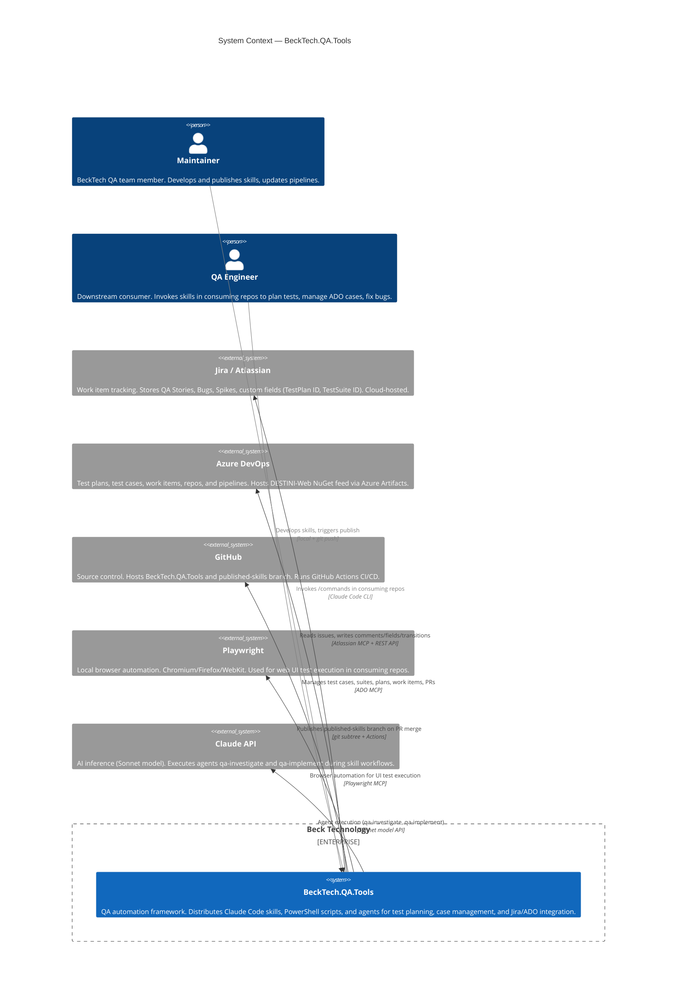

# C4 Diagram — Level 1: System Context

> Generated by Reversa Architect · 2026-05-23
> Confidence: 🟢 CONFIRMADO | 🟡 INFERIDO | 🔴 LACUNA

---

## Context Diagram

---

## Actors

| Actor | Type | Description | Confidence |
|-------|------|-------------|------------|
| **Maintainer** | Human | BeckTech QA team member with write access to `BeckTech.QA.Tools`. Develops skills, updates SHARED_MANIFEST, triggers CI publish. | 🟢 |
| **QA Engineer** | Human | Works in a consuming repo (e.g., `BeckTech.QA.Estimator`). Invokes skills via `/work-on`, `/apply-test-plan`, etc. Cannot edit synced files. | 🟢 |

---

## Systems

| System | Role | Protocols | Confidence |
|--------|------|-----------|------------|
| **BeckTech.QA.Tools** | Producer framework | git, Claude Code | 🟢 |
| **Jira / Atlassian** | Work item source of truth | MCP + REST API | 🟢 |
| **Azure DevOps** | Test management + packaging | MCP + Azure Artifacts | 🟢 |
| **GitHub** | Source control + CI | git + GitHub Actions webhooks | 🟢 |
| **Playwright** | UI test automation | Playwright MCP (local) | 🟢 |
| **Claude API** | AI inference for agents | Model API (Sonnet) | 🟢 |

---

## Key Boundaries

- **BeckTech.QA.Tools** produces artifacts; it does **not** own state. All test case data lives in ADO; all issue data lives in Jira.
- The `published-skills` branch is the **only output channel** for skill distribution. Consumer repos pull from it.
- NuGet packages (TestKit) are a **separate output channel** via Azure Artifacts — independent from skill distribution.
- Claude API is an **implicit runtime dependency** — skills do not call it directly; Claude Code session uses it transparently.
