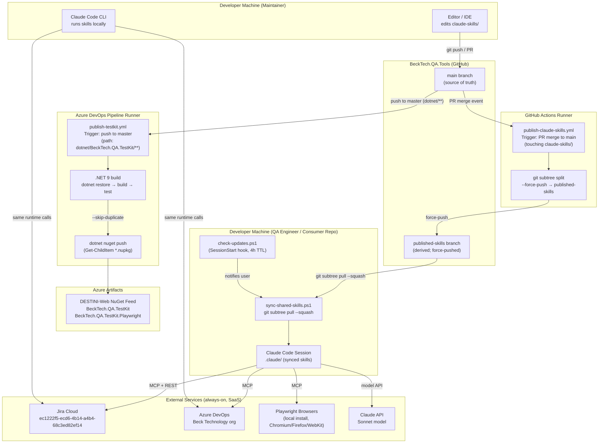

# Deployment & Infrastructure

> Generated by Reversa Architect · 2026-05-23
> Confidence: 🟢 CONFIRMADO | 🟡 INFERIDO | 🔴 LACUNA

---

## Overview

BeckTech.QA.Tools has **no server deployments**. Infrastructure consists of two CI/CD pipelines and a git-based distribution mechanism. There is no containerization (no Docker, no Kubernetes). All execution happens in developer machines (Claude Code sessions) or CI runners.

---

## Deployment Diagram



---

## Pipeline Details

### `publish-claude-skills.yml` (GitHub Actions)

| Attribute | Value | Confidence |
|-----------|-------|------------|
| **Trigger** | PR completed to `main`, touching `claude-skills/**` | 🟢 |
| **PR filter** | `pr: none` — never runs on open PRs | 🟢 |
| **Action** | `git subtree split -b published-skills --force-push` | 🟢 |
| **Output** | `published-skills` branch updated (history rewritten) | 🟢 |
| **Runner** | GitHub-hosted (Ubuntu, inferred) | 🟡 |
| **Auth** | GitHub Actions `GITHUB_TOKEN` (implicit) | 🟡 |

### `publish-testkit.yml` (Azure DevOps Pipelines)

| Attribute | Value | Confidence |
|-----------|-------|------------|
| **Trigger** | Push to `master`, path filter `dotnet/BeckTech.QA.TestKit/**` | 🟢 |
| **PR filter** | `pr: none` + `ne(Build.Reason, 'PullRequest')` (double gate) | 🟢 |
| **SDK** | `.NET 9.x` | 🟢 |
| **Steps** | `dotnet restore` → `dotnet build` → `dotnet test` → `dotnet nuget push` | 🟢 |
| **nupkg glob** | `Get-ChildItem *.nupkg -Recurse` (PowerShell, not shell glob) | 🟢 |
| **Idempotency** | `--skip-duplicate` — same version = no-op | 🟢 |
| **Output** | `BeckTech.QA.TestKit` + `BeckTech.QA.TestKit.Playwright` to DESTINI-Web | 🟢 |
| **Auth** | `NuGetAuthenticate@1` service connection | 🟡 |
| **Service connection identity** | AAD principal/group not documented | 🔴 |

---

## Distribution Mechanism (git subtree)

```
BeckTech.QA.Tools
└── claude-skills/           ← source
      ↓  git subtree split
published-skills branch      ← derived artifact (no history)
      ↓  git subtree pull --squash
Consumer Repo
└── .claude/                 ← synced copy (guarded by PreToolUse hook)
```

| Step | Command | Who Runs | Confidence |
|------|---------|----------|------------|
| Publish | `publish-skills.ps1` → `git subtree split -b published-skills --force-push` | CI or Maintainer | 🟢 |
| Consume | `sync-shared-skills.ps1` → `git subtree pull --prefix=.claude shared-skills published-skills --squash` | QA Engineer | 🟢 |
| Check updates | `check-updates.ps1` (SessionStart hook, 4h TTL cache) | Automatic | 🟢 |
| Guard edits | `guard-shared-skills.ps1` (PreToolUse hook, exit 2) | Automatic | 🟢 |

---

## Environments

| Environment | Type | Used For | Confidence |
|-------------|------|----------|------------|
| **Developer machine** | Local | Skill development, local testing, consumer skill invocation | 🟢 |
| **GitHub Actions runner** | Ephemeral CI | Publish `published-skills` branch | 🟢 |
| **Azure DevOps runner** | Ephemeral CI | Build and publish TestKit NuGet packages | 🟢 |
| **Jira Cloud** | SaaS (always-on) | Work item source of truth | 🟢 |
| **Azure DevOps** | SaaS (always-on) | Test management + Azure Artifacts NuGet feed | 🟢 |

No staging, no containerized deployments, no infrastructure-as-code (Terraform/Bicep/ARM) detected. 🟢

---

## Secrets & Credentials

| Secret | Where Stored | Used By | Confidence |
|--------|-------------|---------|------------|
| `ATLASSIAN_EMAIL` | Env var (user machine) | Jira REST scripts | 🟢 |
| `ATLASSIAN_API_TOKEN` | Env var (user machine) | Jira REST scripts | 🟢 |
| `ADO_PAT` | Env var (user machine) | ADO MCP + scripts | 🟢 |
| GitHub `GITHUB_TOKEN` | GitHub Actions (implicit) | `publish-claude-skills.yml` push | 🟡 |
| NuGet service connection | ADO service connection | `NuGetAuthenticate@1` | 🟡 |
| `~/.claude/settings.local.json` | User-local file (gitignored) | Personal session tokens | 🟢 |

**Gap:** `QA_ALLOW_SHARED_EDIT=1` env var bypasses guard hook. Not documented in consumer-facing setup docs. 🟢 (known)
