# ERD — BeckTech.QA.Tools Domain Entities

> Generated by Reversa Architect · 2026-05-23
> Confidence: 🟢 CONFIRMADO | 🟡 INFERIDO | 🔴 LACUNA

> **Note:** This system has **no database**. Entities below are logical domain objects that exist as JSON files, Markdown documents, ADO work items, or Jira issues. The ERD captures their structural relationships and cardinalities.

---

## ERD Diagram

```mermaid
erDiagram

    %% ── JIRA SIDE ──────────────────────────────────────────────────────────

    JiraIssue {
        string key PK "e.g. QA-123, DC-456"
        string type "Bug | Automation Story | QA Story | Spike | Subtask"
        string title
        string status "To Do | In Progress | Done | etc."
        string parent_key FK "nullable; for Subtask"
        string project_key
        string cloud_id "hardcoded: ec1222f5-..."
        string updated "ISO-8601 timestamp for cache freshness"
        string customfield_10257 "TestPlan ID (written by apply-test-plan)"
        string customfield_10258 "TestSuite ID (written by apply-test-plan)"
    }

    JiraIssueCache {
        string key PK
        string cache_dir "~/.claude/fetch-jira-item/<key>/"
        string raw_json "raw.json — source of truth for freshness"
        string brief_md "jira-fetch-brief.md — structured summary for agents"
        string[] attachment_paths "local paths if attachments downloaded"
    }

    JiraIssue ||--o| JiraIssue : "parent_key (Subtask → parent)"
    JiraIssue ||--|| JiraIssueCache : "cached locally per fetch"

    %% ── TEST PLAN SIDE ──────────────────────────────────────────────────────

    TestPlan {
        string file_path PK "relative path in consuming repo"
        string type "feature | regression"
        string plan_type "Feature | Regression"
        string coverage_scope "epic/story key or AUT name"
        string[] sections "Markdown section headers"
        TestCase[] test_cases
    }

    Sidecar {
        string file_path PK "adjacent to TestPlan .md"
        string generated_at
        object defaults "Operations JSON defaults block"
        TestCase[] test_cases "parsed test cases matching Operations JSON"
    }

    TestPlan ||--|| Sidecar : "generates (apply-test-plan caches)"

    %% ── ADO SIDE ──────────────────────────────────────────────────────────

    ADOTestPlan {
        int id PK
        string name
        string area_path
        string iteration_path
        string state
    }

    ADOTestSuite {
        int id PK
        int test_plan_id FK
        int parent_suite_id FK "nullable"
        string name
        string suite_type "StaticTestSuite | RequirementTestSuite"
    }

    ADOTestCase {
        int id PK
        string title
        string state "Design | Ready | Closed"
        string aut "Custom.AUT"
        string qa_functional_area "Custom.QAFunctionalArea"
        string coverage_type "Story | Regression | Exploratory"
        string automation_status "Planned | Not Automated | Automated"
        bool manual "Custom.Manual"
        string manual_reason "Custom.ManualReason (required if manual=true)"
        string regression_coverage_eval "Custom.RegressionCoverageEvaluation"
        string[] steps "HTML-formatted steps (set via testplan_update_test_case_steps)"
    }

    ADOPullRequest {
        int id PK
        string title
        string status "Active | Completed | Abandoned"
        string source_branch
        string target_branch
        string[] reviewer_ids
    }

    ADOTestPlan ||--|{ ADOTestSuite : "contains"
    ADOTestSuite ||--o{ ADOTestSuite : "parent_suite_id (nested suites)"
    ADOTestSuite ||--|{ ADOTestCase : "contains"

    %% ── OPERATIONS JSON ──────────────────────────────────────────────────────

    OperationsJSON {
        string file_path PK "input file to create-ado-test-cases.ps1"
        object defaults "aut, qa_functional_area, coverage_type, etc."
        TestCaseSpec[] test_cases "array of TC specs"
    }

    OperationsJSON ||--|{ ADOTestCase : "creates (NOT idempotent)"
    Sidecar }|--|| OperationsJSON : "schema-aligned (reused)"

    %% ── DISTRIBUTION SIDE ──────────────────────────────────────────────────────

    SharedManifest {
        string file_path PK "claude-skills/SHARED_MANIFEST"
        string[] paths "list of relative paths to sync"
        string last_generated "timestamp"
    }

    SyncRecord {
        string repo_root PK "consumer repo root path"
        string last_sync "ISO-8601"
        string[] synced_paths "recorded paths for set-delta"
    }

    Skill {
        string name PK "e.g. apply-test-plan"
        string skill_md_path "path to SKILL.md"
        int version "qa-version marker"
        bool user_invocable
        string[] dependencies "other skills or agents"
    }

    Agent {
        string name PK "qa-investigate | qa-implement"
        string model "Sonnet"
        string[] allowed_tools
        string output_contract "investigation.md | source files"
    }

    PowerShellScript {
        string name PK "e.g. fetch-jira-issue.ps1"
        string category "jira | ado | utility | setup"
        string output_format "Standard Output Envelope: {success, data, error}"
    }

    SharedManifest ||--|{ Skill : "tracks (sync paths)"
    SyncRecord }|--|| SharedManifest : "records (per repo)"
    Skill ||--o{ Agent : "spawns"
    Skill ||--o{ PowerShellScript : "calls"
    Skill ||--o{ Skill : "composes (higher-order)"

    %% ── CROSS-DOMAIN LINKS ──────────────────────────────────────────────────────

    JiraIssue ||--o{ ADOTestPlan : "linked via customfield_10257 (TestPlan ID)"
    JiraIssue ||--o{ ADOTestSuite : "linked via customfield_10258 (TestSuite ID)"
    TestPlan ||--|{ ADOTestCase : "produces (via apply-test-plan)"
    JiraIssue ||--o| ADOPullRequest : "referenced (commit-change + create PR)"
```

---

## Entity Descriptions

### Jira-Side Entities

| Entity | Storage | Owner | Confidence |
|--------|---------|-------|------------|
| `JiraIssue` | Jira Cloud | Atlassian | 🟢 |
| `JiraIssueCache` | `~/.claude/fetch-jira-item/` | Local filesystem (user) | 🟢 |

### Test Plan Entities

| Entity | Storage | Owner | Confidence |
|--------|---------|-------|------------|
| `TestPlan` | Markdown file in consuming repo | QA Engineer | 🟢 |
| `Sidecar` | JSON adjacent to TestPlan | `apply-test-plan` skill | 🟢 |
| `OperationsJSON` | JSON input file | `create-ado-test-cases.ps1` | 🟢 |

### ADO Entities

| Entity | Storage | Owner | Confidence |
|--------|---------|-------|------------|
| `ADOTestPlan` | Azure DevOps | Microsoft ADO | 🟢 |
| `ADOTestSuite` | Azure DevOps | Microsoft ADO | 🟢 |
| `ADOTestCase` | Azure DevOps Work Item | Microsoft ADO | 🟢 |
| `ADOPullRequest` | Azure DevOps Repos | Microsoft ADO | 🟢 |

### Distribution Entities

| Entity | Storage | Owner | Confidence |
|--------|---------|-------|------------|
| `SharedManifest` | `claude-skills/SHARED_MANIFEST` | BeckTech.QA.Tools | 🟢 |
| `SyncRecord` | `.sync-record` in consumer repo | Consumer repo | 🟢 |
| `Skill` | `claude-skills/skills/*/SKILL.md` | BeckTech.QA.Tools | 🟢 |
| `Agent` | `claude-skills/agents/*.md` | BeckTech.QA.Tools | 🟢 |
| `PowerShellScript` | `claude-skills/scripts/*.ps1` | BeckTech.QA.Tools | 🟢 |

---

## Key Invariants

| Invariant | Description | Confidence |
|-----------|-------------|------------|
| **No DB** | System has no persistent database. All state is external (Jira, ADO) or transient (session). | 🟢 |
| **Cache freshness** | `JiraIssueCache` is valid only if `raw.json` exists AND `updated` field matches live Jira. | 🟢 |
| **TC non-idempotent** | `OperationsJSON → ADOTestCase` creation is not idempotent. Same input = duplicate TCs. | 🟢 |
| **TestPlan → Sidecar** | Sidecar schema is intentionally aligned with OperationsJSON to avoid re-serialization in `apply-test-plan`. | 🟢 |
| **Jira writeback scope** | `JiraIssue.customfield_10257/10258` only written for **feature** plans, never for regression plans. | 🟢 |
