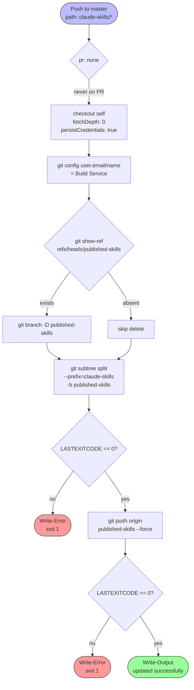

# Flowchart — `publish-claude-skills.yml`

> Source: `publish-claude-skills.yml` (63 lines)
> Type: Azure DevOps Pipelines YAML
> Trigger: push to `master` touching `claude-skills/*`

## Pipeline flow

## Step-level decisions

| Decision | Branch a | Branch b |
|---|---|---|
| Local `published-skills` exists? | delete with `branch -D` | continue |
| `git subtree split` exit code | non-zero → fail job | zero → push |
| `git push --force` exit code | non-zero → fail job | zero → success |

## Why force-push?

`published-skills` is a **projection** of `claude-skills/`, not an additive history. Every release recomputes the entire branch via `git subtree split` and overwrites the remote. Consumers `git subtree pull` from this branch, so they expect a flattened, rewritable history.
