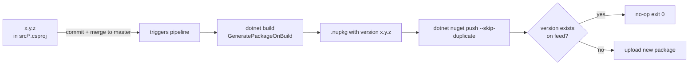

# Flowchart — `publish-testkit.yml`

> Source: `publish-testkit.yml` (87 lines)
> Type: Azure DevOps Pipelines YAML
> Trigger: push to `master` touching `dotnet/BeckTech.QA.TestKit/**`

## Pipeline flow

```mermaid
flowchart TD
    A([Push to master<br/>path: dotnet/BeckTech.QA.TestKit/**]) --> B{pr: none}
    B --> C[checkout self<br/>fetchDepth: 1]
    C --> D[UseDotNet@2<br/>sdk 9.0.x]
    D --> E[dotnet restore<br/>solution]
    E --> F[dotnet build<br/>--configuration Release<br/>--no-restore]
    F -->|GeneratePackageOnBuild<br/>emits .nupkg| G[dotnet test<br/>--no-build<br/>--logger trx<br/>--logger console]
    G --> H[PublishTestResults@2<br/>condition: succeededOrFailed]
    H --> I{succeeded AND<br/>Build.Reason != PullRequest?}
    I -->|no| END1([Stop — test-only run])
    I -->|yes| J[CopyFiles@2<br/>**/bin/Release/*.nupkg<br/>--> staging/nuget<br/>flattenFolders: true]
    J --> K[NuGetAuthenticate@1]
    K --> L{succeeded AND<br/>Build.Reason != PullRequest?}
    L -->|no| END2([Stop])
    L -->|yes| M[pwsh: Get-ChildItem<br/>staging/nuget *.nupkg]
    M --> N{packages found?}
    N -->|no| Z1([throw — no nupkgs])
    N -->|yes| O[dotnet nuget push<br/>$packages.FullName<br/>-s azureArtifactsPath<br/>-k az --skip-duplicate]
    O --> P{LASTEXITCODE == 0?}
    P -->|no| Z2([throw — push failed])
    P -->|yes| Q([Pushed to<br/>DESTINI-Web feed])

    style A fill:#bbf,stroke:#333
    style Q fill:#9f9,stroke:#333
    style Z1 fill:#f99,stroke:#333
    style Z2 fill:#f99,stroke:#333
```

## Conditional matrix

| Step | Condition | Skipped when |
|---|---|---|
| `Restore`, `Build`, `Test` | unconditional | never |
| `PublishTestResults@2` | `succeededOrFailed()` | only when prior step is `canceled` or `skipped` |
| `CopyFiles@2` | `and(succeeded(), ne(Build.Reason, 'PullRequest'))` | prior fail OR PR trigger |
| `NuGetAuthenticate@1` | unconditional | never (runs even on dry-runs) |
| `dotnet nuget push` (pwsh) | `and(ne(Build.Reason, 'PullRequest'), succeeded())` | prior fail OR PR trigger |

## Version-release semantics



The pipeline is **stateless w.r.t. previous runs** — the release version is whatever `<Version>` is set to in the csproj at the commit being built. `--skip-duplicate` makes same-version re-runs idempotent.

## Why glob in pwsh, not in `dotnet nuget push`?

| Layer | Glob behaviour |
|---|---|
| `bash` native command args | auto-expands `*.nupkg` |
| `pwsh` native command args | **does not** auto-expand `*.nupkg` |
| `dotnet nuget push` CLI | own glob logic — regressed between SDK patches in the past |

Solution: enumerate with `Get-ChildItem -Filter *.nupkg`, pass `$packages.FullName` (resolved paths) to the CLI. Removes dependency on either shell or CLI glob behaviour. PR 14547 (`bc5df85`) introduced this fix.
