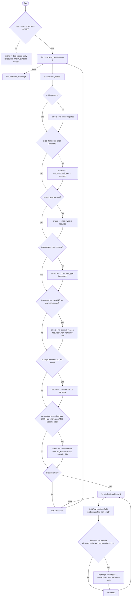

# Flowchart — Validate-OperationsJson (create-ado-test-cases.ps1)

**Source:** `claude-skills/scripts/create-ado-test-cases.ps1` lines 84–134
**Inputs:** `[object]$Ops`
**Outputs:** `@{ Errors = [], Warnings = [] }`

---

---

## Decision summary

| Rule | Type | Outcome |
|---|---|---|
| `test_cases` missing or empty | hard | early exit with single error |
| missing `title`/`qa_functional_area`/`test_type`/`coverage_type` | hard | error added, continue checking other rules |
| `manual=true` but no `manual_reason` | hard | error added |
| `steps` provided but not an array | hard | error added |
| `description_metadata` has both `ac_references` and `absorbs_ids` | hard | error added (XOR rule) |
| step `action` first word ∈ forbidden verbs (`observe`,`verify`,`see`,`check`,`confirm`,`note`) | soft | warning added |

Hard errors abort the whole run (caller calls `Write-Error` → `$ErrorActionPreference=Stop` → exit). Warnings are surfaced in the response envelope under `data.warnings`.
