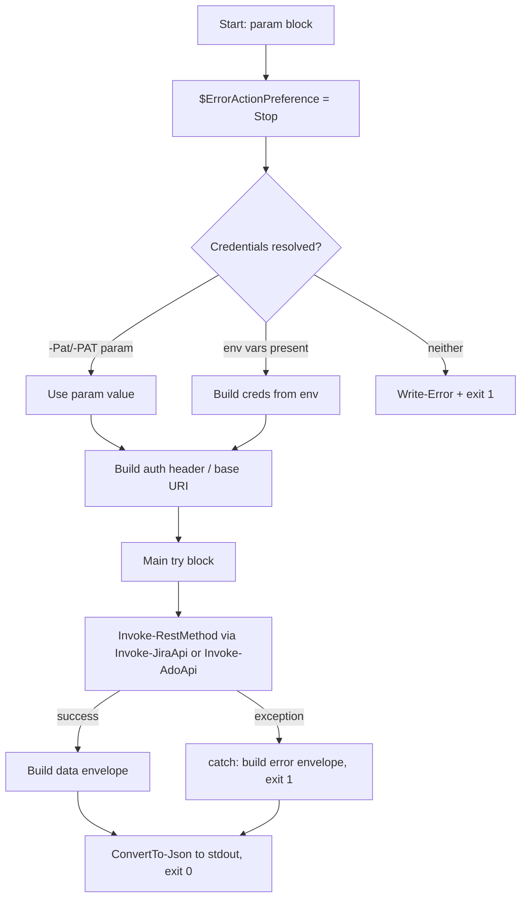
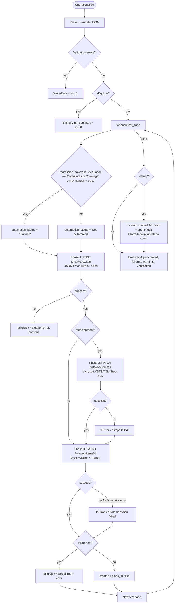
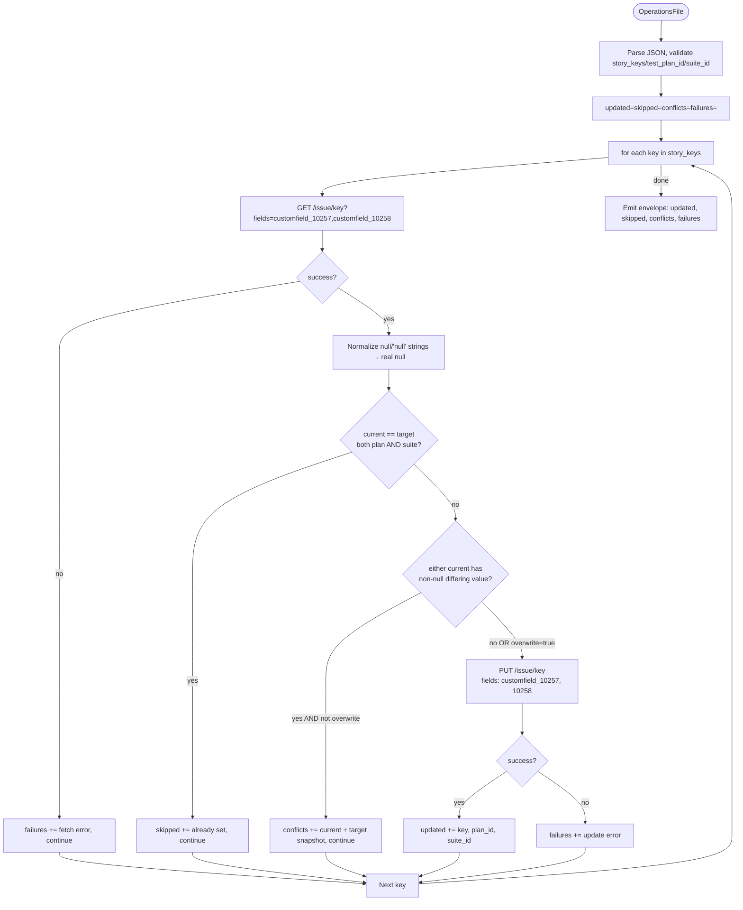
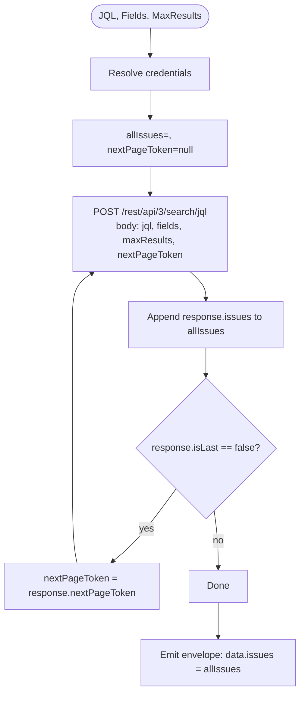
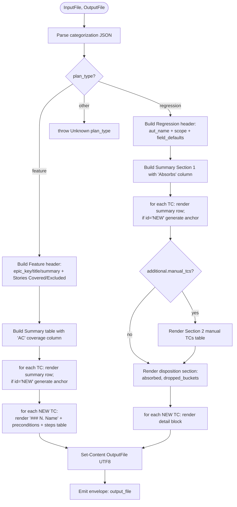
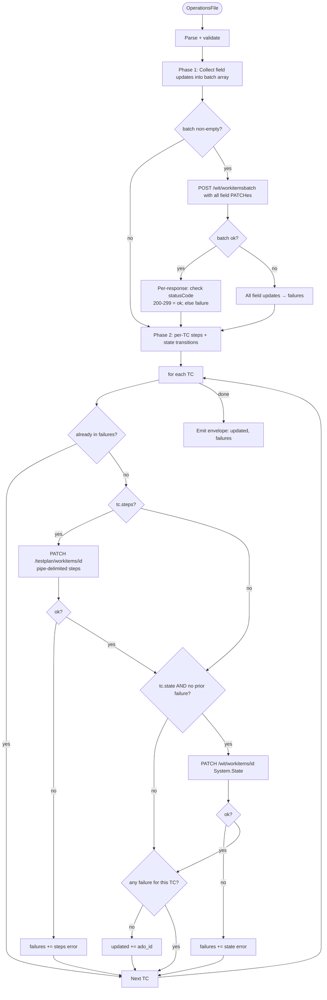
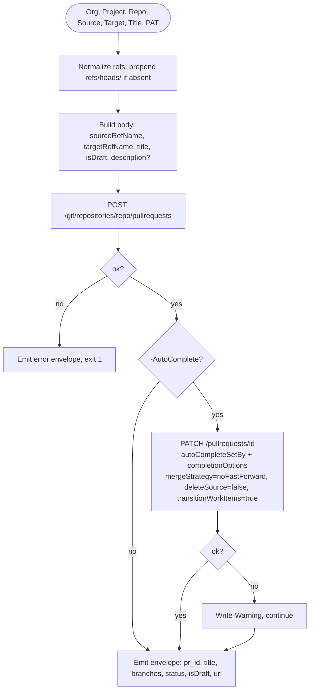
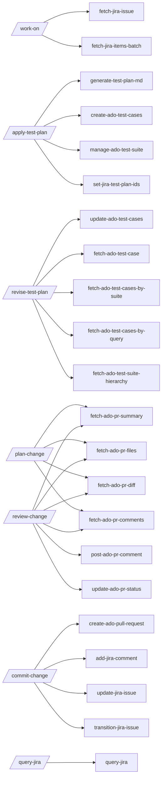

# Flowcharts — Scripts Module

**Module:** claude-skills/scripts/ (22 PowerShell automation scripts)
**Last updated:** 2026-05-23

---

## 1. Common script lifecycle (applies to all 22)



---

## 2. create-ado-test-cases.ps1 — Multi-phase TC creation



---

## 3. manage-ado-test-suite.ps1 — Suite resolution + TC add

```mermaid
flowchart TD
    Start([OperationsFile]) --> Parse[Parse JSON, validate plan_id + name/id]
    Parse --> Branch{ops.suite_id provided?}

    Branch -->|yes| UseId[suite_id = ops.suite_id]
    Branch -->|no| List[GET /testplan/plans/planId/suites]

    List --> Filter[Filter where name == ops.suite_name]
    Filter --> Count{count?}
    Count -->|2+| Ambig[ERROR: ambiguous suite name + exit 1]
    Count -->|1| UseFound[suite_id = existing[0].id]
    Count -->|0| Parent{ops.parent_suite_id?}

    Parent -->|yes| UseParent[parentId = ops.parent_suite_id]
    Parent -->|no| FindRoot[Find suiteType == 'RootSuite']
    FindRoot --> RootCheck{found?}
    RootCheck -->|no| FailRoot[ERROR + exit 1]
    RootCheck -->|yes| UseRoot[parentId = root.id]

    UseParent --> Create[POST /testplan/plans/planId/suites/parentId<br/>name + suiteType=StaticTestSuite]
    UseRoot --> Create
    Create --> CreateOK{success?}
    CreateOK -->|no| FailCreate[ERROR + exit 1]
    CreateOK -->|yes| UseCreated[suite_id = created.id]

    UseId --> AddTCs
    UseFound --> AddTCs
    UseCreated --> AddTCs

    AddTCs{tc_ids present?}
    AddTCs -->|no| Out
    AddTCs -->|yes| Batch[POST /test/plans/planId/suites/suiteId/testcases/id1,id2,...]
    Batch --> BatchOK{success?}
    BatchOK -->|yes| AddedAll[added_tc_ids = all]
    BatchOK -->|no| PerID[for each id: POST single]
    PerID --> PerIDLoop{success per id?}
    PerIDLoop -->|yes| AppendAdded
    PerIDLoop -->|no| AppendFail[failures += id, error]
    AppendAdded --> PerID
    AppendFail --> PerID
    PerID -->|done| Out
    AddedAll --> Out[Emit envelope: suite, added_tc_ids, failures]
```

---

## 4. set-jira-test-plan-ids.ps1 — Conflict-aware custom field write



---

## 5. fetch-jira-items-batch.ps1 — Auto-paginated JQL search



---

## 6. generate-test-plan-md.ps1 — Categorization → Markdown



---

## 7. update-ado-test-cases.ps1 — Two-phase update



---

## 8. create-ado-pull-request.ps1 — PR creation + optional auto-complete



---

## 9. Distribution-level call graph (skills → scripts)



🟡 **Inferred edges** — based on skill names and script purposes; precise call sites should be confirmed by reading each SKILL.md.
