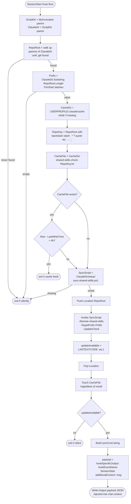

# Flowchart — `check-updates.ps1`

> `claude-skills/setup/check-updates.ps1` lines 11–73. Confidence 🟢.
> Hook type: SessionStart. Output JSON only when updates exist.

## Key constants

| Constant | Value | Where |
|---|---|---|
| Cache TTL | 4 hours | line 35 (`[TimeSpan]::FromHours(4)`) |
| Cache root | `$env:USERPROFILE/.claude/cache` | line 28 |
| Cache key sanitizer | regex `[\\/:*?"<>|]` → `'_'` | line 30 |
| Sync remote (hardcoded) | `shared-skills` | line 48 |

## Side effects

1. **Creates `~/.claude/cache/`** if missing (uses `New-Item -Force`).
2. **Touches `CacheFile`** with current timestamp on every non-cached run, even if the sync check errors.
3. **Emits one JSON object** to stdout iff updates available. Otherwise silent (no `Write-Output`).

## Error posture

`$ErrorActionPreference = 'SilentlyContinue'` at top (line 8). Combined with `2>$null` redirects on `git fetch`/sync, the hook is engineered to never produce stderr noise during session startup.
