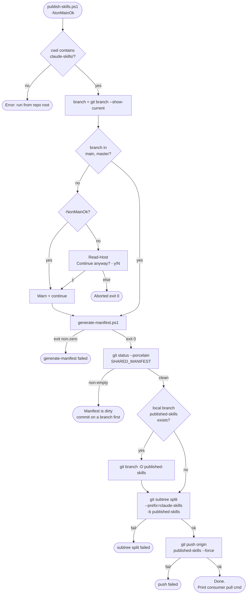

# Flowchart — `publish-skills.ps1`

> `claude-skills/setup/publish-skills.ps1` lines 12–82. Confidence 🟢.

## Critical invariants

| Step | Invariant | Why |
|---|---|---|
| Manifest dirty check (line 48) | Must be clean before publish | Forces manifest regeneration to ship in the same PR as the file change |
| Force-delete local branch (line 59) | `git branch -D` if exists | `git subtree split -b` refuses to write into an existing branch |
| Force-push (line 71) | `--force` always | Publish branch is a rebuild from main, not additive |
| Branch gate (line 26) | Only main/master unless `-NonMainOk` | Prevents publishing stale or experimental subtree state |
