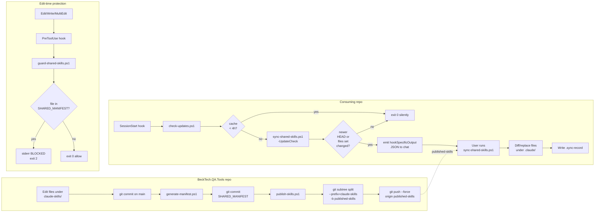
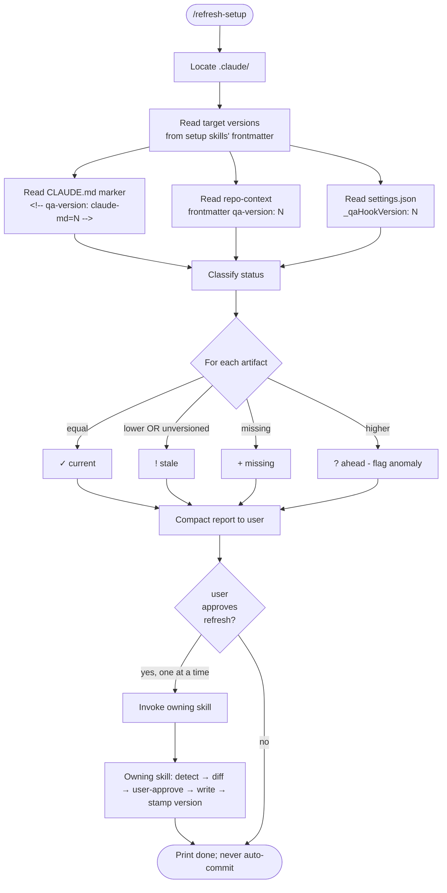

# Flowcharts — Setup & Configuration Module

> Module-level flow. Per-function flowcharts: `setup-sync.md`, `setup-publish.md`, `setup-guard.md`, `setup-check-updates.md`.
> Confidence: 🟢 CONFIRMADO unless noted.

## Distribution lifecycle (producer → consumer)

## Onboarding flow (per user, per repo)

```mermaid
flowchart TD
    Start([User runs /onboard]) --> Pre1{shared-skills<br/>remote configured?}
    Pre1 -->|no| Pre1a[git remote add shared-skills]
    Pre1 -->|yes| Pre2
    Pre1a --> Pre2{repo-context<br/>filled in?}
    Pre2 -->|no| Pre2a[Offer /setup-repo-context]
    Pre2 -->|yes| Pre3
    Pre2a --> Pre3{CLAUDE.md in<br/>QA-owned dir?}
    Pre3 -->|no| Pre3a[Offer /setup-claude-md]
    Pre3 -->|yes| Pre4
    Pre3a --> Pre4[git fetch shared-skills]
    Pre4 --> Pre5{updates<br/>available?}
    Pre5 -->|yes| Pre5a[Offer sync]
    Pre5 -->|no| S1
    Pre5a --> S1

    S1{hooks<br/>installed AND<br/>_qaHookVersion<br/>== current?} -->|no| S1a[Invoke<br/>setup-claude-hooks]
    S1 -->|yes| S2
    S1a --> S2{atlassian<br/>MCP listed?}
    S2 -->|no| S2a[Invoke<br/>setup-atlassian-mcp]
    S2 -->|yes| S3
    S2a --> S3{ATLASSIAN_EMAIL<br/>and TOKEN set?}
    S3 -->|no| S3a[Invoke<br/>setup-atlassian-credentials]
    S3 -->|yes| S4
    S3a --> S4{ado MCP<br/>listed?}
    S4 -->|no| S4a[Invoke<br/>setup-azure-devops-mcp]
    S4 -->|yes| S5
    S4a --> S5{ADO_PAT set?}
    S5 -->|no| S5a[Invoke<br/>setup-ado-credentials]
    S5 -->|yes| S6
    S5a --> S6{playwright<br/>MCP listed?}
    S6 -->|no| S6a[Ask user; if yes:<br/>setup-playwright-mcp]
    S6 -->|yes| S7
    S6a --> S7{notify.ps1 +<br/>Stop/Notification<br/>hooks present?}
    S7 -->|no| S7a[Ask user; if yes:<br/>setup-notifications]
    S7 -->|yes| Done
    S7a --> Done([Print summary<br/>with ✓ + - ! markers])
```

## Drift audit (`/refresh-setup`)

