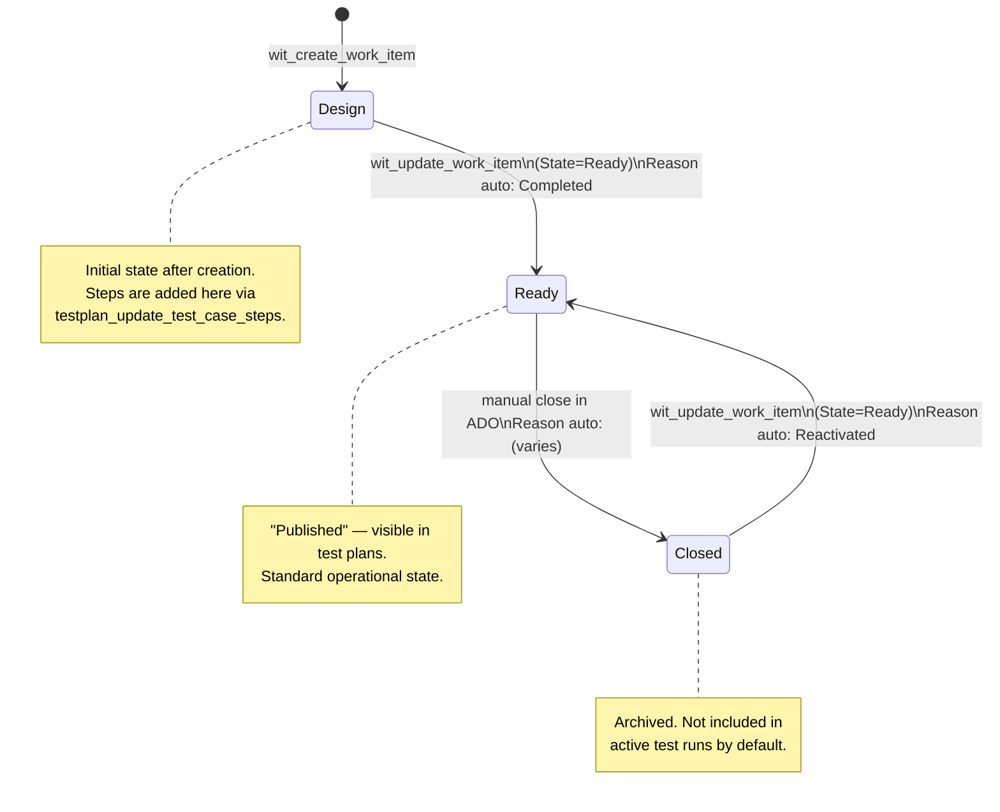
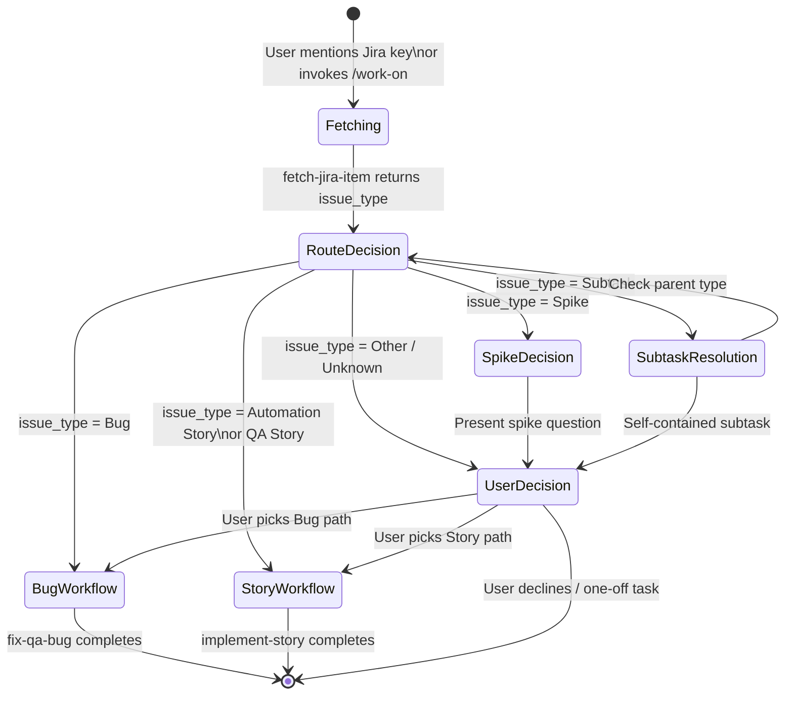
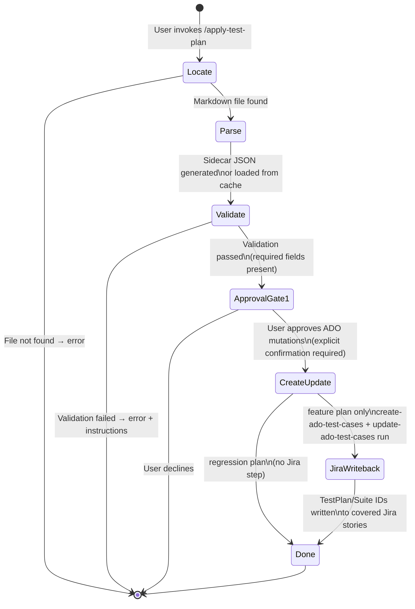
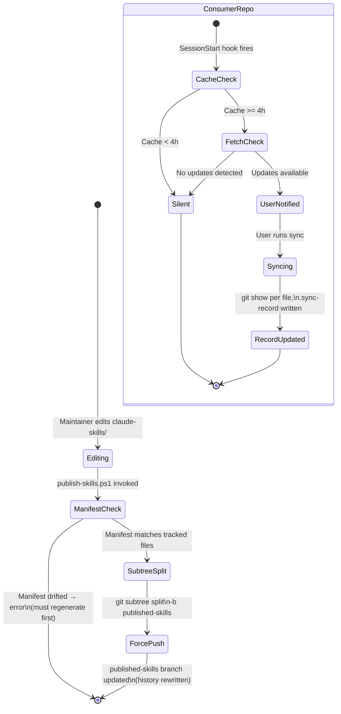
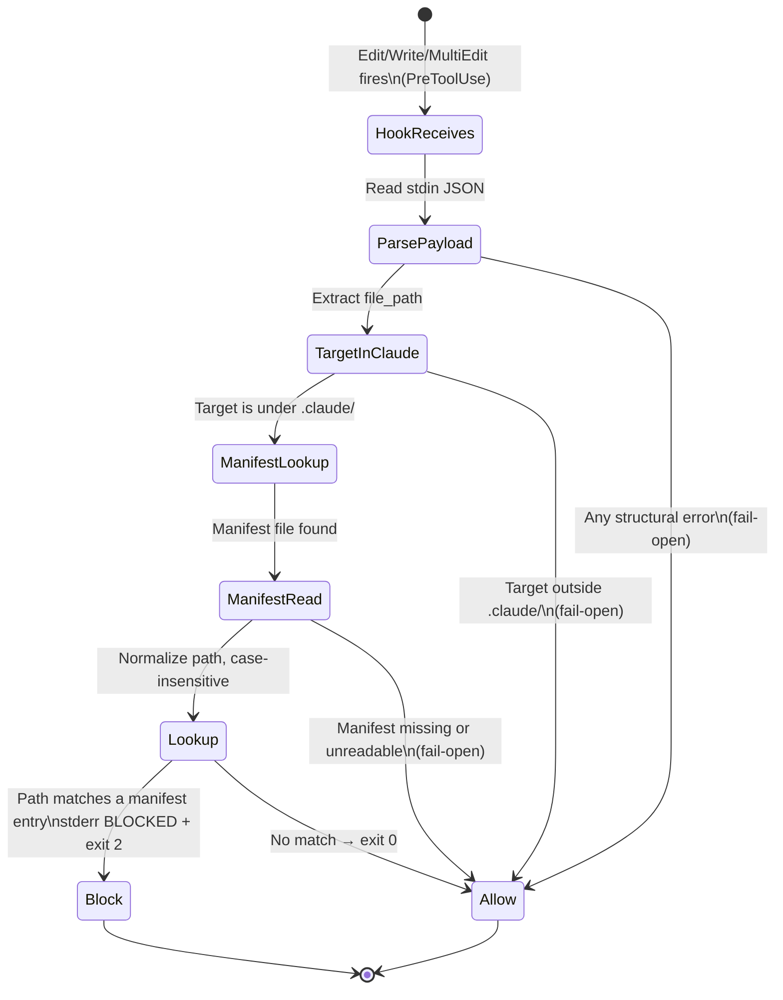

# State Machines — BeckTech.QA.Tools

> Generated by Reversa Detective · 2026-05-23
> Confidence: 🟢 CONFIRMADO | 🟡 INFERIDO | 🔴 LACUNA

---

## 1. ADO Test Case — System.State

The primary entity with a formal state machine is the **ADO Test Case** work item.

### States and Transitions

### Business Rules

| Rule | Detail | Confidence |
|------|--------|------------|
| Creation always lands in `Design` | `wit_create_work_item` produces `Design` state | 🟢 |
| `Design → Ready` requires separate PATCH | Cannot combine creation fields + state transition in one call | 🟢 |
| `Closed → Design` is NOT a valid transition | Re-open always targets `Ready` | 🟢 |
| Never set `System.Reason` manually | Workflow assigns `Completed` / `Reactivated` automatically | 🟢 |
| Disposition `Absorbed` / `Dropped` → state unchanged | Field updates only; no state transition needed | 🟡 |

---

## 2. Work Item Routing — work-on Router

The `work-on` skill acts as a state machine routing Jira issue types to downstream workflows.

### Shortcut Rule

If user's message makes type obvious (`fix QA-1234`, `implement DC-456`), `RouteDecision` is skipped. Jira fetch still runs.

---

## 3. apply-test-plan — Execution Pipeline

`apply-test-plan` has a linear gate-based state machine: each stage must pass before the next is allowed.

**Gate invariant:** `apply-test-plan` never authors or edits plan content. Any content issue → redirect to `/revise-test-plan`.

---

## 4. Skill Distribution — published-skills Branch

---

## 5. Jira Issue — Status (🔴 LACUNA)

The Jira issue status lifecycle for QA items is **not extractable from this repo's source**. The `fetch-jira-item` skill reads and writes statuses via the Atlassian API, but the allowed transitions and status values are defined in Jira project configuration (not in code).

Known interaction points:
- `transition-jira-issue.ps1` resolves transition names → executes
- `apply-test-plan` transitions stories upon test plan application 🟡

**Verification required:** Inspect Jira project workflow configuration for QA and DC projects to map full status state machine.

---

## 6. Guard Hook — File Edit Decision

