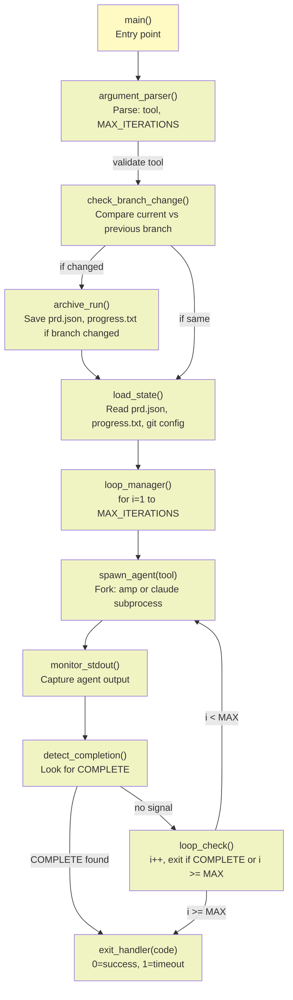
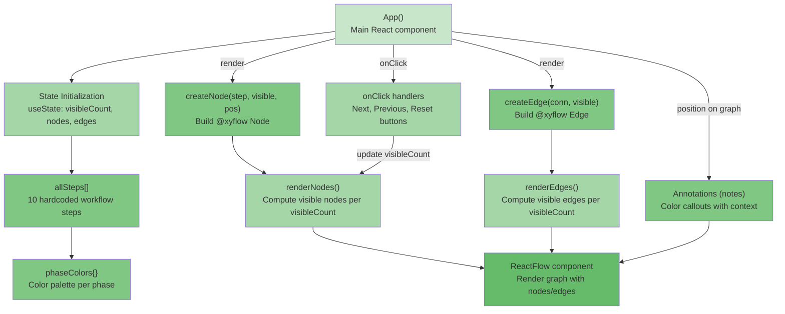
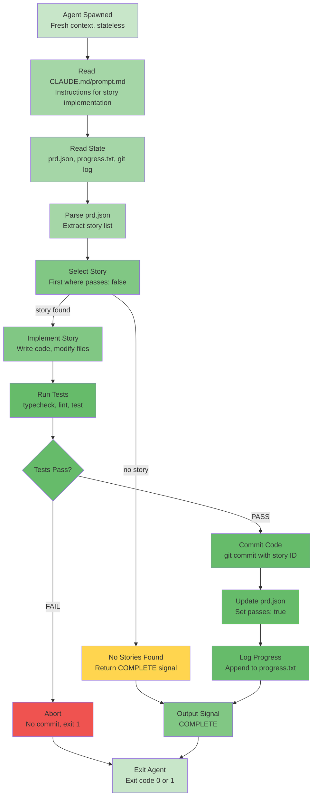

# Ralph — C4 Components Diagram

**Generated:** 2026-05-20  
**Confidence:** 🟢 CONFIRMED (ralph.sh, App.tsx)

---

## Components Overview

This diagram shows internal components of the most complex containers: Ralph Loop Orchestrator, Flowchart UI, and Agent Runtime.

---

## Component 1: Ralph Loop Orchestrator (ralph.sh)

### Internal Components



### Component Responsibilities

| Component | Input | Output | Logic |
|-----------|-------|--------|-------|
| **argument_parser** | `$@` (CLI args) | tool, MAX_ITERATIONS | Validate --tool [amp\|claude], parse MAX_ITERATIONS |
| **check_branch_change** | prd.json.branchName, git current branch | boolean (changed?) | Compare stored vs current branch |
| **archive_run** | Previous prd.json, progress.txt | archive/YYYY-MM-DD-{branch}/ | Copy files to archive if branch changed; reset progress.txt |
| **load_state** | prd.json, progress.txt, git config | $PRD_JSON, $PROGRESS_TXT, $BRANCH | Read files into memory/vars |
| **loop_manager** | MAX_ITERATIONS | Loop state (i, continue?) | Manage iteration counter; determine exit condition |
| **spawn_agent** | tool, prd.json, progress.txt | subprocess PID | Fork process: `amp` or `claude --prompt CLAUDE.md` |
| **monitor_stdout** | Agent stdout | Agent output stream | Capture all output; stream to terminal |
| **detect_completion** | Agent stdout stream | boolean (COMPLETE found?) | Grep for `<promise>COMPLETE</promise>` |
| **loop_check** | i, exit condition | (continue? or exit?) | Check if i >= MAX_ITERATIONS or COMPLETE detected |
| **exit_handler** | exit code | exit(code) | Print summary; exit with 0 or 1 |

### Key Data Structures

```bash
# Global state (in-memory during execution)
declare -r TOOL="amp"                    # or "claude"
declare -r MAX_ITERATIONS=10
declare BRANCH_NAME=""
declare STORY_PASSES_COUNT=0
declare AGENT_PID=""
```

### State Machine

```
START
  ├─ Parse arguments
  ├─ Check if branch changed
  ├─ If yes: archive previous run
  └─ Load prd.json, progress.txt
     │
LOOP (i=1 to MAX_ITERATIONS)
  ├─ Spawn agent (Amp or Claude)
  ├─ Monitor stdout for COMPLETE signal
  ├─ If COMPLETE found: goto EXIT_SUCCESS
  ├─ If not found AND i < MAX: goto LOOP (i+1)
  └─ If i >= MAX: goto EXIT_TIMEOUT
     │
EXIT_SUCCESS
  └─ Print "All stories completed"
     Exit 0
     
EXIT_TIMEOUT
  └─ Print "Max iterations reached"
     Exit 1
```

---

## Component 2: Flowchart UI (App.tsx)

### Internal Components



### Component Specifications

| Component | Type | Purpose | Data |
|-----------|------|---------|------|
| **App** | React Functional | Main component; manages state and lifecycle | visibleCount, nodes, edges, nodePositions |
| **State Initialization** | Hook | Initialize React state for animation | visibleCount: 1, nodes: [], edges: [] |
| **allSteps** | Data | Define 10 workflow steps (hardcoded) | Array of {id, label, description, phase} |
| **phaseColors** | Data | Color palette for phases (setup/loop/decision/done) | Record<Phase, {bg, border}> |
| **createNode** | Function | Build @xyflow Node object | Input: step, visible flag, position |
| **createEdge** | Function | Build @xyflow Edge object | Input: edge connection, visible flag |
| **renderNodes** | Computed | Recalculate node opacity & position based on visibleCount | Filtered: nodes where index <= visibleCount |
| **renderEdges** | Computed | Recalculate edge visibility & animation | Filtered: edges where both source & target visible |
| **Button Handlers** | Event | Handle user clicks (Next, Previous, Reset) | visibleCount++, visibleCount--, visibleCount=1 |
| **ReactFlow** | Component | @xyflow graph renderer | nodes[], edges[] |
| **Annotations** | Data | Colored callout notes (e.g., "PRD format") | Array of {id, position, color, content} |

### State Flow

```typescript
State: {
  visibleCount: 1,                              // Step counter (1-10)
  nodes: Node[],                                // @xyflow nodes
  edges: Edge[],                                // @xyflow edges
  nodePositions: Map<string, {x, y}>           // Persistent positions
}

// Derived state (recomputed on each render)
visibleNodes = nodes.filter(n => n.step_index <= visibleCount)
visibleEdges = edges.filter(e => 
  source_visible AND target_visible
)
```

### User Interaction Flow

```
User Click "Next" Button
  │
  └─ onClick handler
     ├─ visibleCount++
     ├─ Re-render with new visibleCount
     ├─ Recalculate nodes (opacity, visibility)
     ├─ Recalculate edges (animated if both endpoints visible)
     └─ @xyflow re-renders graph

Visual Result:
  ├─ Next node fades in
  ├─ Next edge animates (arrow moves from source to target)
  ├─ Previous nodes remain opaque
  └─ User sees one step at a time
```

### 10 Workflow Steps (allSteps)

```javascript
allSteps = [
  // SETUP (3 steps)
  { id: "setup-1", phase: "setup", label: "Write PRD", ... },
  { id: "setup-2", phase: "setup", label: "Convert to prd.json", ... },
  { id: "setup-3", phase: "setup", label: "Run ./ralph.sh", ... },
  
  // LOOP (5 steps)
  { id: "loop-1", phase: "loop", label: "Agent Spawned", ... },
  { id: "loop-2", phase: "loop", label: "Pick Story", ... },
  { id: "loop-3", phase: "loop", label: "Implement & Test", ... },
  { id: "loop-4", phase: "loop", label: "Commit & Update", ... },
  { id: "loop-5", phase: "loop", label: "Log Progress", ... },
  
  // DECISION (1 step)
  { id: "decision-1", phase: "decision", label: "More stories?", ... },
  
  // DONE (1 step)
  { id: "done-1", phase: "done", label: "Complete", ... }
]
```

---

## Component 3: AI Agent Runtime

### Internal Components (Pseudo-code, Platform-Agnostic)



### Component Responsibilities

| Component | Input | Output | Logic |
|-----------|-------|--------|-------|
| **Agent Start** | Subprocess args | Fresh context | Initialize with zero memory |
| **Read Instructions** | CLAUDE.md / prompt.md | Instructions in context | Load guidelines for story implementation |
| **Read State** | prd.json, progress.txt, git log | Story list, past patterns | Parse JSON; extract learnings |
| **Parse PRD** | prd.json | UserStory[] | Extract `stories[]` array |
| **Select Story** | stories[] | story or null | Find first where `passes: false` (or return null) |
| **No Stories Found** | null | COMPLETE signal | All stories done; output `<promise>COMPLETE</promise>` |
| **Implement Story** | story, repo state | Modified files | Write code to implement acceptance criteria |
| **Run Tests** | repo, modified files | test results | Execute: typecheck, lint, test |
| **TestPass Decision** | test results | Pass/Fail | Branch: if all pass, commit; else abort |
| **Commit Code** | Modified files | git commit | Stage files, commit with `feat: [Story ID] - [Title]` |
| **Update prd.json** | story.id | prd.json updated | Set `story.passes = true`; commit to git |
| **Log Progress** | story, files changed, learnings | progress.txt entry | Append structured entry with date, story ID, learnings |
| **Output Complete** | (nothing) | stdout | Print `<promise>COMPLETE</promise>` (if all stories done) |
| **Abort** | test failure | exit code 1 | No commit; exit with error code |
| **Exit Agent** | success or failure | exit(0 or 1) | Terminate subprocess |

### Execution Flow (State Machine)

```
SPAWN AGENT
  ├─ Load instructions (CLAUDE.md)
  ├─ Load state (prd.json, progress.txt)
  ├─ Parse PRD
  ├─ Find first story where passes: false
  │
  ├─ IF no story found:
  │  └─ Output <promise>COMPLETE</promise>
  │     Exit 0
  │
  └─ IF story found:
     ├─ Implement story
     ├─ Run tests
     │
     ├─ IF tests pass:
     │  ├─ Commit code
     │  ├─ Update prd.json
     │  ├─ Log progress
     │  └─ IF more stories exist: exit 0 (loop continues)
     │     ELSE: output <promise>COMPLETE</promise>, exit 0
     │
     └─ IF tests fail:
        └─ Abort (no commit)
           Exit 1
```

### Quality Check Subprocess

```
Run Tests = [
  1. typecheck (e.g., tsc --noEmit)
  2. lint (e.g., eslint src/)
  3. test (e.g., npm test)
]

ALL must pass. If ANY fails: ABORT.
```

---

## Component Interactions

### Orchestrator ↔ Agent

```
ralph.sh                          Agent subprocess
─────────────────────────────────────────────────
  spawn_agent(--tool amp)  ──────→
                         Reads: prd.json, progress.txt
                         Reads: CLAUDE.md
                                 │
                         Implement story
                         Run tests
                                 │
                         Outputs: stdout + updates files
                    ←────────────────────────
  monitor_stdout           Agent exits with code
  detect_completion
  loop_check
```

### Agent ↔ File System

```
Agent
├─ Reads:
│  ├─ prd.json (story to implement)
│  ├─ progress.txt (patterns to follow)
│  ├─ git log (history)
│  └─ CLAUDE.md (instructions)
│
└─ Writes:
   ├─ Source code files (repo root)
   ├─ git commit (updated prd.json)
   ├─ progress.txt (append entry)
   └─ stdout (completion signal)
```

### Flowchart ↔ User

```
User Browser
├─ Views: hardcoded 10-step workflow
├─ Clicks: Next, Previous, Reset buttons
├─ Sees: node fade-in, edge animations
└─ Understands: Ralph's loop structure
```

---

## Dependencies Between Components

| Component | Depends On | Why |
|-----------|-----------|-----|
| loop_manager | spawn_agent, monitor_stdout, detect_completion | Orchestration |
| spawn_agent | load_state | Needs prd.json, progress.txt paths |
| detect_completion | monitor_stdout | Reads stdout stream |
| loop_check | detect_completion | Needs COMPLETE signal to exit |
| Implement Story | instructions, prd.json | Needs story details + guidelines |
| Run Tests | Implement Story | Must test what was written |
| Commit Code | Run Tests | Only commit if tests pass |
| Update prd.json | Commit Code | Only update after successful commit |
| Log Progress | Update prd.json | Log after state updated |
| createNode | StepDefinitions, phaseColors | Needs step data + colors |
| createEdge | StepDefinitions, nodePositions | Needs connection data + positions |
| renderNodes | visibleCount | Visibility based on counter |
| renderEdges | renderNodes | Only show edges if both nodes visible |
| Button Handlers | visibleCount | Modify counter on click |

---

## Error Handling in Components

| Component | Error | Handling |
|-----------|-------|----------|
| argument_parser | Invalid tool | Print error, exit 1 |
| check_branch_change | git command fails | Continue (assume same branch) |
| load_state | prd.json malformed | Agent will detect; exit 1 |
| spawn_agent | Process fails | ralph.sh detects exit code; retry next iteration |
| detect_completion | Timeout | ralph.sh loop_check handles via iteration counter |
| Test execution | Test fails | Abort (no commit); next iteration picks same story |
| Commit fails | git push rejected | Agent detects error; ralph.sh sees exit code 1 |
| Update prd.json | File locked | git commit fails; abort iteration |

