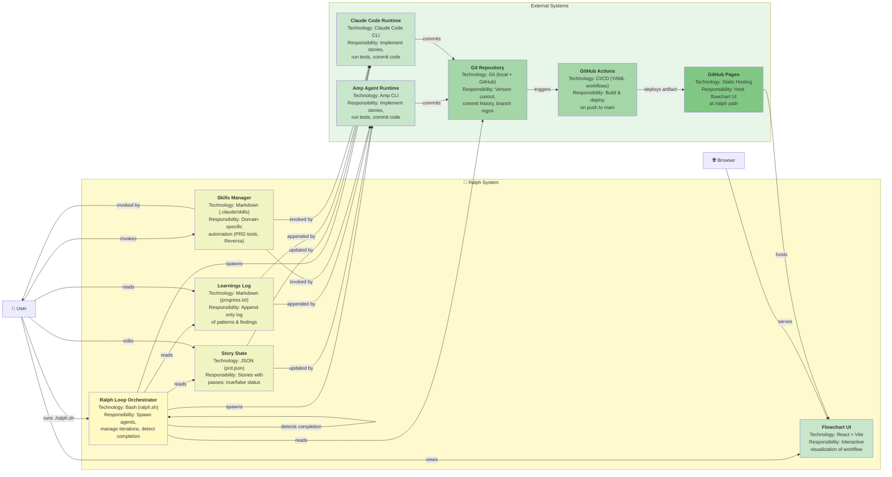

# Ralph — C4 Containers Diagram

**Generated:** 2026-05-20  
**Confidence:** 🟢 CONFIRMED

---

## Containers Overview

This diagram shows the internal structure of Ralph: the orchestrator loop, file-based state, UI, and external integrations.

---

## C4 Containers Diagram (Mermaid)



---

## Container Specifications

### 1. Ralph Loop Orchestrator 🟢
**Technology Stack:** Bash script (`ralph.sh`)

**Responsibilities:**
- Load `prd.json` and validate tool selection
- Check if branch changed; archive previous run if needed
- Spawn fresh AI agent (Amp or Claude) up to MAX_ITERATIONS times
- Monitor agent stdout for `<promise>COMPLETE</promise>` signal
- Detect exit code (0 = success, 1 = failure)
- Handle MAX_ITERATIONS timeout

**Inputs:**
- Command-line args: `--tool [amp|claude]`, `MAX_ITERATIONS`
- Files: `prd.json`, `progress.txt`, git config

**Outputs:**
- Spawned subprocess (agent)
- Exit code (0 or 1)

**Key Functions:**
```bash
main_loop() {
  for ((i = 1; i <= MAX_ITERATIONS; i++)); do
    spawn_agent $TOOL
    if agent_output contains "<promise>COMPLETE</promise>"; then
      exit 0
    fi
  done
  exit 1  # MAX_ITERATIONS exceeded
}
```

---

### 2. Story State (prd.json) 🟢
**Technology Stack:** JSON file

**Schema:**
```json
{
  "projectName": "ralph",
  "branchName": "main",
  "stories": [
    {
      "id": "US-001",
      "title": "Add flowchart visualization",
      "acceptanceCriteria": [
        "React component renders 10-step workflow",
        "TypeScript typecheck passes",
        "Deployed to GitHub Pages"
      ],
      "passes": false
    }
  ]
}
```

**Responsibilities:**
- Define what stories need implementation
- Track completion status per story
- Serve as source of truth for agent iterations

**Invariants:**
- `passes: boolean` — only forward transition (false → true, never true → false)
- `acceptanceCriteria: string[]` — must be verifiable via tests
- `id: string` — unique identifier for git commit messages

**Mutations:**
- Agent sets `stories[i].passes = true` after implementation
- ralph.sh archives prd.json if branch changes

---

### 3. Learnings Log (progress.txt) 🟢
**Technology Stack:** Markdown file (append-only)

**Format:**
```markdown
## Codebase Patterns
- Pattern 1
- Pattern 2
- ...

## [2026-05-20 10:30] - US-001
- **Implementation:** Added flowchart UI component
- **Files Changed:** flowchart/src/App.tsx (+380 lines)
- **Learnings for future iterations:**
  - Use @xyflow/react for node/edge layouts
  - Phase colors: setup=#f0f7ff, loop=#f5f5f5, decision=#fff8e6, done=#f0fff4
  - visibleCount state tracks animation progress
---

## [2026-05-20 11:15] - US-002
- ...
```

**Responsibilities:**
- Preserve patterns discovered across stateless iterations
- Provide audit trail of what was implemented
- Help future agents avoid mistakes and understand conventions

**Invariants:**
- Append-only; never truncated
- Each entry includes date, story ID, implementation details, learnings
- Patterns section at top (consolidated)

**Mutations:**
- Agents append new entries after each successful story
- Patterns section is consolidated by agents

---

### 4. Skills Manager 🟡
**Technology Stack:** Markdown + SKILL.md definitions

**Location:** `.claude/skills/` and `.agents/skills/`

**Known Skills:**
- `/prd` — Generate PRD from scratch
- `/prd-to-json` — Convert Markdown PRD → prd.json
- `/reversa` — Initiate legacy code analysis (40+ sub-skills)

**Responsibilities:**
- Provide domain-specific CLI tools for Ralph workflow
- Enable PRD generation, conversion, analysis
- Serve as extension point for new capabilities

**Invocation:**
- Direct CLI: `<tool> /prd` (e.g., `amp /prd` or `claude /prd`)
- Via skill system in agent prompt

**Integration Points:**
- Ralph agents invoke skills to analyze code, generate specs
- Users invoke skills to set up PRD or run Reversa analysis

---

### 5. Flowchart UI 🟢
**Technology Stack:** React 19 + @xyflow/react + Vite + TypeScript

**Architecture:**
- Single **App.tsx** component (~380 lines)
- Hardcoded workflow (10 steps)
- @xyflow for node/edge rendering
- Mermaid-compatible layouts

**Data Models:**
```typescript
type Step = {
  id: string;
  label: string;
  description: string;
  phase: 'setup' | 'loop' | 'decision' | 'done';
};

type Node = {
  id: string;
  data: { label: string };
  position: { x: number; y: number };
  style: { backgroundColor: string; opacity: number };
};

type Edge = {
  id: string;
  source: string;
  target: string;
  animated: boolean;
  style: { stroke: string };
};
```

**Key Functions:**
- `createNode()` — Build @xyflow Node with phase colors
- `createEdge()` — Build @xyflow Edge with animation
- `onClick handlers` — Next/Previous/Reset button logic

**Deployment:**
- Built via `npm run build` → `flowchart/dist/`
- Deployed to GitHub Pages at `/ralph/` path
- Served as static HTML (no backend)

**Interactions:**
- User clicks Next/Previous → `visibleCount` changes → nodes/edges re-render
- Reset clears animation state

---

### 6. Amp Agent Runtime 🟢
**Technology Stack:** Amp CLI (external process)

**Spawn Command:**
```bash
amp --tool amp --prompt /path/to/CLAUDE.md < prd.json
```

**Responsibilities:**
- Read prd.json, progress.txt, git history
- Pick highest-priority story (passes: false)
- Implement story (write code)
- Run quality checks (typecheck, lint, test)
- If tests pass: commit + update prd.json + log progress + output COMPLETE signal
- If tests fail: abort (no commit)

**Exit Codes:**
- `0` → Story completed (or no stories found)
- `1` → Story failed tests or error occurred

**Concurrency:**
- Single agent per iteration (sequential)
- Fresh context per iteration (no memory)

---

### 7. Claude Code Runtime 🟢
**Technology Stack:** Claude Code CLI (external process)

**Spawn Command:**
```bash
claude --tool claude-code --prompt /path/to/CLAUDE.md < prd.json
```

**Responsibilities:** (identical to Amp)
- Read state, pick story, implement, test, commit

**Exit Codes:** (identical to Amp)

**Difference from Amp:**
- Uses Claude 4.x models instead of smaller LLMs
- Better reasoning for complex stories (tradeoff: slower, more expensive)

---

### 8. Git Repository 🟢
**Technology Stack:** Git (local + GitHub remote)

**Responsibilities:**
- Version control for codebase
- Commit history (audit trail)
- Branch management
- Trigger CI/CD pipelines

**Artifacts Stored:**
- `src/` files (application code)
- `prd.json` (updated by agents)
- `progress.txt` (appended by agents)
- `archive/` (previous runs)
- `.github/workflows/` (CI/CD definitions)

**Mutations:**
- Agents commit: `git commit -m "feat: [Story ID] - [Title]"`
- ralph.sh creates branches: `git checkout -b <branchName>`
- GitHub Actions: auto-triggered on push to main

**Integration with Ralph:**
- ralph.sh reads: `git log`, current branch, commit status
- Agents write: commits, branch updates
- CI/CD reads: push events, build artifacts

---

### 9. GitHub Actions 🟢
**Technology Stack:** YAML workflow (`.github/workflows/deploy.yml`)

**Trigger:** Push to `main` or manual `workflow_dispatch`

**Pipeline:**
1. **Checkout code** — actions/checkout@v4
2. **Setup Node.js 20** — actions/setup-node@v4
3. **Install dependencies** — `npm ci` (clean install from lockfile)
4. **Build** — `npm run build` (Vite + TypeScript)
5. **Deploy artifact** — Upload to GitHub Pages

**Output:** Flowchart dist/ deployed to `/ralph/` path

**Integration with Ralph:**
- Triggered automatically on agent commits
- Builds flowchart (UI only; no backend)
- Hosts at github.com/pages (static)

---

### 10. GitHub Pages 🟢
**Technology Stack:** Static hosting (GitHub)

**Responsibilities:**
- Host flowchart UI (compiled React app)
- Serve at `/ralph/` path
- No backend processing

**Content:**
- `flowchart/dist/index.html` (entry point)
- `flowchart/dist/assets/` (bundled JS, CSS, images)

**User Interaction:**
- Browser opens GitHub Pages URL
- Loads React app
- Renders interactive 10-step workflow

---

## Data Flow Between Containers

```
┌─────────────────────────────────────────────────────────────┐
│                                                             │
│  ITERATION 1                                                │
│  ───────────                                                │
│                                                             │
│  User runs: ./ralph.sh --tool amp 10                       │
│      │                                                       │
│      └─→ Orchestrator reads prd.json                        │
│           (story: US-001, passes: false)                    │
│           │                                                  │
│           └─→ Spawns Amp Agent                              │
│                │                                             │
│                ├─ Reads prd.json (US-001 details)          │
│                ├─ Reads progress.txt (empty)                │
│                ├─ Reads git log (empty)                     │
│                │                                             │
│                ├─ Implements US-001 (writes code)           │
│                ├─ Runs: npm run test                         │
│                ├─ Tests PASS                                 │
│                │                                             │
│                ├─ Commits: git commit -m "feat: US-001..."   │
│                ├─ Updates: prd.json (US-001.passes=true)     │
│                ├─ Git: pushes commit                         │
│                ├─ Appends: progress.txt (US-001 entry)       │
│                │                                             │
│                └─ Outputs: <promise>COMPLETE</promise>       │
│                           (if all stories done)              │
│                           OR exits normally (i < MAX)        │
│      │                                                       │
│      └─ Orchestrator detects COMPLETE signal                │
│         (or loop counter i+1 < MAX)                         │
│         │                                                    │
│         └─→ Exit 0 (success) OR spawn next agent            │
│                                                             │
└─────────────────────────────────────────────────────────────┘

State After Iteration 1:
  ✓ Git: new commit (feat: US-001...)
  ✓ prd.json: US-001.passes = true
  ✓ progress.txt: 1 entry with learnings
```

---

## Container Dependencies

| Container | Depends On | Type | Why |
|-----------|-----------|------|-----|
| Orchestrator | Git, prd.json, progress.txt | Hard | Reads state, spawns agents |
| Amp Agent | prd.json, progress.txt, Git | Hard | Reads for context; writes commits |
| Claude Agent | prd.json, progress.txt, Git | Hard | Same as Amp |
| prd.json | (none) | — | Source of truth; no dependencies |
| progress.txt | (none) | — | Append-only; written by agents |
| Flowchart UI | (none) | Soft | Hardcoded steps; no live data |
| GitHub Actions | Git, Flowchart code | Hard | Triggered by push; builds flowchart |
| GitHub Pages | GitHub Actions artifacts | Hard | Serves compiled flowchart |

---

## Resilience & Failure Modes

| Failure | Container | Impact | Recovery |
|---------|-----------|--------|----------|
| prd.json malformed | Orchestrator | Can't parse stories | ralph.sh should validate (gap) |
| Agent crashes | Orchestrator | Iteration aborts | Next iteration picks same story |
| Git commit fails | Agent | Code written but not committed | Agent error exit; next iteration retries |
| Network timeout | Git | Push fails | Agent detects error; next iteration retries |
| GitHub Actions fails | Pages | Flowchart not deployed | Manual re-trigger or fix workflow |
| Pages down | User | Can't view flowchart | User can still run ralph.sh; UI is not critical |

