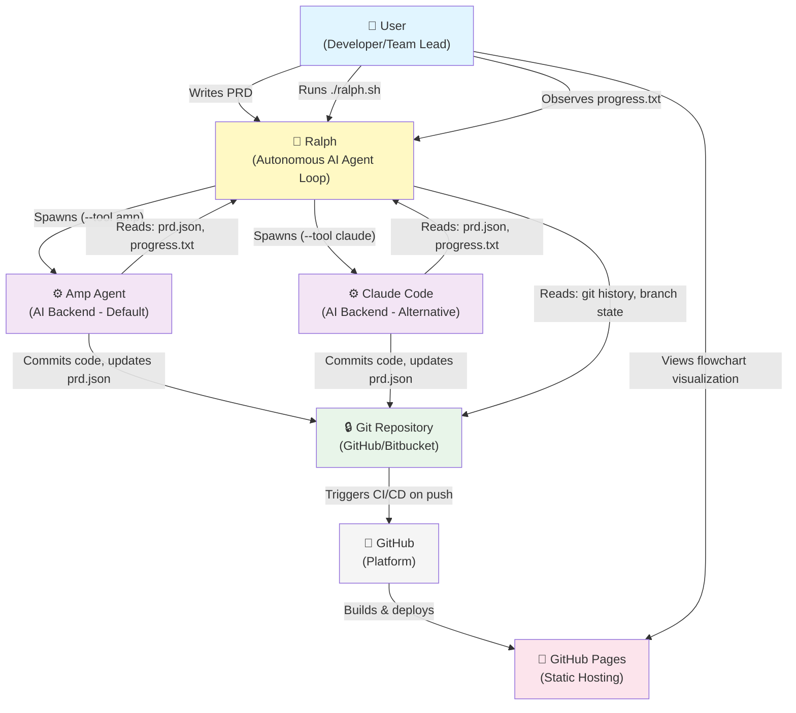

# Ralph — C4 Context Diagram

**Generated:** 2026-05-20  
**Confidence:** 🟢 CONFIRMED

---

## Context Overview

This diagram shows Ralph within its ecosystem: users, AI backends, version control, and hosting platforms.

---

## C4 Context Diagram (Mermaid)



---

## Key Relationships

### User ↔ Ralph
| Interaction | Direction | Protocol | Purpose |
|-------------|-----------|----------|---------|
| Write PRD | User → Ralph | File (`prd.json`) | Define stories |
| Run loop | User → Ralph | CLI (`./ralph.sh [options]`) | Start automation |
| Monitor progress | User → Ralph | File (`progress.txt`) | Track learnings |
| View flowchart | User → Pages | Browser HTTP/HTTPS | Understand workflow |

### Ralph ↔ Agents
| Interaction | Direction | Protocol | Purpose |
|-------------|-----------|----------|---------|
| Spawn agent | Ralph → Agent | Subprocess + CLI args | Start iteration |
| Provide context | Ralph → Agent | File + stdin (`prd.json`, `progress.txt`) | Agent reads state |
| Wait for completion | Ralph → Agent | stdout + exit code | Detect COMPLETE signal |

### Agents ↔ Git
| Interaction | Direction | Protocol | Purpose |
|-------------|-----------|----------|---------|
| Commit changes | Agent → Git | Git CLI (`git commit`, `git push`) | Persist code |
| Update PRD | Agent → Git | Git CLI + file edit | Mark stories done |

### Ralph ↔ Git
| Interaction | Direction | Protocol | Purpose |
|-------------|-----------|----------|---------|
| Read history | Ralph → Git | Git CLI (`git log`) | Audit trail |
| Archive runs | Ralph → Git | File system (archive/) | Branch isolation |

### Git ↔ GitHub
| Interaction | Direction | Protocol | Purpose |
|-------------|-----------|----------|---------|
| Push commits | Git → GitHub | Git protocol (SSH/HTTPS) | Sync repository |
| Trigger workflows | GitHub → Git | GitHub Actions webhook | Start CI/CD |

### GitHub ↔ Pages
| Interaction | Direction | Protocol | Purpose |
|-------------|-----------|----------|---------|
| Build artifact | GitHub → Pages | GitHub API + artifact upload | Deploy UI |
| Serve HTML | Pages → Browser | HTTP/HTTPS | User views flowchart |

---

## External Systems

### 🐙 GitHub (Platform)
- **Role:** Repository host, CI/CD platform, static site hosting
- **Technology:** Git, GitHub Actions, GitHub Pages
- **Integration:** ralph.sh reads git; agents push commits; CI/CD builds flowchart

### ⚙️ Amp Agent
- **Role:** AI backend (default) for implementing stories
- **Technology:** Amp CLI (external tool)
- **Integration:** ralph.sh spawns as subprocess; agent reads/writes files

### ⚙️ Claude Code
- **Role:** AI backend (alternative) for implementing stories
- **Technology:** Claude Code CLI (external tool)
- **Integration:** ralph.sh spawns as subprocess; agent reads/writes files

---

## User Personas

### Developer
- **Goals:** Automate feature implementation, focus on high-level design
- **Interactions:**
  - Writes PRD in Markdown or JSON
  - Runs `./ralph.sh` to start agent loop
  - Reviews progress.txt after each iteration
  - Commits to git when loop completes

### Team Lead / Product Manager
- **Goals:** Understand workflow, monitor progress, guide roadmap
- **Interactions:**
  - Views flowchart visualization (explains how Ralph works)
  - Defines stories in prd.json
  - Reviews patterns in progress.txt
  - Gathers learnings for next features

### AI Backend Operator (Platform)
- **Goals:** Keep Amp/Claude running, handle context overflows, troubleshoot
- **Interactions:**
  - Configures `--tool amp|claude` flag in ralph.sh
  - Monitors agent process logs
  - Handles spawn failures or context limit breaches

---

## Data Flow Summary

```
1. User writes PRD
   ↓
2. User runs: ./ralph.sh --tool amp|claude MAX_ITERATIONS
   ↓
3. Ralph spawns Agent (fresh subprocess)
   ↓
4. Agent reads prd.json, progress.txt, git history
   ↓
5. Agent picks story (passes: false)
   ↓
6. Agent implements, runs tests
   ↓
7. If tests pass:
   - Agent commits code
   - Agent updates prd.json (passes: true)
   - Agent appends to progress.txt
   ↓
8. If tests fail:
   - Agent aborts (no commit)
   ↓
9. Ralph detects output:
   - If <promise>COMPLETE</promise>: Exit success
   - Else: Spawn next agent (i+1)
   ↓
10. Loop until COMPLETE or MAX_ITERATIONS
```

---

## Deployment Topology

```
┌─────────────────────────────────┐
│        GitHub Repository        │
│  (main branch + archive/)       │
│                                 │
│  Monitored by:                  │
│  - Git hooks (local)            │
│  - GitHub Actions (.yml)        │
└──────────────┬──────────────────┘
               │
        ┌──────▼──────┐
        │GitHub Pages │
        │  (/ralph/)  │
        └─────────────┘
               │
        ┌──────▼────────────┐
        │ User Browser      │
        │ (views flowchart) │
        └───────────────────┘
```

---

## Security Considerations

| Component | Risk | Mitigation |
|-----------|------|-----------|
| Git Credentials | Agent needs push permission | Use SSH keys or HTTPS tokens; git config auth |
| prd.json | Sensitive story data in repo | Use `.gitignore` for secrets; review before commit |
| progress.txt | Contains learnings (may be sensitive) | Keep in repo; consider access controls |
| Agent Process | Subprocess isolation from user | Runs in isolated OS process; can't access parent memory |
| GitHub Pages | Public hosting | Flowchart is static; no secrets exposed |

---

## Resilience & Failure Modes

| Failure | Impact | Recovery |
|---------|--------|----------|
| Agent crashes mid-story | Iteration aborts; prd.json unchanged | Next agent picks same story |
| Git commit fails | Code written but not committed | Agent handles error; no progress.txt update |
| Network timeout | Agent can't push to GitHub | ralph.sh detects exit code != 0; retry next iteration |
| Max iterations reached | Loop exits without completing all stories | User reviews progress.txt; can re-run with higher MAX |
| prd.json malformed | Agent can't parse stories | ralph.sh should validate before spawn (gap) |

