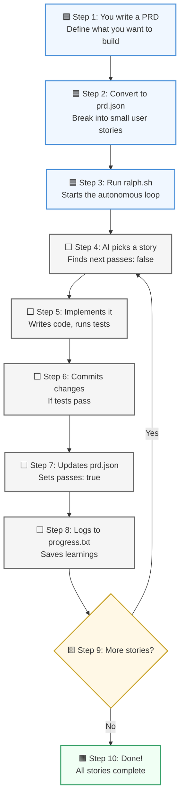
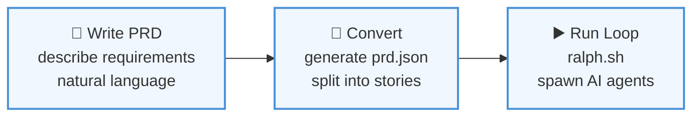
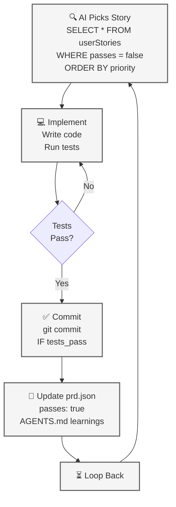
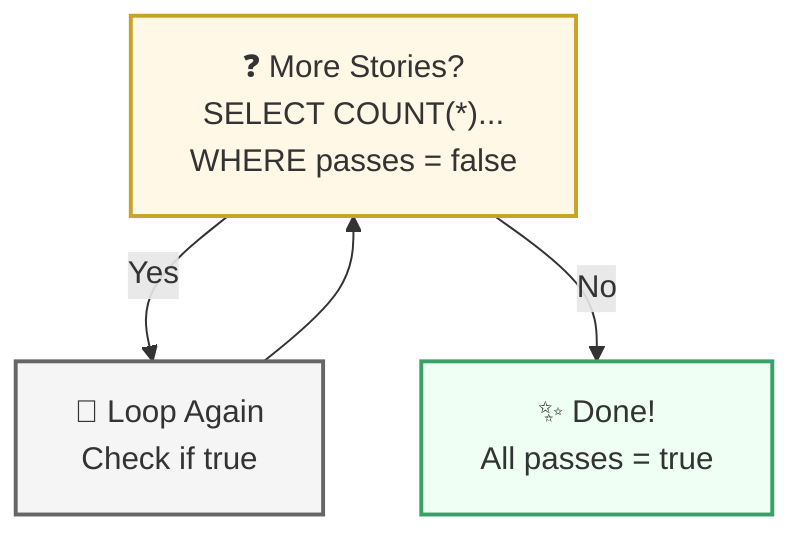
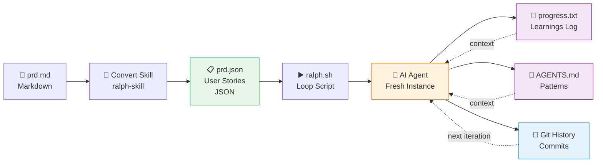

# Ralph Flowchart — Visual Process Flow

**Module:** Flowchart (React SPA)  
**Generated:** 2026-05-20  
**Purpose:** Step-by-step visualization of Ralph's autonomous agent loop

---

## Overall Flow Diagram



---

## Phase: Setup (Steps 1–3)

User prepares the work environment:



**Decisions:** None  
**User Actions:** Write docs, run script  
**Exit:** Once ralph.sh starts, control passes to AI agents

---

## Phase: Main Loop (Steps 4–8)

AI agent executes in fresh context each iteration:



**Key Property:** Each iteration is a **fresh AI instance** with clean context  
**Memory Between Iterations:**
- Git history (commits from previous iterations)
- `progress.txt` (learnings)
- `prd.json` (which stories are done)

---

## Phase: Decision & Exit (Steps 9–10)

Check if work is complete:



**Exit Condition:** `∀ story ∈ userStories: story.passes = true`

---

## Data Flow Diagram



---

## Control Flow: Visibility & Progressive Disclosure

The React App reveals steps progressively:

```
User clicks "Next"
├─ visibleCount++
├─ FOR each step in allSteps:
│  └─ IF step_index < visibleCount: opacity = 1, pointerEvents = auto
├─ FOR each edge in edgeConnections:
│  └─ IF source_visible AND target_visible: animated = true
└─ Re-render all nodes & edges

User clicks "Previous"
└─ Same, but visibleCount--

User clicks "Reset"
├─ visibleCount = 1
├─ Reset all node positions to defaults
└─ Hide all edges
```

**Purpose:** Progressive disclosure teaches users Ralph's workflow step-by-step

---

## State Machine: Loop Phase

```mermaid
stateDiagram-v2
    [*] --> PickStory
    PickStory --> Implement
    Implement --> TestsPass{Tests Pass?}
    TestsPass -->|No| Implement
    TestsPass -->|Yes| Commit
    Commit --> UpdatePRD
    UpdatePRD --> LogProgress
    LogProgress --> CheckMore{More<br/>Stories?}
    CheckMore -->|Yes| PickStory
    CheckMore -->|No| Done
    Done --> [*]
```

**Invariant:** Each iteration is atomic — either all steps succeed or iteration fails and agent re-runs

---

## Data Transformation Pipeline

**PRD.md → prd.json:**

```
User Story (Text):
  "As a user, I want to add a task with priority so that I can organize my work"

Ralph Skill converts to:
{
  "id": "US-003",
  "title": "Add priority field to task",
  "description": "As a user, I want...",
  "acceptanceCriteria": [
    "Add priority column to tasks table",
    "Create database migration",
    "Update task model",
    "Typecheck passes",
    "Tests pass"
  ],
  "priority": 1,
  "passes": false
}

AI Agent transforms to Code:
  - Migrations: schema changes
  - Models: updated types
  - UI: new input field
  - Tests: coverage
  - Commit: code in git

Updates prd.json:
  - Flips "passes": true
  - Appends to progress.txt
  - Updates AGENTS.md
```

---

## Checkpoint & Resumption

```
Iteration 1: 
  ├─ Pick story US-001
  ├─ Implement
  ├─ Update prd.json (US-001 passes: true)
  ├─ Commit to main
  └─ Git history preserved

Iteration 2 (Fresh AI Instance):
  ├─ Reads prd.json
  │   └─ Knows US-001 is done
  ├─ Reads progress.txt
  │   └─ Learns patterns from US-001
  ├─ Reads AGENTS.md
  │   └─ Knows gotchas & conventions
  ├─ Pick story US-002
  ├─ Implement (informed by prior learnings)
  └─ Loop...
```

**Key:** Only 3 sources of memory across iterations
- Git history (immutable)
- progress.txt (append-only)
- prd.json (current state)

---

## Complexity Notes

| Aspect | Complexity | Reason |
|--------|-----------|--------|
| Flowchart rendering | O(n) where n=10 steps | Linear re-render of nodes |
| Edge visibility | O(e) where e=9 edges | Check both endpoints each render |
| Position tracking | O(n) | Store position per node on drag |
| Phase lookup | O(1) | Constant time color map |
| Loop iterations | Unbounded | Depends on PRD size & AI capability |

---

## Design Patterns

1. **Progressive Disclosure** — Show steps gradually (teaching UX pattern)
2. **State Mutation on Callbacks** — useCallback + useState for event handling
3. **Ref for Transient Position State** — useRef maintains layout across renders without re-creating nodes
4. **Factory Functions** — createNode(), createEdge() reduce duplication
5. **Enumerated Phases** — Type-safe phase colors via Record<Phase, Colors>

