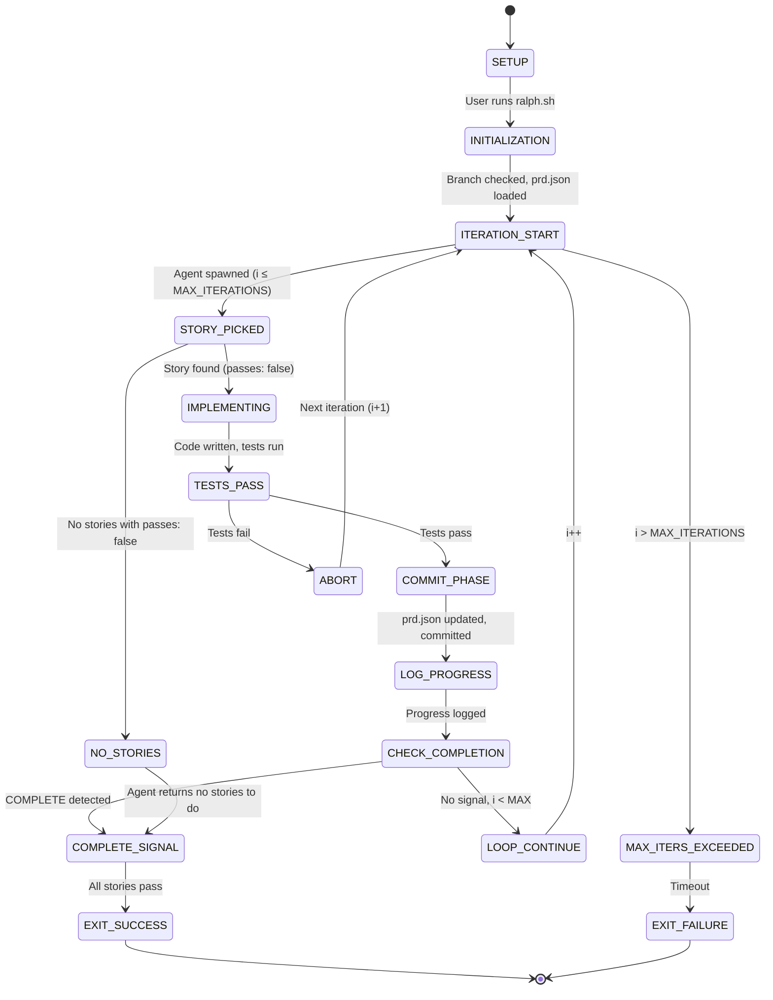

# Ralph — State Machines

**Generated:** 2026-05-20  
**Doc Level:** Completo  
**Confidence:** 🟢 CONFIRMED (from code analysis)

---

## Overview

Ralph has two primary state machines:

1. **Ralph Loop State Machine** — Orchestrates iterations from setup to completion
2. **User Story State Machine** — Tracks individual story progression

---

## State Machine 1: Ralph Loop Lifecycle

### States

```
┌─────────────┐
│   SETUP     │  User writes PRD, converts to prd.json
└──────┬──────┘
       │
       ▼
┌──────────────────┐
│ INITIALIZATION   │  Load prd.json, check branch, init progress.txt
└──────┬───────────┘
       │
       ▼
┌──────────────────────┐
│  ITERATION START     │  Spawn fresh agent (Amp or Claude)
│  (i = 1 to MAX)      │
└──────┬───────────────┘
       │
       ├─────────────────────────────┐
       │                             │
       ▼                             ▼
┌──────────────────┐        ┌──────────────────┐
│  STORY PICKED    │        │  NO STORIES      │
│  (passes: false) │        │  (all pass: true)│
└──────┬───────────┘        └────────┬─────────┘
       │                             │
       │                             ▼
       │                    ┌──────────────────┐
       │                    │  COMPLETE SIGNAL │
       │                    │  <promise>       │
       │                    │  COMPLETE</     │
       │                    │  promise>        │
       │                    └────────┬─────────┘
       │                             │
       ▼                             ▼
┌──────────────────┐        ┌──────────────────┐
│  IMPLEMENTING    │        │  EXIT SUCCESS    │
│  (code, test)    │        │  (all done)      │
└──────┬───────────┘        └──────────────────┘
       │
       ├─────────────────┬──────────────────┐
       │                 │                  │
    PASS             FAIL            TIMEOUT
       │                 │                  │
       ▼                 ▼                  ▼
┌──────────────────┐ ┌──────────────┐ ┌──────────────┐
│  COMMIT PHASE    │ │  ABORT       │ │  MAX ITERS   │
│  (update prd)    │ │  (try again) │ │  REACHED     │
└────────┬─────────┘ └──────┬───────┘ └──────┬───────┘
         │                  │                │
         │                  │                │
         ▼                  │                ▼
┌──────────────────┐        │        ┌──────────────────┐
│  LOG PROGRESS    │        │        │  EXIT FAILURE    │
│  (append .txt)   │        │        │  (timeout)       │
└────────┬─────────┘        │        └──────────────────┘
         │                  │
         └──────┬───────────┘
                │
                ▼
         ┌─────────────┐
         │  LOOP END   │
         │  (continue? )│
         └──────┬──────┘
                │
        ┌───────┴────────┐
        │                │
       YES              NO (max reached)
        │                │
        ▼                ▼
   ITERATION START  EXIT FAILURE
```

### State Definitions

| State | Description | Entry Condition | Exit Condition |
|-------|-------------|-----------------|-----------------|
| **SETUP** | User creates PRD (Markdown) | Start of process | User converts to prd.json |
| **INITIALIZATION** | Load prd.json, check branch, init progress.txt | ralph.sh starts | prd.json valid + progress.txt ready |
| **ITERATION START** | Spawn fresh agent (Amp or Claude) | i ≤ MAX_ITERATIONS | Agent process spawned successfully |
| **STORY PICKED** | Agent finds next story where `passes: false` | Agent reads prd.json | Story found (or no stories found) |
| **NO STORIES** | No more stories with `passes: false` | Agent scans prd.json | Agent returns without implementing |
| **IMPLEMENTING** | Agent writes code, runs tests, commits | Story picked | Tests pass OR tests fail |
| **COMMIT PHASE** | Agent updates prd.json, commits to git | Tests pass | prd.json updated, commit pushed |
| **LOG PROGRESS** | Agent appends to progress.txt | Commit done | progress.txt updated |
| **LOOP END** | Check completion signal & max iterations | progress.txt updated | Continue (i+1) or exit |
| **COMPLETE SIGNAL** | Agent outputs `<promise>COMPLETE</promise>` | All stories `passes: true` | ralph.sh detects + exits |
| **ABORT** | Tests failed; agent stops, no commit | Tests fail | Return to ITERATION START (next i) |
| **MAX ITERS REACHED** | Loop hit MAX_ITERATIONS limit | i > MAX_ITERATIONS | Exit with error |
| **EXIT SUCCESS** | Ralph completed all stories | COMPLETE signal detected | Process terminates (exit 0) |
| **EXIT FAILURE** | Ralph timed out or errored | MAX ITERS reached without COMPLETE | Process terminates (exit 1) |

---

## State Machine 2: User Story Lifecycle

### States

```
┌────────────────────┐
│  NOT YET WRITTEN   │  Story not in prd.json
└─────────┬──────────┘
          │
          ▼
┌────────────────────┐
│  CREATED           │  Story added to prd.json
│  (passes: false)   │
└─────────┬──────────┘
          │
          ▼
┌────────────────────┐
│  IN PROGRESS       │  Agent selected, working on story
└─────────┬──────────┘
          │
    ┌─────┴─────┐
    │           │
 PASS       FAIL
    │           │
    ▼           ▼
┌──────────┐ ┌──────────────┐
│ COMPLETE │ │ BLOCKED      │
│ (passes: │ │ (bug found,  │
│  true)   │ │  tests fail) │
└──────────┘ └────────┬─────┘
                      │
                      ▼
             ┌──────────────────┐
             │ AWAITING FIX      │
             │ (next iteration)  │
             └────────┬─────────┘
                      │
                      ▼
             (Return to IN PROGRESS)
```

### Story State Fields

Each story in prd.json has:
```json
{
  "id": "US-001",
  "title": "Add priority field",
  "acceptanceCriteria": ["Add column", "Migrate", "Typecheck passes"],
  "passes": false
}
```

**State Attribute:** `passes: boolean`
- `false` → Story needs implementation (CREATED or AWAITING FIX)
- `true` → Story completed (COMPLETE)

**Implicit States:** Stored in git history + progress.txt
- Which agent iteration picked the story
- What code was changed
- Why it passed or failed

### State Transitions

| From | Event | To | Details |
|------|-------|----|---------| 
| NOT YET WRITTEN | User adds to prd.json | CREATED | Story is now in prd.json |
| CREATED | Agent picks (passes: false) | IN PROGRESS | Agent spawned, story selected |
| IN PROGRESS | Tests pass, commit succeeds | COMPLETE | Agent updates prd.json: passes=true |
| IN PROGRESS | Tests fail, abort | BLOCKED | No commit; agent stops |
| BLOCKED | Next agent iteration | AWAITING FIX | Same story will be picked again |
| AWAITING FIX | Tests pass (fixed) | COMPLETE | Agent updates prd.json: passes=true |
| COMPLETE | (no transitions) | COMPLETE | Story is done; never re-opened |

---

## State Machine 3: Agent Execution (Internal to One Iteration)

### Substates During Iteration

When an agent is spawned (ITERATION START), it follows this internal flow:

```
┌──────────────────┐
│  AGENT STARTED   │
│  Clean context   │
└────────┬─────────┘
         │
         ▼
┌──────────────────┐
│  READ STATE      │
│  (prd.json,      │
│   progress.txt)  │
└────────┬─────────┘
         │
         ▼
┌──────────────────┐
│  PICK STORY      │
│  (passes: false) │
└────────┬─────────┘
         │
    ┌────┴────┐
    │          │
 FOUND     NOT FOUND
    │          │
    ▼          ▼
┌─────────┐ ┌──────────────┐
│IMPLEMENT│ │RETURN COMPLETE│
│ (code)  │ └──────┬───────┘
└────┬────┘        │
     │             ▼
     ▼        (exit agent)
┌──────────────┐
│  RUN TESTS   │
└──────┬───────┘
       │
   ┌───┴───┐
   │       │
 PASS   FAIL
   │       │
   ▼       ▼
┌──────┐ ┌─────┐
│COMMIT│ │ABORT │
└──┬───┘ └──┬──┘
   │        │
   ▼        ▼
┌──────────────┐
│UPDATE prd.json
│SET passes=true
└──┬───────────┘
   │
   ▼
┌──────────────┐
│LOG progress  │
└──┬───────────┘
   │
   ▼
(exit agent)
```

---

## Data Flow Across Iterations

### State Artifacts

```
ITERATION 1                    ITERATION 2
───────────                    ───────────

Agent reads:                   Agent reads:
  prd.json (fresh)      ───>   prd.json (updated)
  progress.txt (empty)  ───>   progress.txt (1 entry)
  git log               ───>   git log (1 commit added)

Agent writes:                  Agent writes:
  code                  ───>   code (prd.json: US-001.passes=true)
  commit                ───>   commit (updated prd.json)
  progress.txt entry    ───>   progress.txt entry (2 entries now)

Git state after I1:           Git state after I2:
  main                         main (both commits)
    ├─ feat: US-001 ...  ──┐   ├─ feat: US-001 ...
    └─ (prd.json updated) │   ├─ feat: US-002 ...
                          └─> └─ (prd.json updated)
```

---

## Completion Criteria

### Loop Completion
Ralph exits with **success** when:
1. Agent detects `passes: true` for ALL stories in prd.json
2. Agent outputs `<promise>COMPLETE</promise>`
3. ralph.sh receives signal and exits (code 0)

### Loop Failure
Ralph exits with **failure** when:
1. Loop reaches `MAX_ITERATIONS` without COMPLETE signal
2. Agent crashes or errors
3. ralph.sh detects failure and exits (code 1)

---

## Race Conditions & Edge Cases

### Edge Case 1: User Edits prd.json While Agent Is Running
**State:** IMPLEMENTATION / COMMIT PHASE  
**Problem:** prd.json changes underneath agent  
**Mitigation:** Agents should not run concurrently on same branch. ralph.sh is single-threaded.

### Edge Case 2: Git Conflict During Commit
**State:** COMMIT PHASE  
**Problem:** Another process pushed to main  
**Mitigation:** Agent's commit will fail; iteration aborts and user sees error.

### Edge Case 3: Agent Crashes Mid-Iteration
**State:** IMPLEMENTING or COMMIT PHASE  
**Problem:** Agent process dies; prd.json might be partial  
**Mitigation:** git commit is atomic; if commit failed, prd.json unchanged. Next iteration picks same story again.

### Edge Case 4: Progress File Corruption
**State:** LOG PROGRESS  
**Problem:** progress.txt write fails or corrupts  
**Mitigation:** Append-only; truncation is unlikely. File is human-readable; user can manually inspect/fix.

---

## Mermaid Diagram (Full Loop)



---

## Validation Checklist

- [ ] Flowchart in App.tsx matches state transitions
- [ ] ralph.sh loop (for loop i=1 to MAX) matches ITERATION START/END states
- [ ] prd.json schema includes `passes` boolean
- [ ] progress.txt is append-only (never truncated)
- [ ] No story can have `passes: true` → `passes: false` (only forward)
- [ ] COMPLETE signal only appears when all stories are `passes: true`

