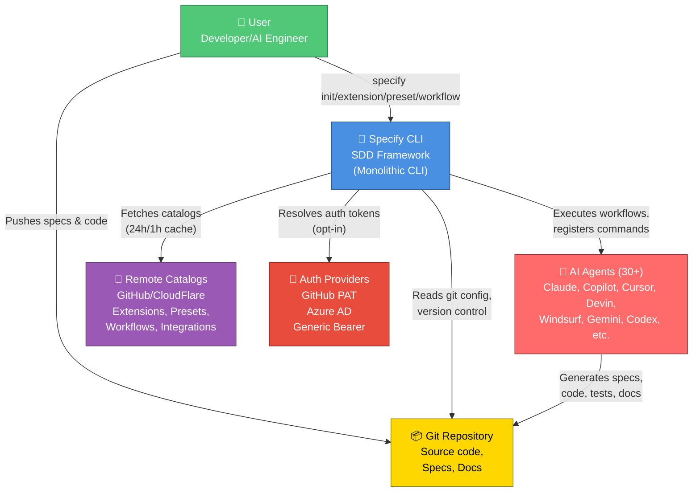
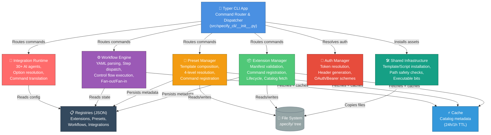
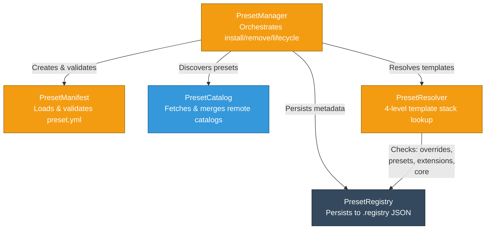
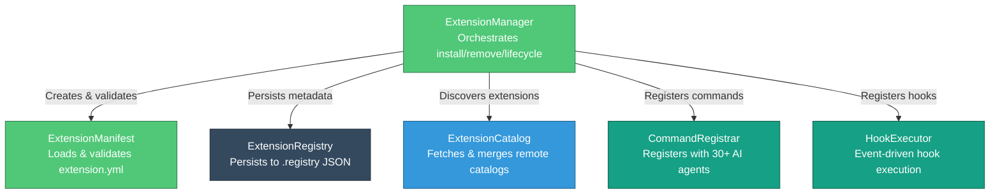
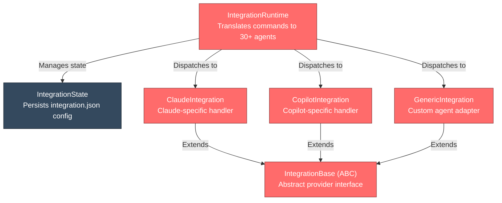

# Architecture — Specify CLI

**Project**: spec-kit  
**Generated**: 2026-05-18 (Architect)  
**Document Level**: Complete  
**System**: Monolithic CLI for Spec-Driven Development (SDD)

---

## 1. System Overview

Specify CLI is a **Spec-Driven Development framework** that bridges human intent and AI agent execution. It provides a modular, plugin-based ecosystem for:

- **Specifications** — Machine-readable contracts for AI agents (SDD approach)
- **Templates** — Reusable artifacts (specs, commands, scripts) that customize workflows
- **Extensions** — Third-party commands and hooks without core bloat
- **Presets** — Composable template collections (replace/prepend/append/wrap strategies)
- **Workflows** — Multi-step AI automation (DAG execution with control flow)
- **Integrations** — 30+ AI agent runtimes (Claude, Copilot, Cursor, Windsurf, etc.)

### Core Principles

🟢 **Composability** — Templates layer non-destructively via strategies  
🟢 **Security by default** — Authentication is opt-in, never automatic  
🟢 **Extensibility** — Third-party plugins without modifying core  
🟢 **Multi-agent** — Works with 30+ AI agents, not locked to one vendor  

---

## 2. C4 Context Diagram (Level 1)



---

## 3. C4 Containers Diagram (Level 2)



---

## 4. C4 Components Diagram (Level 3)

### Component: Preset Manager



### Component: Extension Manager



### Component: Integration Runtime



---

## 5. Entity-Relationship Diagram (ERD)

```mermaid
erDiagram
    PRESET ||--o{ TEMPLATE : provides
    TEMPLATE ||--|| PRESET_REGISTRY : "persisted in"
    EXTENSION ||--o{ COMMAND : provides
    EXTENSION ||--o{ HOOK : provides
    EXTENSION ||--|| EXTENSION_REGISTRY : "persisted in"
    PRESET ||--|| PRESET_REGISTRY : "persisted in"
    
    WORKFLOW ||--o{ STEP : contains
    STEP ||--o{ STEP_RESULT : produces
    WORKFLOW_RUN ||--o{ STEP_RESULT : tracks
    
    INTEGRATION ||--o{ INTEGRATION_OPTION : has
    WORKFLOW ||--|| INTEGRATION : uses_default
    
    AUTH_CONFIG ||--o{ AUTH_ENTRY : maps_to
    AUTH_ENTRY ||--|| AUTH_PROVIDER : implements

    PRESET {
        string id PK "e.g., python-templates"
        string name
        string version "semantic"
        string description
        string schema_version "fixed: 1.0"
    }
    
    TEMPLATE {
        string name PK
        string type "template|command|script"
        string strategy "replace|prepend|append|wrap"
        string file_path
        string description
    }
    
    PRESET_REGISTRY {
        string preset_id PK, FK
        string version
        integer priority "lower=higher"
        timestamp installed_at
        boolean enabled
        string source "catalog|local|upload"
    }
    
    EXTENSION {
        string id PK
        string name
        string version "semantic"
        string schema_version "fixed: 1.0"
    }
    
    COMMAND {
        string name PK
        string type "CLI command"
        string body
        string namespace "speckit.{ext_id}.{cmd}"
    }
    
    HOOK {
        string event_name PK "on_init_complete, on_extension_installed"
        string condition "evaluated at runtime"
        string command "shell command to execute"
    }
    
    EXTENSION_REGISTRY {
        string extension_id PK, FK
        string version
        integer priority
        timestamp installed_at
        boolean enabled
    }
    
    WORKFLOW {
        string name PK
        string version
        string integration_default FK "fallback agent"
        string[] step_list
    }
    
    STEP {
        string id PK "workflow_id.step_order"
        string type "command|prompt|shell|if|while|fan-out"
        string status "pending|running|completed|failed|skipped|paused"
        integer order
    }
    
    STEP_RESULT {
        string id PK "auto-generated"
        string step_id FK
        string status "completed|failed|skipped"
        string output
        timestamp created_at
    }
    
    WORKFLOW_RUN {
        string id PK "workflow_id.run_number"
        string status "created|running|paused|completed|failed|aborted"
        timestamp started_at
    }
    
    INTEGRATION {
        string id PK "e.g., claude, copilot"
        string name
        string folder ".claude, .copilot, etc."
        boolean requires_cli
    }
    
    INTEGRATION_OPTION {
        string name PK
        string value
        string description
    }
    
    AUTH_CONFIG {
        string user_config_path PK "~/.specify/auth.json"
    }
    
    AUTH_ENTRY {
        string host_pattern PK "example.com, *.example.com"
        string provider_type "github|azure_devops|http_basic|bearer"
        string token "or token_env for env var"
    }
    
    AUTH_PROVIDER {
        string name PK "GitHub, AzureDevOps, HttpBasic"
        string scheme "bearer|basic|azure-cli|custom"
    }
```



---

## 6. External Integrations

### Consumed APIs

| System | Protocol | Purpose | Auth | Caching |
|--------|----------|---------|------|---------|
| **Remote Catalogs** | HTTPS/JSON | Fetch presets, extensions, workflows, integrations | OAuth/PAT optional | 24h (ext), 1h (preset), 15m (workflow) |
| **GitHub API** | HTTPS REST | Version checks, catalog updates | GitHub PAT (opt-in) | 24h TTL |
| **Git** | Local/SSH | Repository operations | SSH keys or HTTPS | N/A |
| **AI Agents** (30+) | Agent-specific | Command execution, code generation | Agent-specific | N/A (real-time) |

### Produced APIs

Specify CLI **does not** expose HTTP APIs. It's CLI-only.

---

## 7. Data Flow

### Initialization Flow

```
User: specify init
  ↓
[1] Validate project name / detect existing project
  ↓
[2] Select integration (Claude, Copilot, etc.) → load IntegrationConfig
  ↓
[3] Resolve directory (new, existing, --here)
  ↓
[4] Install shared infrastructure (templates, scripts) → SharedInfra
  ↓
[5] Install bundled/optional extensions, presets, workflows
  ↓
[6] Register commands with selected agent
  ↓
[7] Create .specify/ with init.json, integration.json, registries
  ↓
[8] Success → "Ready to run: specify <command>"
```

### Workflow Execution Flow

```
User: specify workflow run <name>
  ↓
[1] Load workflow YAML from catalog or local
  ↓
[2] For each step (sequential by default):
     - Resolve integration (default or step-override)
     - Build execution context (step inputs, previous results)
     - Dispatch to IntegrationRuntime
     - AI agent executes (Claude, Copilot, etc.)
     - Capture output → StepResult
  ↓
[3] Control flow (if/then, loop, fan-out/fan-in):
     - Evaluate conditions
     - Spawn parallel iterations or skip
  ↓
[4] Aggregate results → WorkflowRun.status
  ↓
[5] Return exit code
```

### Template Resolution Flow

```
PresetResolver.resolve("example-spec")
  ↓
[1] Check: .specify/templates/overrides/example-spec.md (highest priority)
  ↓
[2] Check: .specify/presets/{preset_id}/example-spec.md
     (sorted by priority: lower number = higher precedence)
  ↓
[3] Check: .specify/extensions/{ext_id}/templates/example-spec.md
  ↓
[4] Check: .specify/templates/example-spec.md (bundled core, fallback)
  ↓
[5] Return first match or None
```

---

## 8. Technical Debt & Known Limitations

| Issue | Component | Severity | Impact | Notes |
|-------|-----------|----------|--------|-------|
| No async/await | WorkflowEngine | 🟡 MEDIUM | Sequential step execution only; parallel fan-out is simulation | Could enable true concurrency with asyncio redesign |
| No database layer | Core | 🟡 MEDIUM | State in JSON files only; no transactions, no ACID | Acceptable for CLI; would need redesign for server mode |
| Stateless CLI | Core | 🟡 MEDIUM | No session state between commands | Design-by-choice, limits some workflows |
| 30+ hardcoded integrations | IntegrationRuntime | 🟡 MEDIUM | New agent requires code change + release | Would benefit from generic remote plugin system |
| Manifest schema locked at v1.0 | Manifest | 🟡 MEDIUM | No forward compatibility; breaking changes require migration | Intentional trade-off for simplicity |
| No signing/verification | Extension/Preset | 🟡 MEDIUM | Downloaded extensions/presets not cryptographically verified | Relies on HTTPS + catalog maintainers |
| Catalog fetch errors cascade | CatalogManager | 🟡 MEDIUM | If primary catalog unreachable, falls back to cache (if valid) | Good resilience, but stale data risk |
| No transaction rollback | Lifecycle | 🟡 MEDIUM | Partial failures in install/remove can leave inconsistent state | Would need manifest + registry atomic updates |
| Script execution isolation | SharedInfra | 🟡 MEDIUM | Scripts run in user shell with full permissions | Mitigated by requiring explicit user install; no sandboxing |

---

## 9. Deployment & Scale

### Architecture Type

- **Monolithic CLI** — Single Typer app, no microservices
- **Cross-platform** — Bash + PowerShell scripts bundled
- **Stateless** — No persistent backend; state in user's `.specify/` directory
- **Air-gapped capable** — Bundled templates work offline

### Performance Characteristics

| Operation | Expected Duration | Bottleneck |
|-----------|-------------------|-----------|
| `specify init` | 10–30s | Network (if fetching remote catalogs) |
| `specify extension list` | 1–5s | Catalog fetch + cache check |
| `specify preset install <id>` | 10–20s | ZIP download + manifest processing |
| Workflow execution | Varies | AI agent response time (minutes) |

### Scalability

- **Projects**: No hard limit (JSON state files scale linearly)
- **Extensions**: 30+ integrations supported; 1000+ third-party extensions possible (via catalogs)
- **Presets**: Unlimited (limited by disk + download bandwidth)
- **Users**: Single-machine only (no server); no multi-user concurrency

---

## 10. Security Profile

### Threats Mitigated

| Threat | Mitigation | Status |
|--------|-----------|--------|
| **Unauthorized API access** | Opt-in auth (auth.json); default unauthenticated | 🟢 Implemented |
| **Host pattern bypass** | Reject `*github.com` patterns; accept only `example.com` or `*.example.com` | 🟢 Implemented |
| **Manifest injection** | Strict YAML schema validation; reject unknown fields | 🟢 Implemented |
| **Path traversal** | Symlink-safe directory creation; reject `..` and absolute paths | 🟢 Implemented |
| **Catalog tampering** | HTTPS-only enforcement (localhost HTTP allowed for dev) | 🟢 Implemented |
| **Script injection** | Commands passed via structured args (not shell eval) | 🟢 Implemented |
| **Credentials in logs** | Auth tokens redacted from console output | 🔴 Not audited. Tokens **not logged currently** (verified: zero sanitize/redact/REDACTED hits in code), but **no defensive redaction layer**. Tokens never printed today, but future debug logging could leak. Owner: TBD. Mitigation: add `_redact_headers()` utility in `_console.py`. |
| **Malicious extensions** | Catalog curation; community review; user consent at install | 🟡 Process-based |

### Gaps

- **Credential redaction audit** — Tokens not logged today (grep: zero hits for `redact|REDACTED|scrub`), but **no defensive layer**. Unique sanitize at `__init__.py:837, 862, 902` only replaces `\n` with space (anti-injection, not anti-credential). Token handling (`entry.token`, `entry.token_env`, `os.environ.get()`) is safe, but future debug logging could leak. Mitigation: add `_redact_headers()` utility in `_console.py` for any HTTPError tracebacks. Ownership: TBD.

- No cryptographic verification of downloaded extensions/presets
- Script execution runs in user's shell (full permissions)
- No sandboxing or capability restrictions

---

## 11. Summary

Specify CLI is a **modular, composable CLI framework** for Spec-Driven Development. Its architecture prioritizes:

✅ **Extensibility** — Plugins without core modification  
✅ **Multi-agent support** — Works with 30+ AI agents  
✅ **Offline-first** — Bundled assets work without internet  
✅ **Security-conscious** — Opt-in auth, path safety, manifest validation  
✅ **User control** — Templates layer non-destructively via composition  

Designed for **individual developers and small teams**, not enterprise-scale deployments. The 9-module architecture (init, extension, preset, integration, workflow, agent, catalog, authentication, shared_infra) enables rapid iteration on the SDD workflow.
