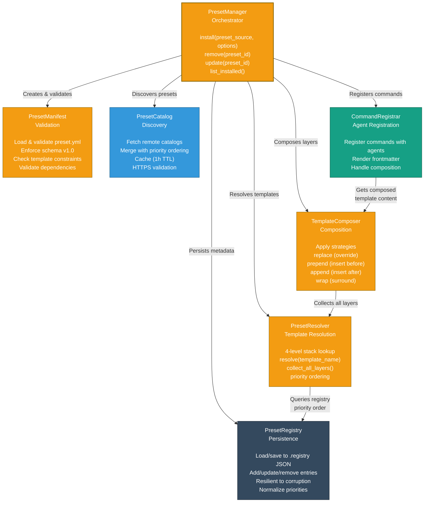
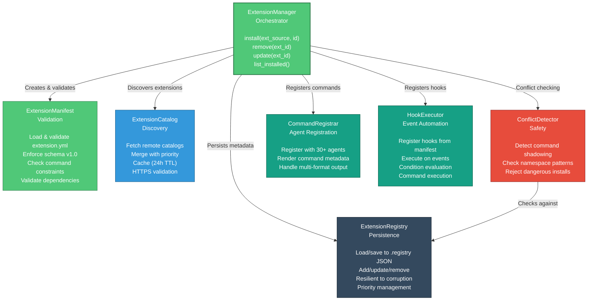
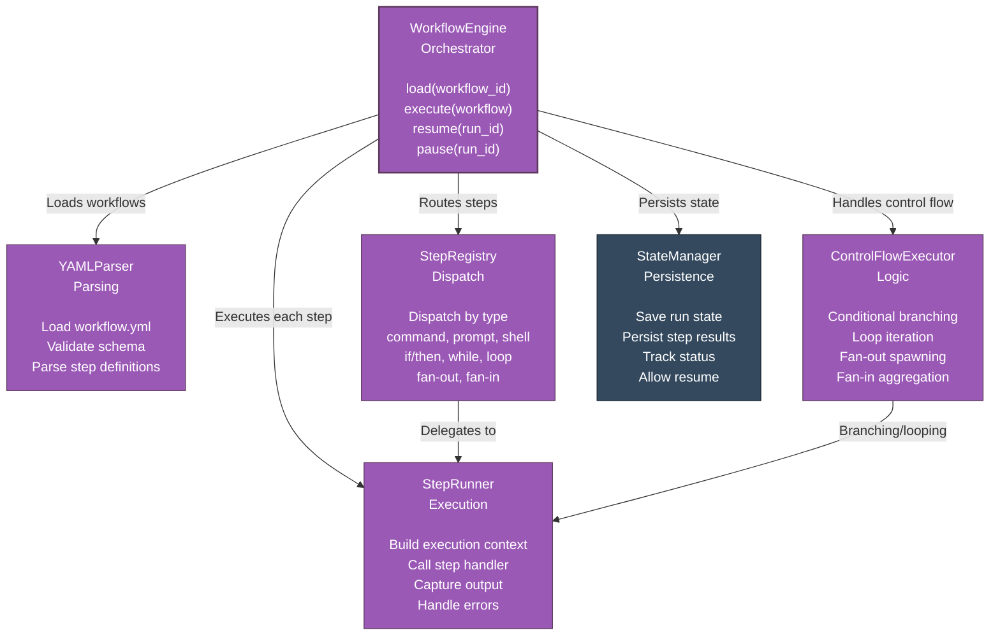
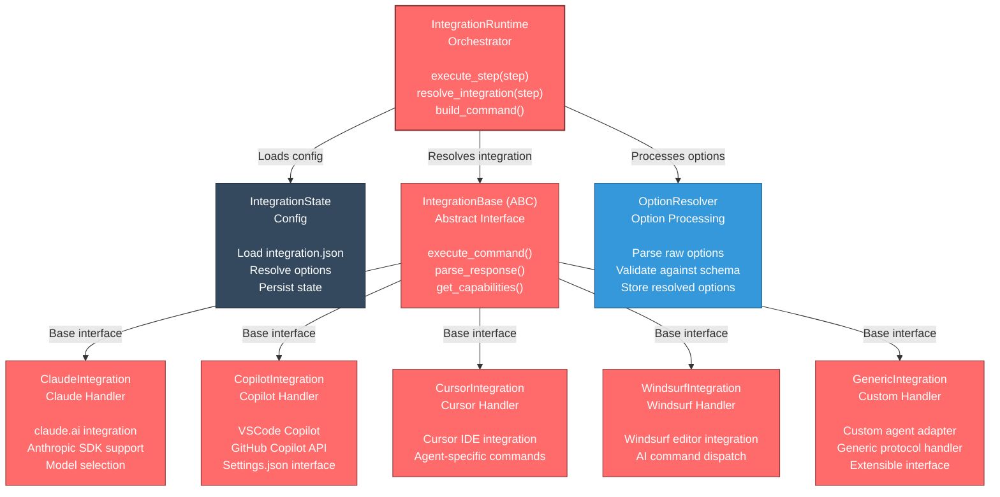
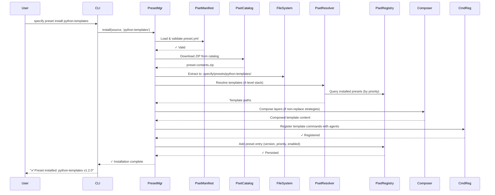
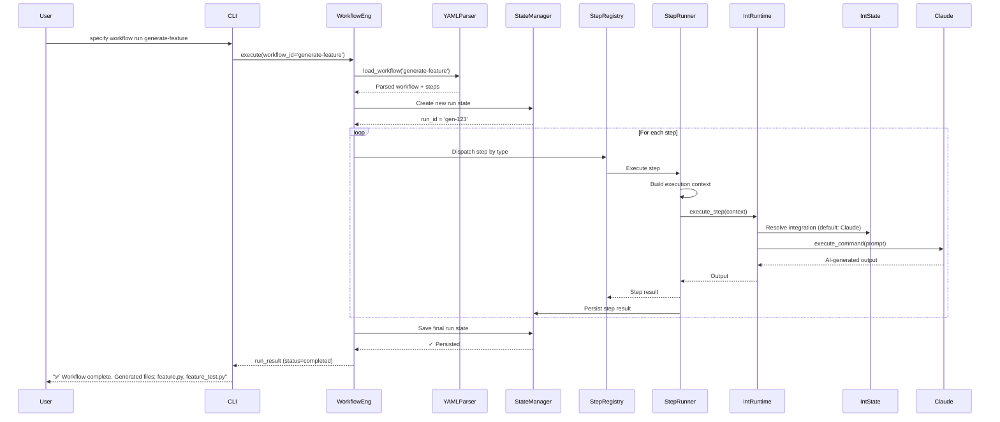

# C4 Components Diagram — Specify CLI

**System**: Specify CLI  
**Level**: 3 — Components (Selected Containers)  
**Generated**: 2026-05-18

---

## Component Diagram: Preset Manager

The **PresetManager** container is responsible for template composition, resolution, and lifecycle. It's the most algorithmically complex subsystem.



### Preset Manager Components

| Component | Responsibility | Key Methods |
|-----------|----------------|-------------|
| **PresetManager** | Orchestrate install/remove/update; manage full lifecycle | `install()`, `remove()`, `update()`, `list_installed()`, `get_preset()` |
| **PresetManifest** | Load & validate `preset.yml` files | `__init__(path)`, `_validate()`, properties for id/name/version/templates |
| **PresetRegistry** | Persist preset metadata to `.registry` JSON | `_load()`, `_save()`, `add()`, `update()`, `remove()`, `list()` |
| **PresetCatalog** | Fetch remote catalogs, cache, merge prioritized sources | `_fetch_single_catalog()`, `fetch_catalog()`, `get_preset_info()`, `download_preset()` |
| **PresetResolver** | Resolve template names via 4-level priority stack | `resolve()`, `collect_all_layers()`, `_resolve_layer()` |
| **TemplateComposer** | Apply composition strategies (replace/prepend/append/wrap) | `compose()`, `_apply_strategy()`, `_substitute_placeholder()` |
| **CommandRegistrar** | Register preset commands with agents | `register_commands()`, `render_command()`, `_render_frontmatter()` |

### Key Algorithms

**4-Level Template Resolution**:
```
PresetResolver.resolve("example-spec")
  ↓ Level 1: .specify/templates/overrides/example-spec.md (highest)
  ↓ Level 2: .specify/presets/{preset_id}/example-spec.md (by priority)
  ↓ Level 3: .specify/extensions/{ext_id}/templates/example-spec.md
  ↓ Level 4: .specify/templates/example-spec.md (bundled, lowest)
  → Return first match or None
```

**Template Composition**:
```
Given: "strategy": "wrap" (non-replace strategy)
  ↓ Collect all layers via resolve_all_layers()
  ↓ For each layer (top to bottom by priority):
     - If this layer's strategy is replace: skip lower layers
     - If this layer's strategy is prepend: insert content before next layer
     - If this layer's strategy is append: insert content after next layer
     - If this layer's strategy is wrap: wrap next layer with placeholder {CORE_TEMPLATE}
  ↓ Merge results → final composed template
```

---

## Component Diagram: Extension Manager



### Extension Manager Components

| Component | Responsibility | Key Methods |
|-----------|----------------|-------------|
| **ExtensionManager** | Orchestrate install/remove/update; manage lifecycle | `install()`, `remove()`, `update()`, `list_installed()` |
| **ExtensionManifest** | Load & validate `extension.yml` files | `__init__(path)`, `_validate()`, properties for id/name/version/commands |
| **ExtensionRegistry** | Persist extension metadata to `.registry` JSON | `_load()`, `_save()`, `add()`, `update()`, `remove()` |
| **ExtensionCatalog** | Fetch remote catalogs, cache, merge sources | `_fetch_single_catalog()`, `fetch_catalog()`, `get_extension_info()`, `download_extension()` |
| **ConflictDetector** | Detect command name conflicts, namespace violations | `validate_install_conflicts()`, `_collect_manifest_command_names()` |
| **CommandRegistrar** | Register extension commands with 30+ AI agents | `register_commands()`, `_register_with_agent()` |
| **HookExecutor** | Register and execute event-driven hooks | `register_hooks()`, `execute_hook()`, `_evaluate_condition()` |

### Namespace Validation

**Pattern**: `speckit.{extension_id}.{command_name}`

Example:
- Valid: `speckit.ai-tools.generate-spec`
- Invalid: `speckit.ai-tools` (no command name)
- Invalid: `my-custom.ai-tools.spec` (wrong namespace prefix)

---

## Component Diagram: Workflow Engine



### Workflow Engine Components

| Component | Responsibility | Key Methods |
|-----------|----------------|-------------|
| **WorkflowEngine** | Load and execute workflows, manage lifecycle | `load()`, `execute()`, `resume()`, `pause()`, `abort()` |
| **YAMLParser** | Parse and validate workflow YAML | `load_workflow()`, `validate_schema()`, `parse_steps()` |
| **StepRegistry** | Dispatch steps by type to appropriate handlers | `dispatch()`, `get_handler()`, `register_step_type()` |
| **ControlFlowExecutor** | Evaluate conditionals, loops, fan-out/fan-in | `evaluate_condition()`, `execute_loop()`, `fan_out()`, `fan_in()` |
| **StepRunner** | Execute individual step, handle errors, capture output | `run_step()`, `build_context()`, `handle_error()`, `capture_output()` |
| **StateManager** | Persist workflow/step state for resumability | `save_run_state()`, `load_run_state()`, `update_step_result()` |

### Step Types

| Type | Purpose | Example |
|------|---------|---------|
| **command** | Execute CLI command | `specify plan --input requirements.md` |
| **prompt** | Send prompt to AI agent | `Generate code from spec {spec_path}` |
| **shell** | Execute shell script | `bash scripts/deploy.sh` |
| **if/then** | Conditional execution | `if: '{{ steps.check.output }}'` |
| **while/do-while** | Loop constructs | `while: '{{ item.remaining > 0 }}'` |
| **fan-out** | Parallel iterations | `for_each: {{ items }}` |
| **fan-in** | Aggregation after fan-out | `aggregate: {{ fanout_results }}` |

---

## Component Diagram: Integration Runtime



### Integration Runtime Components

| Component | Responsibility | Key Methods |
|-----------|----------------|-------------|
| **IntegrationRuntime** | Dispatch steps to appropriate agent handler | `execute_step()`, `resolve_integration()`, `build_command()` |
| **IntegrationState** | Load and manage integration configuration | `load_config()`, `save_config()`, `get_option()`, `set_option()` |
| **IntegrationBase (ABC)** | Abstract base for all agent implementations | `execute_command()` (must implement), `parse_response()`, `get_capabilities()` |
| **ClaudeIntegration** | Claude.ai or Anthropic SDK handler | `execute_command()` impl., model selection, streaming support |
| **CopilotIntegration** | GitHub Copilot handler | `execute_command()` impl., VSCode settings.json interface |
| **CursorIntegration** | Cursor IDE handler | `execute_command()` impl., Cursor-specific protocol |
| **WindsurfIntegration** | Windsurf editor handler | `execute_command()` impl., Windsurf command dispatch |
| **GenericIntegration** | Custom agent adapter | `execute_command()` impl., generic protocol support |
| **OptionResolver** | Parse and validate integration-specific options | `resolve_options()`, `validate_schema()`, `store_options()` |

### Supported Integrations (30+)

🔴 **Tier 1** (Core): Claude, Copilot, Cursor, Devin, Windsurf, Gemini, Codex  
🟡 **Tier 2** (Extended): Goose, Kimi, OpenCode, Tabnine, Qwen, Roo, Shai, Trae, Vibe  
🟢 **Tier 3** (Community): Kilocode, Junie, Lingma, Kiro CLI, QoderCLI, Auggie, AMP, AGY, Bob, Forge, PI, Codebuddy, iFlow

---

## Data Flow: Component Interaction

### Preset Installation & Template Composition



### Workflow Execution



---

## Technology Details

| Component | Language | Key Libraries | Purpose |
|-----------|----------|----------------|---------|
| CLI | Python | Typer (Click) | Command routing, argument parsing |
| Config | Python | pyyaml, json5 | YAML/JSON parsing |
| Validation | Python | packaging, pathspec | Version specifiers, path patterns |
| Workflow | Python | yaml, json | YAML parsing, state persistence |
| Integration | Python | subprocess, agent SDKs | Command execution, agent communication |
| Auth | Python | urllib, hashlib | HTTPS requests, token handling |
| Caching | Python | pathlib, json | File-based cache with TTL checks |

