```mermaid
graph TB
    User["👤 User"]
    
    subgraph SpecKit["Specify CLI (Python Application)"]
        CLI["🎼 Typer CLI App<br/>Command Router & Dispatcher<br/>(src/specify_cli/__init__.py)<br/><br/>Routes commands to handlers<br/>Manages user interactions<br/>Orchestrates subsystems"]
        
        ExtMgr["📦 Extension Manager<br/>(extensions.py)<br/><br/>Manifest validation<br/>Lifecycle (install/remove/update)<br/>Command registration<br/>Catalog fetch & merge<br/>Conflict detection"]
        
        PresetMgr["🎨 Preset Manager<br/>(presets.py)<br/><br/>Template composition<br/>4-level template resolution<br/>Manifest validation<br/>Lifecycle orchestration<br/>Catalog fetch & merge"]
        
        WorkflowEng["⚙️ Workflow Engine<br/>(workflows/)<br/><br/>YAML parsing & validation<br/>Step type registry<br/>Sequential + control-flow execution<br/>State persistence<br/>Input/output handling"]
        
        IntRuntime["🔌 Integration Runtime<br/>(integration_runtime.py)<br/>30+ AI agent handlers<br/><br/>Claude, Copilot, Cursor, Devin<br/>Windsurf, Gemini, Codex<br/>Goose, Kimi, OpenCode, etc.<br/>Command translation & option resolution"]
        
        AuthMgr["🔐 Auth Manager<br/>(authentication/)<br/><br/>Token resolution<br/>Auth header generation<br/>Multi-scheme support<br/>Opt-in configuration"]
        
        SharedInfra["🛠️ Shared Infrastructure<br/>(shared_infra.py)<br/><br/>Template/script installation<br/>Path safety checks<br/>Executable bit handling<br/>Manifest merging"]
        
        Agents["👥 Agent Manager<br/>(agents.py)<br/><br/>Command registration with agents<br/>Frontmatter parsing<br/>Multi-format output (MD, TOML, JSON)<br/>Script path rewriting"]
    end
    
    subgraph Storage["Local State (JSON Files)"]
        Registries["📋 Registries<br/>.specify/extensions/.registry<br/>.specify/presets/.registry<br/>.specify/workflows/.registry<br/><br/>Installed preset/extension metadata<br/>Version, priority, enabled status<br/>Installation timestamp<br/>Source & hash tracking"]
        
        InitConf["⚙️ Init Config<br/>.specify/init.json<br/><br/>Project initialization options<br/>AI integration choice<br/>Script type (bash/powershell)<br/>Branch numbering scheme"]
        
        IntConf["🔌 Integration Config<br/>.specify/integration.json<br/><br/>Selected AI agent<br/>Agent-specific options<br/>Context file paths<br/>Installation directory"]
        
        AuthConf["🔐 Auth Config<br/>~/.specify/auth.json<br/><br/>Host patterns → auth providers<br/>Token references<br/>Scheme selection"]
        
        FileSystem["📁 File System<br/>.specify/ tree<br/><br/>extensions/{id}/<br/>presets/{id}/<br/>templates/{type}/<br/>scripts/{type}/"]
    end
    
    subgraph Cache["Caching Layer"]
        CatalogCache["⚡ Catalog Cache<br/>~/.specify/cache/<br/><br/>Extension catalog (24h TTL)<br/>Preset catalog (1h TTL)<br/>Workflow catalog (15m TTL)<br/>Integration catalog (1h TTL)"]
    end
    
    subgraph Remote["External Systems"]
        GitRepo["📦 Git Repository<br/>Local .git directory<br/><br/>Version control<br/>Stores generated artifacts"]
        
        Catalogs["📡 Remote Catalogs<br/>GitHub CDN<br/><br/>Official extension catalog<br/>Community extensions<br/>Preset catalogs<br/>Workflow catalogs"]
        
        AuthProviders["🔐 Auth Providers<br/>GitHub, Azure, Generic<br/><br/>GitHub PAT endpoint<br/>Azure DevOps endpoint<br/>Generic Bearer/Basic"]
        
        AIAgents["🤖 AI Agents<br/>Claude, Copilot, Windsurf<br/>Cursor, Devin, Gemini, etc.<br/><br/>Execute workflow steps<br/>Generate code, specs, docs"]
    end
    
    %% User interactions
    User -->|"specify <command>"| CLI
    
    %% CLI routing
    CLI -->|"init, extension, preset"| ExtMgr
    CLI -->|"preset, template"| PresetMgr
    CLI -->|"workflow run"| WorkflowEng
    CLI -->|"agent register"| Agents
    
    %% Extension Manager
    ExtMgr -->|"Read/write registry"| Registries
    ExtMgr -->|"Write commands"| Agents
    ExtMgr -->|"Fetch catalogs"| CatalogCache
    
    %% Preset Manager
    PresetMgr -->|"Read/write registry"| Registries
    PresetMgr -->|"Resolve templates"| FileSystem
    PresetMgr -->|"Fetch catalogs"| CatalogCache
    
    %% Workflow Engine
    WorkflowEng -->|"Dispatch steps"| IntRuntime
    WorkflowEng -->|"Fetch workflows"| CatalogCache
    WorkflowEng -->|"Persist state"| Registries
    
    %% Integration Runtime
    IntRuntime -->|"Read agent config"| IntConf
    IntRuntime -->|"Send commands"| AIAgents
    IntRuntime -->|"Resolve auth"| AuthMgr
    
    %% Auth Manager
    AuthMgr -->|"Read auth config"| AuthConf
    AuthMgr -->|"Get tokens from"| AuthProviders
    
    %% Shared Infrastructure
    SharedInfra -->|"Copy templates/scripts"| FileSystem
    SharedInfra -->|"Install extensions"| FileSystem
    
    %% Agent Manager
    Agents -->|"Register with agents"| AIAgents
    
    %% Cache updates
    Catalogs -->|"HTTPS fetch (24h/1h/15m)"| CatalogCache
    
    %% File system
    ExtMgr -->|"Extract ZIP"| FileSystem
    PresetMgr -->|"Copy files"| FileSystem
    CLI -->|"Read/write .specify/"| FileSystem
    
    %% Git interactions
    CLI -->|"Run git commands"| GitRepo
    AIAgents -->|"Commit generated artifacts"| GitRepo
    
    %% Styling
    style SpecKit fill:#4A90E2,stroke:#2E5C8A,stroke-width:3px,color:#fff
    style CLI fill:#4A90E2,stroke:#2E5C8A,color:#fff
    style ExtMgr fill:#50C878,stroke:#2D7A4A,color:#fff
    style PresetMgr fill:#F39C12,stroke:#8B6600,color:#fff
    style WorkflowEng fill:#9B59B6,stroke:#5D3A5D,color:#fff
    style IntRuntime fill:#FF6B6B,stroke:#8B3A3A,color:#fff
    style AuthMgr fill:#E74C3C,stroke:#8B2323,color:#fff
    style SharedInfra fill:#16A085,stroke:#0D5D47,color:#fff
    style Agents fill:#3498DB,stroke:#1C5E89,color:#fff
    
    style Storage fill:#34495E,stroke:#1C2833,stroke-width:2px,color:#fff
    style Registries fill:#34495E,stroke:#1C2833,color:#fff
    style InitConf fill:#34495E,stroke:#1C2833,color:#fff
    style IntConf fill:#34495E,stroke:#1C2833,color:#fff
    style AuthConf fill:#34495E,stroke:#1C2833,color:#fff
    style FileSystem fill:#34495E,stroke:#1C2833,color:#fff
    
    style Cache fill:#3498DB,stroke:#1C5E89,stroke-width:2px,color:#fff
    style CatalogCache fill:#3498DB,stroke:#1C5E89,color:#fff
    
    style Remote fill:#95A5A6,stroke:#5D6D7B,stroke-width:2px,color:#000
    style GitRepo fill:#FFD700,stroke:#8B8000,color:#000
    style Catalogs fill:#9B59B6,stroke:#5D3A5D,color:#fff
    style AuthProviders fill:#E74C3C,stroke:#8B2323,color:#fff
    style AIAgents fill:#FF6B6B,stroke:#8B3A3A,color:#fff
    
    style User fill:#50C878,stroke:#2D7A4A,color:#fff
```

# C4 Containers Diagram — Specify CLI

**System**: Specify CLI (Spec-Driven Development Framework)  
**Level**: 2 — Containers  
**Generated**: 2026-05-18

---



---

## Container Descriptions

### 1. **Typer CLI App** (Command Router)

**Technology**: Python Typer framework (CLI toolkit)  
**Responsibility**: Route user commands to appropriate subsystem handlers  
**Key Operations**:
- Parse command-line arguments
- Dispatch to extension manager, preset manager, workflow engine, etc.
- Aggregate results and display to user
- Handle errors and exit codes

**Interactions**:
- ✅ Reads/writes `.specify/` tree
- ✅ Routes to all subsystems
- ✅ Orchestrates shared infrastructure installs

---

### 2. **Extension Manager** (Plugin System)

**Technology**: Python, YAML, JSON  
**Responsibility**: Discover, validate, install, and manage third-party extensions  
**Key Operations**:
- Load and validate `extension.yml` manifests (schema v1.0)
- Install extensions into `.specify/extensions/{id}/`
- Register extension commands with 30+ AI agents
- Manage hooks (event-driven automation)
- Fetch and merge extension catalogs with priority handling
- Conflict detection (prevent command shadowing)

**Files Managed**:
- `.specify/extensions/.registry` (JSON)
- `.specify/extensions/{ext_id}/extension.yml` (manifest)
- `.specify/extensions/{ext_id}/commands/` (command templates)
- `.specify/extensions/{ext_id}/hooks.yml` (hooks config)

**Key Algorithms**:
- Conflict detection (namespace validation)
- Manifest schema enforcement
- Priority-based catalog merging
- Hook registration and execution

---

### 3. **Preset Manager** (Template Composition)

**Technology**: Python, YAML, JSON, Jinja2 (template processing)  
**Responsibility**: Discover, validate, install, compose, and manage template presets  
**Key Operations**:
- Load and validate `preset.yml` manifests
- Install presets into `.specify/presets/{id}/`
- Resolve templates via 4-level priority stack
- Compose templates via strategies (replace/prepend/append/wrap)
- Register preset commands with agents
- Fetch and merge preset catalogs

**Files Managed**:
- `.specify/presets/.registry` (JSON)
- `.specify/presets/{preset_id}/preset.yml` (manifest)
- `.specify/presets/{preset_id}/templates/` (template files)
- `.specify/templates/overrides/` (project-level template overrides)

**Key Algorithms**:
- 4-level template resolution (priority stack)
- Template composition (strategy-based layering)
- Core template substitution (wrap strategy with placeholder)

---

### 4. **Workflow Engine** (Multi-Step Automation)

**Technology**: Python, YAML  
**Responsibility**: Parse, validate, and execute multi-step workflows with control flow  
**Key Operations**:
- Load workflow YAML from catalogs or local disk
- Parse step definitions (command, prompt, shell, if/then, loop, fan-out, fan-in)
- Execute steps sequentially or in parallel (fan-out/fan-in)
- Evaluate conditions and branching logic
- Persist execution state (for resume capability)
- Pass context between steps (outputs, fan-out items)
- Handle step failures and retries

**Files Managed**:
- `.specify/workflows/` (installed workflows)
- `.specify/workflows/.registry` (workflow metadata)

**Step Types Supported**:
- `command` — call a CLI command
- `prompt` — send prompt to AI agent
- `shell` — execute shell script
- `if/then` — conditional execution
- `while/do-while` — loop constructs
- `fan-out` — parallel execution
- `fan-in` — aggregation after fan-out

---

### 5. **Integration Runtime** (AI Agent Dispatcher)

**Technology**: Python, agent-specific SDKs/CLI tools  
**Responsibility**: Translate workflow steps into 30+ agent-specific formats  
**Key Operations**:
- Load integration configuration (`.specify/integration.json`)
- Resolve default agent (fallback: Claude)
- Build agent-specific commands from step definition
- Execute command via agent CLI or SDK
- Parse agent response and extract output
- Handle agent-specific error codes and retries

**Supported Integrations**:
- Claude (claude.ai or local SDK)
- Copilot (VSCode extension)
- Cursor IDE (integrated)
- Devin (CLI)
- Windsurf (editor integration)
- Gemini (API)
- Codex (API)
- Goose, Kimi, OpenCode, Tabnine, Qwen, Roo, etc. (30+ total)

**Key Algorithms**:
- Option resolution (raw args → parsed → stored)
- Command translation (generic → agent-specific)
- Model selection fallback

---

### 6. **Auth Manager** (Security & Credentials)

**Technology**: Python, HTTP auth schemes (Bearer, Basic, OAuth)  
**Responsibility**: Resolve authentication tokens and build auth headers  
**Key Operations**:
- Load auth configuration from `~/.specify/auth.json`
- Match host patterns (with security validation)
- Resolve tokens (direct or environment variable reference)
- Generate HTTP auth headers (Bearer, Basic, Azure-CLI, custom)
- Support multiple auth providers (GitHub, Azure DevOps, generic)
- Enforce HTTPS-only catalog downloads

**Auth Schemes**:
- `bearer` — Authorization: Bearer {token}
- `basic` — Authorization: Basic {base64(user:pass)}
- `azure-cli` — Dynamic token from Azure CLI
- `custom` — Caller-specified format

**Security**:
- Opt-in authentication (default: unauthenticated)
- Host pattern validation (reject `*github.com` wildcards)
- Auth config file permission warnings (POSIX: chmod 600)
- HTTPS enforcement (localhost HTTP only for dev)

---

### 7. **Shared Infrastructure** (Safe Asset Installation)

**Technology**: Python, path validation, chmod  
**Responsibility**: Install bundled templates and scripts safely  
**Key Operations**:
- Validate destination paths (no escapes, no symlink traversal)
- Copy templates from bundled assets to `.specify/templates/`
- Copy scripts to `.specify/scripts/`
- Set executable bit on Unix systems
- Handle conflicts (force vs. ask)
- Merge manifests (templates + scripts inventory)

**Safety Checks**:
- Path normalization (remove `..`, trailing slashes)
- Symlink-safe directory creation
- Resolved path must stay under project root
- Parent directory validation before creation

---

### 8. **Agent Manager** (Command Registration)

**Technology**: Python, Markdown/TOML/JSON parsing  
**Responsibility**: Register spec kit commands with 30+ AI agents  
**Key Operations**:
- Parse frontmatter from command templates (YAML metadata)
- Render command in agent-specific format (Markdown, TOML, JSON)
- Rewrite script paths (project-relative → absolute)
- Register commands with agent context (Claude.ai, Copilot settings, etc.)
- Support multiple command variants (multi-format output)

**Formats Supported**:
- Markdown (Claude, Goose, generic agents)
- TOML (some custom agents)
- JSON (agent-specific config)

---

## Data Stores

### Registries (JSON Files)

| File | Purpose | Scope |
|------|---------|-------|
| `.specify/extensions/.registry` | Installed extension metadata | Project |
| `.specify/presets/.registry` | Installed preset metadata | Project |
| `.specify/workflows/.registry` | Installed workflow metadata | Project |

**Schema**:
```json
{
  "schema_version": "1.0",
  "extensions": { "ext-id": { "version": "1.0.0", "priority": 10, "enabled": true, "installed_at": "2026-05-16T..." } }
}
```

### Configuration Files

| File | Purpose | Scope |
|------|---------|-------|
| `.specify/init.json` | Initialization options (agent, script type, preset, etc.) | Project |
| `.specify/integration.json` | Selected AI agent and agent-specific config | Project |
| `~/.specify/auth.json` | Authentication providers and token references | User |

### File System

| Path | Purpose |
|------|---------|
| `.specify/extensions/{id}/` | Installed extension files (manifest, commands, hooks, templates) |
| `.specify/presets/{id}/` | Installed preset files (manifest, templates, scripts) |
| `.specify/templates/overrides/` | Project-level template overrides (highest priority) |
| `.specify/templates/` | Core templates (bundled fallback) |
| `.specify/scripts/` | Shell scripts (bash, PowerShell) |

### Caching

| Location | TTL | Purpose |
|----------|-----|---------|
| `~/.specify/cache/extension-catalog.json` | 24h | Extension catalog metadata |
| `~/.specify/cache/preset-catalog.json` | 1h | Preset catalog metadata |
| `~/.specify/cache/workflow-catalog.json` | 15m | Workflow catalog metadata |

---

## Technology Stack

| Layer | Technology |
|-------|-----------|
| **Framework** | Typer (Click-based CLI framework) |
| **Language** | Python 3.11+ |
| **Config** | YAML (manifests), JSON (state), TOML (pyproject.toml) |
| **CLI Formatting** | Rich (terminal UI) |
| **Version Management** | packaging (PEP 440 specifiers) |
| **Manifest Validation** | pyyaml + custom schema checks |
| **Path Matching** | pathspec (gitignore-style patterns) |
| **Build System** | Hatchling (PEP 517) |
| **Testing** | pytest, pytest-cov |

---

## Deployment Topology

```
User Machine
├── `specify` executable (console script entry point)
├── `src/specify_cli/` (application code)
├── `/home/user/.specify/` (user-scoped cache & auth)
└── Project Directory
    ├── `.specify/` (project-scoped config & registries)
    ├── `.git/` (repository)
    └── Source code, specs, docs
```

**Distribution**: PyPI package (`specify-cli`)  
**Installation**: `pipx install specify-cli` or `uv tool install specify-cli`

---

## Integration Points

| External System | Protocol | Interaction |
|-----------------|----------|------------|
| **Remote Catalogs** | HTTPS/JSON | Fetch extension/preset/workflow metadata |
| **Git** | Local/SSH | Read config, run git commands, commit artifacts |
| **AI Agents** (30+) | Agent-specific | Execute workflow steps, generate code |
| **Auth Providers** | HTTPS + standard schemes | Retrieve tokens for authenticated requests |

