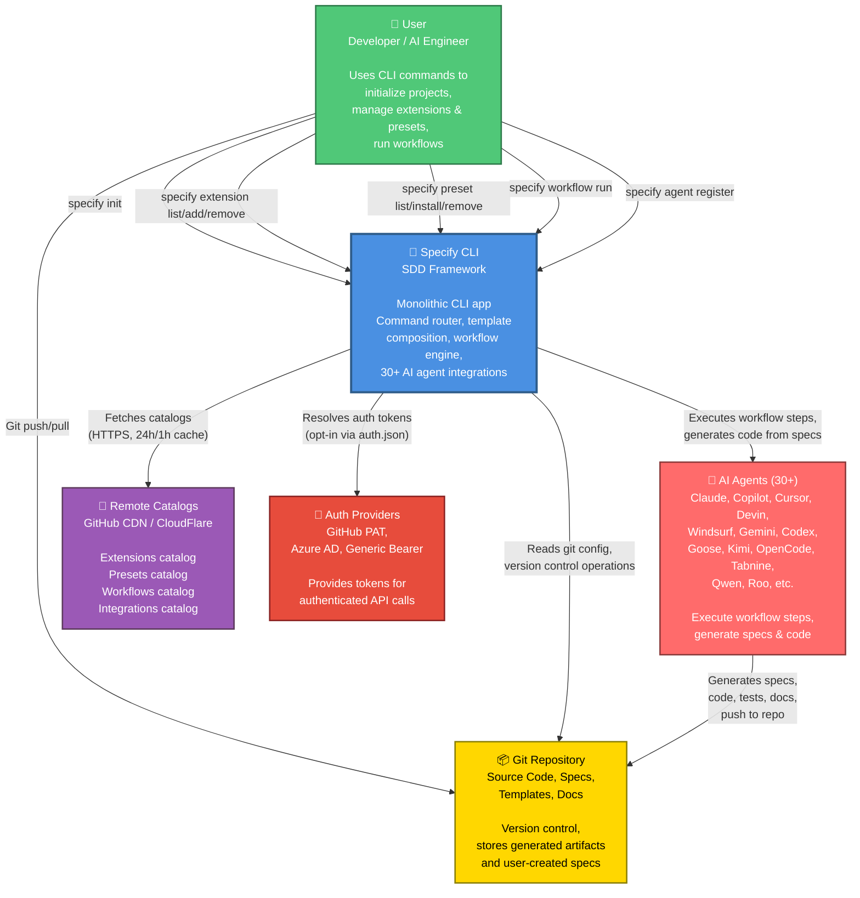

# C4 Context Diagram — Specify CLI

**System**: Specify CLI (Spec-Driven Development Framework)  
**Level**: 1 — System Context  
**Generated**: 2026-05-18

---



---

## System Description

**Specify CLI** is the central system orchestrating Spec-Driven Development workflows. It acts as a **command-line platform** enabling developers to:

1. **Initialize projects** with AI agent integrations, templates, and workflows
2. **Discover and manage extensions** (third-party commands and hooks)
3. **Compose and customize templates** via presets with non-destructive layering
4. **Execute multi-step workflows** that delegate to AI agents for code/spec generation
5. **Authenticate** with remote APIs (opt-in, never automatic)

### Key Responsibilities

- **Command routing** — Dispatch user CLI commands to appropriate handlers
- **Template composition** — Layer templates from overrides, presets, extensions, and core
- **Workflow orchestration** — Execute DAG-structured multi-step workflows with control flow
- **Agent integration** — Translate workflow steps into 30+ agent-specific formats
- **Catalog management** — Fetch, cache, and merge extension/preset/workflow catalogs
- **State persistence** — JSON-based registries and configuration in `.specify/` directory
- **Security** — Opt-in authentication, path safety, manifest validation, HTTPS enforcement

### Scope

- **In scope**: CLI tool, local file management, template composition, workflow execution, remote catalog fetching
- **Out of scope**: Persistent backend server, multi-user concurrency, database, web UI

---

## External Systems

### 1. **User** (Actor)

**Role**: Developer or AI engineer using Specify CLI  
**Interactions**:
- Runs `specify init` to bootstrap projects
- Installs extensions, presets, workflows
- Executes workflows that trigger AI agents
- Commits generated specs and code to Git

**Technology**: CLI shell (bash/zsh/PowerShell)

---

### 2. **AI Agents** (External Systems)

**30+ integrations**: Claude, Copilot, Cursor, Devin, Windsurf, Gemini, Codex, Goose, Kimi, OpenCode, Tabnine, Qwen, Roo, Shai, Trae, Vibe, Kilocode, Junie, Lingma, Kiro CLI, QoderCLI, Auggie, AMP, AGY, Bob, Forge, PI, Codebuddy, iFlow

**Interactions**:
- Receive commands/prompts from workflow engine
- Execute workflow steps (e.g., "generate code from spec")
- Return results (code, docs, specs) back to CLI
- Generated artifacts are committed to Git

**Technology**: Agent-specific (Copilot: VSCode extension; Claude: Claude.ai; etc.)

---

### 3. **Git Repository**

**Role**: Version control and artifact storage  
**Interactions**:
- User commits generated specs and code
- Specify CLI reads Git config (user, email, remotes)
- Specify CLI may trigger Git operations (init, commit, push)
- Stores all generated artifacts alongside source code

**Technology**: Git (local repository)

---

### 4. **Remote Catalogs**

**Sources**:
- Official: `https://raw.githubusercontent.com/github/spec-kit/main/[extensions|presets|workflows|integrations]/catalog.json`
- Community: `https://raw.githubusercontent.com/github/spec-kit/main/[extensions|presets|workflows|integrations]/catalog.community.json`

**Interactions**:
- Specify CLI fetches catalogs via HTTPS
- Caches results (24h for extensions, 1h for presets, 15m for workflows)
- Merges multiple sources (priority-ordered)
- Downloads extension/preset ZIP files on install

**Technology**: HTTPS REST, JSON, ZIP archives

---

### 5. **Auth Providers**

**Supported**:
- GitHub Personal Access Token (PAT)
- Azure DevOps Service Principal
- HTTP Basic Auth
- Generic Bearer Token

**Interactions**:
- User creates `~/.specify/auth.json` (opt-in)
- Specify CLI resolves tokens and builds auth headers
- No authentication attempted unless explicitly configured
- Prevents unauthorized API access

**Technology**: HTTPS, standard auth schemes (Bearer, Basic, OAuth)

---

## Data Flow Summary

### Happy Path: `specify init`

```
User runs: specify init --integration claude --preset python-templates
  ↓
SpecKit validates inputs
  ↓
Fetches remote catalogs (if not cached)
  ↓
Downloads and installs preset ZIP
  ↓
Creates .specify/ tree with registries and config
  ↓
Registers commands with Claude integration
  ↓
Returns: "✅ Project initialized. Run: specify plan"
```

### Workflow Execution

```
User runs: specify workflow run generate-feature
  ↓
Load workflow YAML from catalog or disk
  ↓
For each step in workflow:
  - Resolve integration (default: Claude)
  - Build step context (inputs, previous results)
  - Call AI agent (e.g., Claude.ai)
  - AI generates code/spec
  - Capture output → registry
  ↓
Workflow complete → user commits to Git
```

---

## Architectural Patterns

| Pattern | Implementation | Rationale |
|---------|----------------|-----------|
| **Plugin Architecture** | Extensions register commands; PresetManager layers templates | Enable third-party customization without core modification |
| **Priority Stack** | 4-level template resolution (overrides, presets, extensions, core) | Balance flexibility (customization) with safety (fallback) |
| **Opt-In Security** | Auth is default-off; requires explicit auth.json | Never auto-escalate permissions; user controls credential exposure |
| **Catalog Caching** | Multiple TTLs (24h ext, 1h preset, 15m workflow) | Reduce network calls while allowing frequent updates |
| **State Persistence** | JSON registries in `.specify/` | Simple, human-readable, git-friendly (versioning possible) |
| **Composable Templates** | Prepend/append/wrap strategies | Allow multiple presets to collaborate without full override |

---

## Quality Attributes

| Attribute | Approach | Trade-off |
|-----------|----------|-----------|
| **Extensibility** | Plugin system (extensions + presets) | Increased complexity (manifest validation, conflict detection) |
| **Security** | Opt-in auth, path safety, HTTPS-only | Fewer integrations without manual setup |
| **Offline-first** | Bundled assets in wheel | Larger package size (~10–20 MB) |
| **Composability** | 4-level template stack | Resolution can be slow if many presets installed |
| **User Control** | Explicit configuration (no magic) | Steeper learning curve than opinionated framework |

---

## Deployment Model

- **Distribution**: PyPI package (`specify-cli`)
- **Installation**: `pipx install specify-cli` or `uv tool install specify-cli`
- **Execution**: Single machine, single user
- **State**: Stored in `~/.specify/` and `.specify/` (per-project)
- **No server backend** — All computation happens locally or delegated to AI agents

---

## Glossary

| Term | Definition |
|------|-----------|
| **Specification (Spec)** | Machine-readable contract for AI agents; source of truth in SDD |
| **Spec-Driven Development** | Workflow where specs are authoritative; agents generate code from specs |
| **Constitution** | Project-wide rules document defining conventions and guardrails |
| **Template** | Reusable artifact (Markdown, script, command) customizable via presets |
| **Preset** | Versioned collection of templates grouped by purpose |
| **Extension** | Third-party command + hooks without modifying core |
| **Integration** | Connection to an AI agent (Claude, Copilot, etc.) |
| **Workflow** | DAG of multi-step automation with control flow |
| **Registry** | JSON file persisting installed preset/extension metadata |
| **Catalog** | Remote JSON listing available presets/extensions |

