# Entity-Relationship Diagram (ERD) — Specify CLI

**System**: Specify CLI  
**Generated**: 2026-05-18  
**Scope**: Data model for presets, extensions, workflows, integrations, registries, and authentication

---

## Complete ERD

```mermaid
erDiagram
    %% Preset Domain
    PRESET ||--o{ TEMPLATE : provides
    PRESET_REGISTRY ||--|| PRESET : tracks
    PRESET_MANIFEST ||--|| PRESET : defines
    
    %% Extension Domain
    EXTENSION ||--o{ COMMAND : provides
    EXTENSION ||--o{ HOOK : provides
    EXTENSION_REGISTRY ||--|| EXTENSION : tracks
    EXTENSION_MANIFEST ||--|| EXTENSION : defines
    
    %% Workflow Domain
    WORKFLOW ||--o{ STEP : contains
    WORKFLOW_RUN ||--|| WORKFLOW : executes
    STEP ||--o{ STEP_RESULT : produces
    WORKFLOW_RUN ||--o{ STEP_RESULT : aggregates
    
    %% Integration Domain
    INTEGRATION ||--o{ INTEGRATION_OPTION : has
    INTEGRATION_REGISTRY ||--|| INTEGRATION : tracks
    WORKFLOW ||--|| INTEGRATION : "uses_default"
    STEP ||--|| INTEGRATION : "may_override"
    
    %% Authentication Domain
    AUTH_CONFIG ||--o{ AUTH_ENTRY : contains
    AUTH_ENTRY ||--|| AUTH_PROVIDER : "uses"
    STEP ||--o{ AUTH_ENTRY : "may_require"
    
    %% Shared Registry
    PROJECT_REGISTRY ||--|| PRESET_REGISTRY : "contains"
    PROJECT_REGISTRY ||--|| EXTENSION_REGISTRY : "contains"
    PROJECT_REGISTRY ||--|| WORKFLOW_REGISTRY : "contains"
    PROJECT_REGISTRY ||--|| INTEGRATION_REGISTRY : "contains"
    
    %% Template Resolution
    TEMPLATE ||--|| TEMPLATE_LAYER : "belongs_to"
    TEMPLATE_LAYER ||--|| PRESET_REGISTRY : "references"
    EXTENSION ||--|| TEMPLATE_LAYER : "provides"
    
    %% Entity Definitions
    PRESET {
        string id PK "e.g. python-templates"
        string name "Display name"
        string version "Semantic version (PEP 440)"
        string description "Human-readable description"
        string author FK "Optional"
        string repository FK "Optional: GitHub URL"
        string license FK "Optional: MIT, Apache-2.0, etc."
        string schema_version "Fixed: '1.0'"
    }
    
    PRESET_REGISTRY {
        string preset_id PK,FK "Foreign key: PRESET.id"
        string version "Installed version"
        integer priority "Lower = higher precedence"
        timestamp installed_at "ISO 8601 timestamp"
        boolean enabled "Active in resolution stack"
        string source "Enum: catalog | local | upload"
        string source_url FK "HTTPS URL or localhost"
        string hash "SHA-256 of manifest"
    }
    
    PRESET_MANIFEST {
        string preset_id PK,FK "Foreign key: PRESET.id"
        string requires_speckit_version "PEP 440 specifier"
        string requires_python_version FK "Optional PEP 440 specifier"
        string[] requires_presets FK "Optional prerequisite preset IDs"
        timestamp loaded_at "When manifest was parsed"
        boolean valid "Schema validation passed"
    }
    
    TEMPLATE {
        string name PK "Unique within preset"
        string preset_id PK,FK "Foreign key: PRESET.id"
        string type "Enum: template | command | script"
        string file_path "Relative to preset root"
        string strategy "Enum: replace | prepend | append | wrap"
        string description "Human-readable description"
        integer priority "Within preset: lower = higher"
        boolean is_composed "True if composed from multiple layers"
    }
    
    EXTENSION {
        string id PK "e.g. ai-tools"
        string name "Display name"
        string version "Semantic version (PEP 440)"
        string description "Purpose"
        string author FK "Optional"
        string repository FK "Optional"
        string schema_version "Fixed: '1.0'"
        string[] requires_extensions FK "Optional prerequisite extensions"
    }
    
    EXTENSION_REGISTRY {
        string extension_id PK,FK "Foreign key: EXTENSION.id"
        string version "Installed version"
        integer priority "Lower = higher precedence"
        timestamp installed_at "ISO 8601 timestamp"
        boolean enabled "Active in registry"
        string source "Enum: catalog | local | upload"
        string source_url FK "HTTPS URL"
        string hash "SHA-256 of manifest"
    }
    
    EXTENSION_MANIFEST {
        string extension_id PK,FK "Foreign key: EXTENSION.id"
        string requires_speckit_version "PEP 440 specifier"
        string requires_python_version FK "Optional PEP 440 specifier"
        timestamp loaded_at "When manifest was parsed"
        boolean valid "Schema validation passed"
    }
    
    COMMAND {
        string name PK "Unique across all extensions"
        string extension_id PK,FK "Foreign key: EXTENSION.id"
        string type "Always: CLI command"
        string body "Markdown command definition"
        string namespace "Pattern: speckit.{ext_id}.{cmd}"
        string[] aliases FK "Alternative names"
        string description "Brief description"
        boolean is_composed "True if preset wraps this"
    }
    
    HOOK {
        string id PK "Auto-generated"
        string extension_id FK "Foreign key: EXTENSION.id"
        string event_name "Enum: on_init_complete | on_extension_installed | on_preset_installed | etc."
        string condition "Condition expression (evaluated at runtime)"
        string command "Shell command to execute"
        string description "Human-readable description"
        integer priority "Lower = executed first"
    }
    
    WORKFLOW {
        string id PK "e.g. generate-feature"
        string name "Display name"
        string version "Semantic version"
        string integration_default FK "Default integration if step doesn't override"
        string[] steps FK "Ordered list of step IDs"
        timestamp created_at "ISO 8601"
        timestamp updated_at "ISO 8601"
        string description "Purpose"
    }
    
    WORKFLOW_RUN {
        string id PK "workflow_id.run_sequence"
        string workflow_id FK "Foreign key: WORKFLOW.id"
        string status "Enum: created | running | paused | completed | failed | aborted"
        timestamp started_at "ISO 8601"
        timestamp ended_at "ISO 8601 or null if running"
        integer step_count "Number of steps"
        integer completed_step_count "Number completed"
        string error_message "If failed: error details"
    }
    
    STEP {
        string id PK "workflow_id.step_order"
        string workflow_id FK "Foreign key: WORKFLOW.id"
        integer order "Execution order"
        string type "Enum: command | prompt | shell | if | while | do-while | fan-out | fan-in"
        string name "Human-readable name"
        string definition "YAML step definition"
        string status "Enum: pending | running | completed | failed | skipped | paused"
        string integration_override FK "Optional override: INTEGRATION.id"
    }
    
    STEP_RESULT {
        string id PK "Auto-generated UUID"
        string step_id FK "Foreign key: STEP.id"
        string workflow_run_id FK "Foreign key: WORKFLOW_RUN.id"
        string status "Enum: completed | failed | skipped"
        string output "Command/AI output"
        string error_message "If failed"
        timestamp created_at "When step executed"
        integer execution_time_ms "Duration"
        string[] artifacts FK "Generated file paths"
    }
    
    INTEGRATION {
        string id PK "e.g. claude | copilot | cursor"
        string name "Display name: Claude, GitHub Copilot, Cursor, etc."
        string folder ".claude | .copilot | .cursor | etc."
        boolean requires_cli "Whether agent CLI must be installed"
        string install_url "URL to download/install agent"
        string context_file FK "Optional context file path"
        string api_endpoint FK "Optional API base URL"
    }
    
    INTEGRATION_REGISTRY {
        string integration_id PK,FK "Foreign key: INTEGRATION.id"
        string selected_version "Version of integration handler"
        timestamp configured_at "ISO 8601 timestamp"
        boolean enabled "Active for workflow execution"
    }
    
    INTEGRATION_OPTION {
        string name PK "Option name"
        string integration_id PK,FK "Foreign key: INTEGRATION.id"
        string value "Resolved value"
        string description "Human-readable description"
        string value_type "Enum: string | integer | boolean"
        boolean is_required "Must be set to use integration"
    }
    
    AUTH_CONFIG {
        string user_config_path PK "~/.specify/auth.json"
        timestamp created_at "ISO 8601"
        timestamp last_modified "ISO 8601"
        integer permissions_mode "File permissions (POSIX)"
        boolean is_encrypted "True if encrypted (future)"
    }
    
    AUTH_ENTRY {
        string host_pattern PK "e.g. github.com or *.example.com"
        string auth_config_path FK "Foreign key: AUTH_CONFIG.user_config_path"
        string provider_type "Enum: github | azure_devops | http_basic | bearer | custom"
        string token FK "Inline token OR reference to env var"
        string token_env FK "Env var name (e.g. GITHUB_TOKEN)"
        string scheme "Enum: bearer | basic | azure-cli | custom"
        string custom_header FK "For custom schemes: header name"
        timestamp created_at "ISO 8601"
        timestamp last_used "ISO 8601 or null"
    }
    
    AUTH_PROVIDER {
        string name PK "GitHub, AzureDevOps, HttpBasic, Bearer, Custom"
        string scheme "bearer | basic | azure-cli | custom"
        boolean is_builtin "True for official providers"
        string documentation_url "Where to find setup guide"
        string[] supported_hosts "Hosts this provider typically works with"
    }
    
    TEMPLATE_LAYER {
        string template_name PK "e.g. example-spec"
        integer layer_order PK "1=overrides, 2=presets, 3=extensions, 4=core"
        string preset_id FK "Set if layer_order=2 (presets)"
        string extension_id FK "Set if layer_order=3 (extensions)"
        string file_path "Full path to template file"
        string strategy "Enum: replace | prepend | append | wrap"
        integer priority "For layer_order=2: preset priority"
    }
    
    PROJECT_REGISTRY {
        string project_root PK ".specify/ directory"
        string schema_version "Registry format version"
        timestamp created_at "Project initialization time"
        timestamp last_modified "ISO 8601"
    }
    
    WORKFLOW_REGISTRY {
        string workflow_id PK "Workflow identifier"
        string version "Workflow version"
        timestamp installed_at "ISO 8601"
        boolean enabled "Active in catalog"
        string source "Enum: catalog | local"
    }
```



---

## Entity Descriptions

### Preset Domain

**PRESET** — Represents a single preset (collection of templates).
- **Key fields**: `id` (unique), `version` (semantic), `schema_version` (fixed '1.0')
- **Lifecycle**: Discovered → Installed → Enabled/Disabled → Removed

**PRESET_REGISTRY** — Persistence layer for installed presets.
- **Key fields**: `preset_id` (FK), `version` (installed), `priority` (resolution order)
- **Purpose**: Track what's installed, enabled status, installation source

**TEMPLATE** — Individual template within a preset.
- **Key fields**: `name` (unique), `type` (template|command|script), `strategy` (composition)
- **Resolution**: Resolved via 4-level stack in TEMPLATE_LAYER

---

### Extension Domain

**EXTENSION** — Represents a single extension (commands + hooks).
- **Key fields**: `id` (unique), `version` (semantic), `schema_version` (fixed '1.0')
- **Similar to PRESET** but focused on commands/hooks instead of templates

**COMMAND** — Individual CLI command provided by extension.
- **Namespace**: Pattern `speckit.{extension_id}.{command_name}`
- **Body**: Markdown frontmatter + command implementation
- **Composition**: Can be wrapped by preset commands via `{CORE_TEMPLATE}` placeholder

**HOOK** — Event-driven automation from extensions.
- **Events**: `on_init_complete`, `on_extension_installed`, `on_preset_installed`, etc.
- **Execution**: Condition evaluated, command executed (shell)
- **Priority**: Lower priority executes first

---

### Workflow Domain

**WORKFLOW** — Multi-step automation pipeline.
- **Structure**: Ordered list of STEPs with optional control flow
- **Default integration**: Fallback AI agent if step doesn't override
- **Execution**: Delegates to WORKFLOW_RUN

**WORKFLOW_RUN** — Single execution of a workflow.
- **Status transitions**: created → running → (paused ↔ running) → completed/failed/aborted
- **State**: Persisted to registry for pause/resume capability
- **Results**: Aggregates all STEP_RESULTs

**STEP** — Atomic unit of workflow execution.
- **Types**: command, prompt, shell, if, while, do-while, fan-out, fan-in
- **Integration override**: Can specify different AI agent than workflow default
- **Status**: Transient states (pending, running, paused) → terminal (completed, failed, skipped)

**STEP_RESULT** — Output from a single step execution.
- **Content**: Captured output (code, spec, etc.), error messages, artifacts
- **Timing**: Execution duration and timestamps
- **Many-to-one**: Multiple steps in a run generate multiple results

---

### Integration Domain

**INTEGRATION** — Connection to an AI agent.
- **30+ implementations**: Claude, Copilot, Cursor, Devin, Windsurf, Gemini, Codex, etc.
- **Installation**: May require agent CLI to be pre-installed
- **Configuration**: Per-integration options stored in INTEGRATION_OPTION

**INTEGRATION_REGISTRY** — Persistence for selected/configured integrations.
- **Purpose**: Track which agent is active and when it was configured
- **Scope**: Project-level (one per project)

**INTEGRATION_OPTION** — Configuration parameter for an integration.
- **Examples**: `model` (gpt-4, claude-3), `temperature` (0-1), `context_file` (path)
- **Storage**: Persisted in `.specify/integration.json`

---

### Authentication Domain

**AUTH_CONFIG** — User-level authentication configuration file.
- **Location**: `~/.specify/auth.json` (user home, not project)
- **Purpose**: Maps hosts to authentication providers and tokens
- **Security**: File permissions checked (warning if not 0600 on POSIX)
- **Opt-in**: Default is unauthenticated; requires explicit entry to enable auth

**AUTH_ENTRY** — Single host → provider mapping.
- **Host pattern**: Glob style (`example.com`, `*.example.com`)
- **Token resolution**: Direct inline OR environment variable reference
- **Scheme**: bearer, basic, azure-cli, custom

**AUTH_PROVIDER** — Abstract authentication mechanism.
- **Built-in**: GitHub, Azure DevOps, HTTP Basic, Bearer
- **Custom**: Extensible for third-party providers
- **Scheme**: How to build Authorization header

---

### Template Resolution

**TEMPLATE_LAYER** — Represents one layer in the 4-level resolution stack.

```
Priority: 1 (highest) → 4 (lowest)
  Layer 1: .specify/templates/overrides/       (project-local overrides)
  Layer 2: .specify/presets/{preset_id}/        (installed presets, by priority)
  Layer 3: .specify/extensions/{ext_id}/        (installed extensions)
  Layer 4: .specify/templates/                  (core bundled templates)
```

**Resolution Algorithm**:
```
resolve("example-spec"):
  for layer in [1, 2, 3, 4]:
    if layer == 2:  # Presets
      for preset in presets_by_priority():
        if preset has template "example-spec":
          return template with strategy
    else:
      if layer_location has template "example-spec":
        return template
  return None
```

---

## Cardinalities

| Relationship | Cardinality | Interpretation |
|--------------|------------|-----------------|
| PRESET → TEMPLATE | 1:N | One preset provides multiple templates |
| EXTENSION → COMMAND | 1:N | One extension provides multiple commands |
| EXTENSION → HOOK | 1:N | One extension can register multiple hooks |
| WORKFLOW → STEP | 1:N | One workflow contains multiple steps |
| WORKFLOW_RUN → STEP_RESULT | 1:N | One run aggregates results from all steps |
| INTEGRATION → OPTION | 1:N | One integration has multiple configuration options |
| AUTH_CONFIG → AUTH_ENTRY | 1:N | One config file maps multiple hosts |

---

## Constraints

### Unique Constraints

- `PRESET.id` — Unique across all installed presets
- `EXTENSION.id` — Unique across all installed extensions
- `COMMAND.namespace` — Pattern `speckit.{ext_id}.{cmd}` globally unique
- `TEMPLATE.name + TEMPLATE.preset_id` — Unique within preset
- `WORKFLOW.id` — Unique across all workflows
- `AUTH_ENTRY.host_pattern` — Unique per auth config file

### Foreign Key Constraints

- `PRESET_REGISTRY.preset_id` → `PRESET.id` (on install)
- `COMMAND.extension_id` → `EXTENSION.id`
- `HOOK.extension_id` → `EXTENSION.id`
- `STEP.workflow_id` → `WORKFLOW.id`
- `WORKFLOW_RUN.workflow_id` → `WORKFLOW.id`
- `STEP_RESULT.step_id` → `STEP.id`
- `STEP_RESULT.workflow_run_id` → `WORKFLOW_RUN.id`
- `AUTH_ENTRY.host_pattern` + `AUTH_CONFIG.user_config_path` → `AUTH_CONFIG.user_config_path`

### Business Rule Constraints

- **Schema version locked**: `PRESET.schema_version = '1.0'` exact match required
- **Version format**: PEP 440 semantic versioning enforced
- **Priority ordering**: Lower number = higher precedence (0 is invalid; minimum 1)
- **Host patterns**: Reject `*github.com` (would match `github.com.evil.com`)
- **Namespace pattern**: Extension commands must match `speckit.{ext_id}.{cmd}` regex
- **Composition strategy constraints**: Scripts only support `replace` and `wrap` (not prepend/append)

---

## Evolution & Migrations

### Version 1.0 (Current)

- Preset manifest schema: `1.0` (fixed, no forward compatibility)
- Extension manifest schema: `1.0`
- Registry format: JSON with `schema_version`
- No breaking changes expected until v2.0

### Future Considerations

- **Schema v2.0**: Would require migration script
- **Registry v2.0**: JSON → database (if multi-user support needed)
- **Encryption**: Optional encryption of `auth.json` (future feature)
- **Signing**: Cryptographic verification of downloaded extensions/presets

