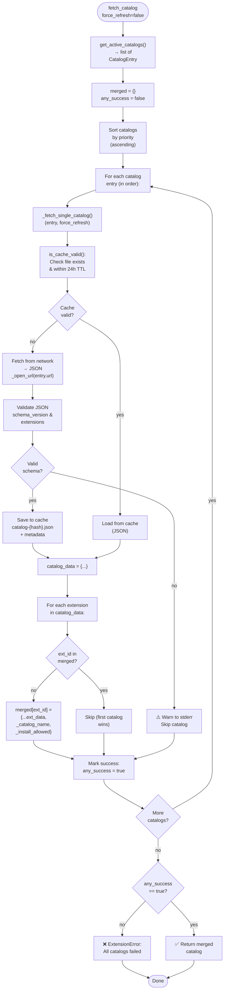
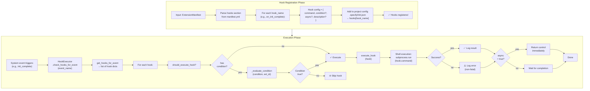

# Flowcharts — Extension Module

**Generated**: 2026-05-17  
**Module**: extension (Extension Management System)

---

## 1. Installation Flow

Extension installation orchestration from discovery through persistence.

```mermaid
flowchart TD
    START([User: install extension]) --> INPUT["INPUT: ext_id, source_type<br/>(remote|local|upload)"]
    
    INPUT --> FETCH{Source Type?}
    FETCH -->|remote| FETCH_CAT["1. ExtensionCatalog<br/>.fetch_catalog()"]
    FETCH -->|local| LOAD_LOCAL["1. Load from<br/>local source"]
    
    FETCH_CAT --> FOR_CAT["For each active catalog<br/>(by priority):"]
    FOR_CAT --> SINGLE["_fetch_single_catalog()<br/>with cache check"]
    SINGLE --> CACHE{"Cache<br/>valid?"}
    CACHE -->|yes| USE_CACHE["Load from cache"]
    CACHE -->|no| NETWORK["Fetch from network"]
    NETWORK --> SAVE_CACHE["Save to cache<br/>(24h TTL)"]
    SAVE_CACHE --> MERGE["Merge into result"]
    MERGE --> NEXT_CAT{More<br/>catalogs?}
    NEXT_CAT -->|yes| FOR_CAT
    NEXT_CAT -->|no| MERGED["Catalog merged<br/>(priority-based)"]
    USE_CACHE --> MERGE
    
    LOAD_LOCAL --> VALIDATE_PATH["Validate source<br/>directory exists"]
    MERGED --> MANIFEST["2. Load manifest<br/>(extension.yml)"]
    VALIDATE_PATH --> MANIFEST
    
    MANIFEST --> LOAD_YAML["ExtensionManifest<br/>._load_yaml()"]
    LOAD_YAML --> YAML_ERR{"Valid<br/>YAML?"}
    YAML_ERR -->|no| ERR1["❌ ValidationError:<br/>Invalid YAML"]
    
    YAML_ERR -->|yes| VALIDATE["_validate()<br/>manifest schema"]
    VALIDATE --> CHK_REQUIRED["Check required<br/>fields"]
    CHK_REQUIRED --> CHK_VER["Check schema version<br/>== '1.0'"]
    CHK_VER --> CHK_EXT["Validate extension<br/>metadata (id, version)"]
    CHK_EXT --> CHK_CMD["Validate commands<br/>pattern & namespace"]
    CHK_CMD --> CHK_HOOK["Check ≥1 command<br/>OR ≥1 hook"]
    
    CHK_REQUIRED --> VALID_ERR{Validation<br/>pass?}
    CHK_VER --> VALID_ERR
    CHK_EXT --> VALID_ERR
    CHK_CMD --> VALID_ERR
    CHK_HOOK --> VALID_ERR
    
    VALID_ERR -->|no| ERR1
    VALID_ERR -->|yes| CONFLICT["3. Detect conflicts"]
    
    CONFLICT --> COLLECT["_collect_manifest_command_names()<br/>→ declared_names"]
    COLLECT --> GET_INST["_get_installed_command_name_map()<br/>→ installed_names"]
    GET_INST --> CHECK_COLL["Check intersection:<br/>declared ∩ installed"]
    CHECK_COLL --> COLL_ERR{Conflict<br/>found?}
    
    COLL_ERR -->|yes| ERR2["❌ ValidationError:<br/>Command shadow"]
    COLL_ERR -->|no| COPY["4. Copy extension"]
    
    COPY --> IF_REMOTE{Remote<br/>source?}
    IF_REMOTE -->|yes| DOWNLOAD["download_extension()<br/>→ ZIP"]
    IF_REMOTE -->|no| FROM_LOCAL["Use local files"]
    
    DOWNLOAD --> URL_CHECK["Validate URL:<br/>HTTPS only<br/>(except localhost)"]
    URL_CHECK --> URL_ERR{Valid?}
    URL_ERR -->|no| ERR3["❌ SecurityError:<br/>Invalid URL"]
    URL_ERR -->|yes| DL_ZIP["Download ZIP<br/>via _open_url()"]
    DL_ZIP --> DL_ERR{Success?}
    DL_ERR -->|no| ERR4["❌ NetworkError"]
    DL_ERR -->|yes| EXTRACT["Extract ZIP<br/>to temp dir"]
    
    EXTRACT --> COPY_DIR["5. shutil.copytree<br/>→ .specify/extensions/{ext_id}"]
    FROM_LOCAL --> COPY_DIR
    
    COPY_DIR --> IGNORE["Load .extensionignore<br/>(if exists)"]
    IGNORE --> IGNORE_FUNC["Create ignore function<br/>for copytree"]
    IGNORE_FUNC --> COPYTREE["copytree(src, dst,<br/>ignore=ignore_func)"]
    COPYTREE --> COPY_ERR{Copy<br/>success?}
    COPY_ERR -->|no| ERR5["❌ IOError:<br/>Copy failed"]
    COPY_ERR -->|yes| REGISTER_CMD["6. Register commands<br/>with agents"]
    
    REGISTER_CMD --> DETECT_AGENTS["Detect installed agents<br/>(.claude, .copilot, ...)"]
    DETECT_AGENTS --> FOR_AGENT["For each agent:"]
    FOR_AGENT --> REG_CMD["CommandRegistrar<br/>.register_commands_for_agent()"]
    REG_CMD --> LOAD_CMD_FILE["Load command files<br/>(markdown/TOML)"]
    LOAD_CMD_FILE --> PARSE_FM["Parse frontmatter"]
    PARSE_FM --> INJECT_META["Inject extension<br/>metadata comment"]
    INJECT_META --> WRITE_CMD["Write to agent<br/>command directory"]
    WRITE_CMD --> NEXT_AGENT{More<br/>agents?}
    NEXT_AGENT -->|yes| FOR_AGENT
    NEXT_AGENT -->|no| REGISTER_HOOKS["7. Register hooks"]
    
    REGISTER_HOOKS --> GET_HOOKS["Extract hooks from<br/>manifest"]
    GET_HOOKS --> HE["HookExecutor<br/>.register_hooks()"]
    HE --> ADD_HOOKS["Add hooks to<br/>.specify/init.json"]
    ADD_HOOKS --> PERSIST["8. Persist to registry"]
    
    PERSIST --> REGISTRY["ExtensionRegistry<br/>.add()"]
    REGISTRY --> SAVE_REG["Save to .registry<br/>(JSON)"]
    SAVE_REG --> SUCCESS["✅ Install complete"]
    
    ERR1 --> CLEANUP1["Cleanup:"]
    ERR2 --> CLEANUP1
    ERR3 --> CLEANUP1
    ERR4 --> CLEANUP1
    ERR5 --> CLEANUP1
    
    CLEANUP1 --> DEL_DIR["Delete .specify/extensions<br/>/{ext_id}"]
    DEL_DIR --> UNREG_HOOKS["Remove hooks from<br/>.specify/init.json"]
    UNREG_HOOKS --> UNREG_CMD["Unregister agent<br/>commands"]
    UNREG_CMD --> FAIL["❌ Installation failed"]
    
    SUCCESS --> END([Done])
    FAIL --> END
```



---

## 2. Manifest Validation Details

Detailed breakdown of validation rules enforced by `ExtensionManifest._validate()`.

```mermaid
flowchart TD
    START([Manifest<br/>._validate()]) --> R1["✓ Required fields:<br/>'schema_version'<br/>'extension'<br/>'requires'<br/>'provides'"]
    
    R1 --> R1_ERR{All<br/>present?}
    R1_ERR -->|no| ERR["❌ Missing<br/>required field"]
    R1_ERR -->|yes| R2["✓ schema_version<br/>== '1.0'"]
    
    R2 --> R2_ERR{Match?}
    R2_ERR -->|no| ERR
    R2_ERR -->|yes| R3["✓ extension.id<br/>matches ^[a-z0-9-]+$"]
    
    R3 --> R3_ERR{Valid?}
    R3_ERR -->|no| ERR
    R3_ERR -->|yes| R4["✓ extension.version<br/>is semantic version"]
    
    R4 --> R4_ERR{Valid?}
    R4_ERR -->|no| ERR
    R4_ERR -->|yes| R5["✓ requires.speckit_version<br/>present"]
    
    R5 --> R5_ERR{Present?}
    R5_ERR -->|no| ERR
    R5_ERR -->|yes| R6["✓ provides.commands<br/>is list or absent"]
    
    R6 --> R6_ERR{Valid?}
    R6_ERR -->|no| ERR
    R6_ERR -->|yes| R7["✓ hooks is dict<br/>or absent"]
    
    R7 --> R7_ERR{Valid?}
    R7_ERR -->|no| ERR
    R7_ERR -->|yes| R8["✓ ≥1 command<br/>OR ≥1 hook<br/>provided"]
    
    R8 --> R8_ERR{Either?}
    R8_ERR -->|no| ERR
    R8_ERR -->|yes| R9["✓ For each command:<br/>name, file present"]
    
    R9 --> R9_ERR{Valid?}
    R9_ERR -->|no| ERR
    R9_ERR -->|yes| R10["✓ Command name<br/>matches speckit<br/>.{ext}.{cmd}"]
    
    R10 --> R10_ERR{Valid?}
    R10_ERR -->|no| WARN_FIX["⚠️ Warning:<br/>Auto-fix name"]
    WARN_FIX --> R11
    R10_ERR -->|yes| R11["✓ Command namespace<br/>== ext.id"]
    
    R11 --> R11_ERR{Match?}
    R11_ERR -->|no| ERR
    R11_ERR -->|yes| R12["✓ Aliases is list<br/>or absent"]
    
    R12 --> R12_ERR{Valid?}
    R12_ERR -->|no| ERR
    R12_ERR -->|yes| R13["✓ No duplicate<br/>names in manifest"]
    
    R13 --> R13_ERR{Unique?}
    R13_ERR -->|no| ERR
    R13_ERR -->|yes| R14["✓ For each hook:<br/>command field<br/>present"]
    
    R14 --> R14_ERR{Valid?}
    R14_ERR -->|no| ERR
    R14_ERR -->|yes| SUCCESS["✅ Validation<br/>passed"]
    
    ERR --> RAISE["raise ValidationError"]
    SUCCESS --> END([Return<br/>manifest])
    RAISE --> END
```

---

## 3. Configuration Layer Resolution

How `ConfigManager` resolves final configuration from 4 sources.

```mermaid
flowchart TD
    START([ConfigManager<br/>.get_config()]) --> L1["Layer 1: Defaults<br/>from extension.yml<br/>→ config section"]
    
    L1 --> L1_LOAD["_get_extension_defaults():<br/>Load manifest<br/>Extract 'config' key"]
    L1_LOAD --> L1_DICT["defaults_dict = {...}"]
    
    L1_DICT --> L2["Layer 2: Project<br/>.specify/extensions<br/>/{ext_id}-config.yml"]
    
    L2 --> L2_LOAD["_get_project_config():<br/>Load YAML file<br/>(if exists)"]
    L2_LOAD --> L2_DICT["project_dict = {...}"]
    
    L2_DICT --> L3["Layer 3: Local<br/>.specify/extensions<br/>/local-config.yml"]
    
    L3 --> L3_LOAD["_get_local_config():<br/>Load YAML file<br/>(if exists)"]
    L3_LOAD --> L3_DICT["local_dict = {...}"]
    
    L3_DICT --> L4["Layer 4: Environment<br/>SPECKIT_{EXT_ID_UPPER}<br/>_{KEY_UPPER}"]
    
    L4 --> L4_LOAD["_get_env_config():<br/>Scan env vars<br/>Parse to dict"]
    L4_LOAD --> L4_DICT["env_dict = {...}"]
    
    L4_DICT --> MERGE["_merge_configs()<br/>(deep merge)"]
    
    MERGE --> MERGE_STEPS["result = {}<br/>1. merge(result, defaults)<br/>2. merge(result, project)<br/>3. merge(result, local)<br/>4. merge(result, env)<br/>(last-one-wins)"]
    
    MERGE_STEPS --> FINAL["Final config =<br/>all 4 layers<br/>merged"]
    
    FINAL --> END([Return<br/>merged config])
```

---

## 4. Catalog Merging Algorithm

Multi-catalog merge based on priority ordering.



---

## 5. Hook Registration & Execution Flow

How hooks are registered from manifest and executed on events.



---

## 6. Command Registration with Agents

How commands are registered with each detected AI agent (Claude, Copilot, etc.).

```mermaid
flowchart TD
    START([CommandRegistrar<br/>.register_commands<br/>_for_all_agents()]) --> DETECT["Detect installed<br/>agents:"]
    
    DETECT --> CHECK_CLAUDE{.claude<br/>exists?}
    CHECK_CLAUDE -->|yes| ADD_CLAUDE["agents += 'claude'"]
    CHECK_CLAUDE -->|no| SKIP_CLAUDE["Skip"]
    
    ADD_CLAUDE --> CHECK_COPILOT{.copilot<br/>exists?}
    SKIP_CLAUDE --> CHECK_COPILOT
    
    CHECK_COPILOT -->|yes| ADD_COPILOT["agents += 'copilot'"]
    CHECK_COPILOT -->|no| SKIP_COPILOT["Skip"]
    
    ADD_COPILOT --> FOR_AGENT["For each agent<br/>in agents list:"]
    SKIP_COPILOT --> FOR_AGENT
    
    FOR_AGENT --> REG_AGENT["register_commands<br/>_for_agent<br/>(agent, manifest)"]
    
    REG_AGENT --> FOR_CMD["For each command<br/>in manifest:"]
    
    FOR_CMD --> LOAD_FILE["Load command file<br/>(from extension dir)"]
    
    LOAD_FILE --> PARSE["Parse file:<br/>Frontmatter + Body<br/>(markdown or TOML)"]
    
    PARSE --> INJECT_META["Inject metadata<br/>comment:<br/><!-- Extension: {ext_id}<br/>--><br/><!-- Config: path -->"]
    
    INJECT_META --> RENDER["Render to format:<br/>- Markdown: yml<br/>- TOML: [tool.speckit<br/>.commands]"]
    
    RENDER --> WRITE["Write to agent<br/>command dir:<br/>.{agent_id}<br/>/commands<br/>/{cmd_name}.md"]
    
    WRITE --> NEXT_CMD{More<br/>commands?}
    NEXT_CMD -->|yes| FOR_CMD
    NEXT_CMD -->|no| NEXT_AGENT{More<br/>agents?}
    
    NEXT_AGENT -->|yes| FOR_AGENT
    NEXT_AGENT -->|no| DONE["✅ All commands<br/>registered for<br/>all agents"]
    
    DONE --> END([Return<br/>registration<br/>results])
```

---

## Summary

| Flow | Purpose | Key Decision Points |
|------|---------|-------------------|
| **Installation** | End-to-end extension setup | Fetch source → Validate → Detect conflicts → Copy → Register → Persist |
| **Validation** | Enforce manifest schema | Required fields, version, naming patterns, constraints |
| **Config Resolution** | Merge 4 config layers | Layer precedence: Defaults < Project < Local < Environment |
| **Catalog Merge** | Combine multiple sources | Priority-ordered, first-match-wins, fallback tolerance |
| **Hook Registration** | Extensibility via events | Parse manifest → Store in config → Execute on events |
| **Command Registration** | Agent integration | Detect agents → Load commands → Inject metadata → Write files |
